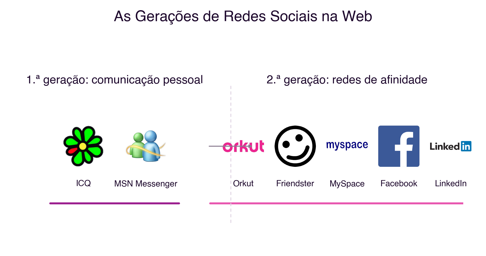
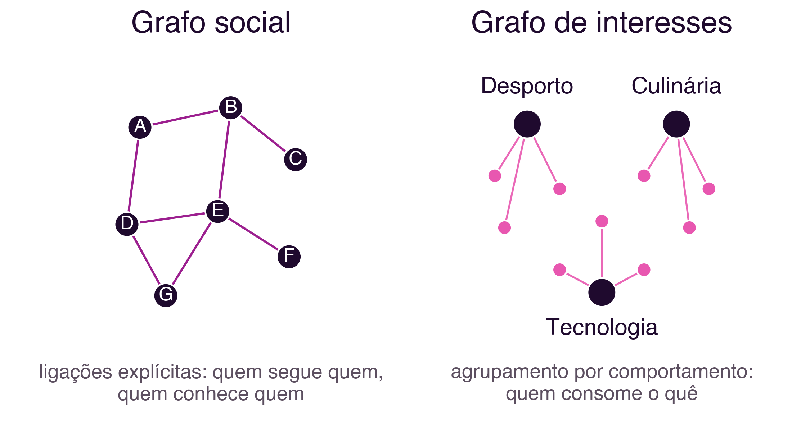

```{=html}
<div class="hero hero-chapter" style="background-image: linear-gradient(to top, rgba(31,10,46,0.88) 0%, rgba(31,10,46,0.6) 20%, rgba(31,10,46,0.15) 45%, rgba(31,10,46,0) 65%), url('../assets/images/heroes/cap02.jpg');">
  <div class="hero-badge">Capítulo 2</div>
  <h1>Redes Sociais: Fundamentos e Dados Estatísticos</h1>
</div>
```

## Introdução {#sec-02-intro .unnumbered}

O capítulo anterior estabeleceu uma distinção fundamental: a rede social,
enquanto conceito, é anterior à tecnologia (@sec-01-redes-nao-tecnologicas),
e aquilo que a computação em rede trouxe foi sobretudo uma mudança de
escala, alcance e meio (@sec-01-sociedade-rede-castells). Este capítulo
aprofunda essa segunda parte: como é que as redes sociais, enquanto
fenómeno humano milenar, se transformaram nas plataformas de redes sociais
na web que hoje conhecemos, que forma assumiram ao longo do tempo, para que
servem e qual a sua adoção real, hoje, em Portugal e no mundo.

## Os Seis Graus de Separação {#sec-02-seis-graus}

Em 1967, o psicólogo social Stanley Milgram conduziu um conjunto de
experiências que se tornariam uma referência incontornável no estudo das
redes sociais. Pediu a centenas de pessoas em diferentes estados dos
Estados Unidos que fizessem chegar uma carta a um destinatário final que
não conheciam pessoalmente, através da rede de conhecidos diretos de cada
participante. O objetivo era medir quantos intermediários, em média, eram
necessários para ligar duas pessoas escolhidas ao acaso [@Milgram1967].

Os resultados são frequentemente simplificados. Das centenas de cartas
enviadas, apenas uma minoria completou o percurso: a maioria das cadeias
interrompeu-se antes de chegar ao destino. Entre as cartas que chegaram,
o número médio de intermediários situou-se por volta de cinco a seis. A
ideia de que "todos estamos ligados por seis graus de separação" não é,
portanto, uma conclusão exata e universal da experiência de Milgram, mas
antes uma popularização: a expressão remonta a um conto do escritor
húngaro Frigyes Karinthy, publicado em 1929, e só se tornou popular
décadas mais tarde através da peça *Six Degrees of Separation*, de John
Guare (1990). O próprio Milgram nunca usou essa expressão nos seus
textos.

O que a experiência de Milgram demonstrou de forma mais sólida foi outra
coisa, mais interessante para o estudo das redes sociais: que uma rede
de relações pessoais, aparentemente local e limitada, tem uma estrutura
que permite alcançar qualquer outro nó dessa rede através de um número
surpreendentemente pequeno de ligações. Foi precisamente esta propriedade
estrutural, a de "mundo pequeno" (*small world*), que os primeiros
sistemas de redes sociais na web foram desenhados para explorar e tornar
visível.

## As Gerações de Redes Sociais na Web {#sec-02-geracoes}

As redes sociais na web são ambientes virtuais onde cada participante
constrói a sua própria rede de relações, baseada nalgum tipo de ligação
com outros participantes. É possível identificar, na sua evolução, três
gerações sucessivas de sistemas [@MeiraEtAl2011a]:

- **Primeira geração**: sistemas baseados em comunicação pessoal direta,
  organizados à volta de listas de contactos para troca de mensagens
  instantâneas. O `ICQ` e o `MSN Messenger` são exemplos característicos
  desta geração.
- **Segunda geração**: sistemas que procuraram replicar, num ambiente
  virtual, as redes de afinidade e de conhecidos já existentes no mundo
  real. O `Orkut`, o `Friendster`, o `MySpace`, o `Facebook` e o `LinkedIn`
  formalizaram esse tipo de relacionamento, com tal sucesso que as redes
  sociais se tornaram mais populares do que o correio eletrónico.
- **Terceira geração**: sistemas em que as redes sociais passaram a
  apoiar diretamente a resolução de problemas concretos: armazenar e
  trocar experiências entre pessoas em situações semelhantes, gerir
  conhecimento organizacional, manter memória institucional e gerar
  ligações novas entre pessoas e organizações que não se conheciam
  previamente.

A @fig-02-geracoes ilustra a primeira e a segunda geração com os
logótipos reais das plataformas referidas: note-se como a segunda
geração já inclui plataformas que, mais tarde, viriam a dominar por
completo o panorama das redes sociais.

{#fig-02-geracoes}

### E depois da terceira geração? {#sec-02-quarta-geracao}

Esta classificação em três gerações foi proposta em 2011, quando o
`Facebook`, o `Orkut` e o `LinkedIn` definiam o panorama das redes sociais.
Entretanto, mais de uma década de evolução tecnológica sugere uma
transformação suficientemente profunda para justificar um novo patamar.

As primeiras três gerações partilham um traço em comum: a visibilidade
de um conteúdo depende, sobretudo, da rede de ligações explícitas do
utilizador, o chamado **grafo social** (*social graph*), ou seja, quem
segue quem. O `TikTok`, popularizado a partir de 2018, alterou este
princípio de forma estrutural: o seu algoritmo de recomendação, a "Para
Ti" (*For You*), decide o que mostrar a cada utilizador com base sobretudo
no comportamento observado (tempo de visualização, interações,
semelhança de conteúdo), e não em quem esse utilizador segue. Passa-se,
assim, de um **grafo social** para um **grafo de interesses**
(*interest graph*): a proximidade que importa deixa de ser "quem
conheces" e passa a ser "o que consomes". Este modelo foi
progressivamente adotado pelas restantes plataformas, incluindo o
`Instagram` e o `YouTube`, através dos seus formatos de vídeo curto
(*Reels*, *Shorts*).

Representando cada rede como um grafo, um conjunto de nós ligados por
arestas, a diferença entre os dois modelos torna-se visível
(@fig-02-grafos). No grafo social, os nós são pessoas e as arestas
representam ligações explícitas entre elas: quem segue quem, quem é
amigo de quem. No grafo de interesses, a proximidade deixa de ser entre
pessoas e passa a ser entre uma pessoa e os temas com que interage: duas
pessoas podem nunca se ter seguido, nem se conhecerem, e ainda assim
serem "vizinhas" na rede, por consumirem o mesmo tipo de conteúdo. A
forma de calcular e visualizar estes grafos, através de métricas como
distância, centralidade ou densidade, será desenvolvida no capítulo
seguinte.

{#fig-02-grafos}

O sociólogo Paolo Gerbaudo descreve esta mudança como a passagem de
"públicos em rede" (*networked publics*), organizados por ligações
interpessoais explícitas, para "públicos agrupados" (*clustered
publics*), organizados algoritmicamente por semelhança comportamental
[@Gerbaudo2026]. Segundo o autor, esta transformação tem implicações que
vão além da experiência individual: torna mais opaco o funcionamento dos
sistemas que decidem o que cada pessoa vê, e acentua a fragmentação do
espaço público digital em grupos de interesse cada vez mais fechados
sobre si próprios. Este ponto liga-se diretamente ao "lado sombrio" da
sociedade em rede já discutido no capítulo anterior (@sec-01-riscos), e
será retomado quando se estudarem os sistemas de recomendação.

## Finalidades das Redes Sociais {#sec-02-finalidades}

Independentemente da geração ou da lógica de funcionamento, as redes
sociais podem também classificar-se pela finalidade principal para que
foram desenhadas [@MeiraEtAl2011a]:

- **Partilha**: publicação e distribuição de conteúdo, como fotografias
  ou vídeos (exemplos históricos: `Flickr`, `YouTube`)
- **Profissional**: manutenção de contactos e relações de trabalho
  (exemplo: `LinkedIn`)
- **Plataforma**: infraestrutura de identidade digital que outros
  serviços usam para autenticação e interligação (exemplo histórico:
  `Ning`)
- **Entretenimento**: interação social com fins predominantemente
  lúdicos (exemplos históricos: `MySpace`, `hi5`)

A @fig-02-finalidades reúne os logótipos das plataformas que melhor
ilustram cada uma destas quatro finalidades.

{#fig-02-finalidades}

Esta classificação foi proposta em 2011, e a fronteira entre estas
quatro finalidades está hoje ainda mais esbatida do que estava então: o
`Instagram` acumula partilha, entretenimento e, cada vez mais, comércio; o
`LinkedIn` passou a distribuir conteúdo em formato de vídeo curto,
tradicionalmente associado ao entretenimento; e várias plataformas
asiáticas, como o `WeChat`, funcionam como "superaplicações" que integram
mensagens, pagamentos, comércio eletrónico e serviços públicos num único
ambiente. A tendência dominante não é a especialização, mas a
convergência de finalidades numa mesma plataforma.

## A Adoção das Redes Sociais em Números {#sec-02-numeros}

Segundo o relatório *Digital 2024* da We Are Social/Meltwater, com
análise da Kepios, já referido no capítulo anterior, existiam **5,04 mil
milhões de identidades de utilizador ativas em redes sociais** no início
de 2024, o equivalente a 62,3% da população mundial [@WeAreSocial2024].
Comparando este valor com os 5,35 mil milhões de utilizadores de
Internet estimados para o mesmo período (@sec-01-numeros), conclui-se
que cerca de 94% de quem usa a Internet usa também, pelo menos, uma rede
social: a adoção de redes sociais está hoje praticamente equiparada à
adoção da própria Internet. O utilizador típico despende, em média, **2
horas e 23 minutos por dia** em redes sociais [@WeAreSocial2024].

Em Portugal, o mesmo período regista 7,43 milhões de utilizadores de
redes sociais, o equivalente a 72,6% da população total, para 8,84
milhões de utilizadores de Internet (86,4% da população)
[@DataReportalPortugal2024]. A adoção em Portugal é, portanto, superior
à média mundial em ambas as dimensões (@fig-02-adocao).

![Adoção da Internet e das redes sociais, mundial e em Portugal (2024). Fontes: We Are Social/Meltwater [@WeAreSocial2024]; DataReportal [@DataReportalPortugal2024].](../assets/images/cap02/adocao-mundial-portugal-2024.png){#fig-02-adocao}

As plataformas mais alcançadas por
publicidade em Portugal, no início de 2024, eram o `YouTube` (72,6% da
população), o `Facebook` (58,1%), o `Instagram` (56,7%), o `LinkedIn` (47,9%)
e o `Facebook Messenger` (46,4%), seguidos do `TikTok`, já com 42,6% de
alcance entre adultos [@DataReportalPortugal2024] (@fig-02-plataformas-pt).

![Alcance das principais plataformas em Portugal, por publicidade potencial (janeiro de 2024). Fonte: DataReportal, *Digital 2024: Portugal* [@DataReportalPortugal2024].](../assets/images/cap02/pt-plataformas-2024.png){#fig-02-plataformas-pt}

Vale a pena notar que
esta métrica, alcance publicitário potencial, não é diretamente
comparável ao número de utilizadores ativos mensais divulgado por cada
plataforma a nível mundial: por essa métrica, o `Facebook` continua a ser
a maior rede social do mundo, com 3,05 mil milhões de utilizadores
ativos mensais [@WeAreSocial2024]. Alcance publicitário e utilizadores
ativos mensais são métricas diferentes, calculadas de forma diferente,
pelo que não devem ser comparadas diretamente entre si.

## Síntese {#sec-02-sintese}

Este capítulo aprofundou o estudo das redes sociais, enquanto instância
tecnológica de um fenómeno social pré-existente, introduzido no capítulo
anterior:

1. A experiência de Milgram (1967) demonstrou a propriedade de "mundo
   pequeno" das redes sociais, popularizada, de forma imprecisa, como
   "seis graus de separação" [@Milgram1967]
2. As redes sociais na web evoluíram em três gerações sucessivas,
   marcadas pela comunicação pessoal, pela replicação de redes de
   afinidade reais e pela resolução colaborativa de problemas
   [@MeiraEtAl2011a]
3. Uma quarta transformação, ainda sem consenso quanto ao nome, está em
   curso desde 2018: a passagem de um grafo social explícito para um
   grafo de interesses definido algoritmicamente [@Gerbaudo2026]
4. As quatro finalidades clássicas das redes sociais, partilha,
   profissional, plataforma e entretenimento, tendem hoje à
   convergência numa mesma plataforma, em vez de à especialização
5. A adoção de redes sociais está hoje próxima da adoção da própria
   Internet, tanto a nível mundial como em Portugal
   [@WeAreSocial2024; @DataReportalPortugal2024]

## Para Refletir {#sec-02-reflexao}

O algoritmo de recomendação de conteúdo, ao decidir o que cada pessoa vê
com base no seu comportamento e não nas suas ligações explícitas, tem um
poder de influência muito maior do que uma lista de amigos jamais teve.
Que responsabilidade cabe a uma plataforma quando é o seu algoritmo,
e não as escolhas explícitas do utilizador, a decidir a que conteúdo
esse utilizador é exposto?

Pensa também na tua própria utilização de redes sociais: consegues
identificar, nas plataformas que usas, exemplos de grafo social e de
grafo de interesses a funcionar em simultâneo? E as quatro finalidades
descritas neste capítulo, partilha, profissional, plataforma e
entretenimento, aplicam-se ainda com nitidez às plataformas que usas
diariamente, ou já convergiram todas numa só?

## Referências {#sec-02-referencias .unnumbered}

::: {#refs}
:::
