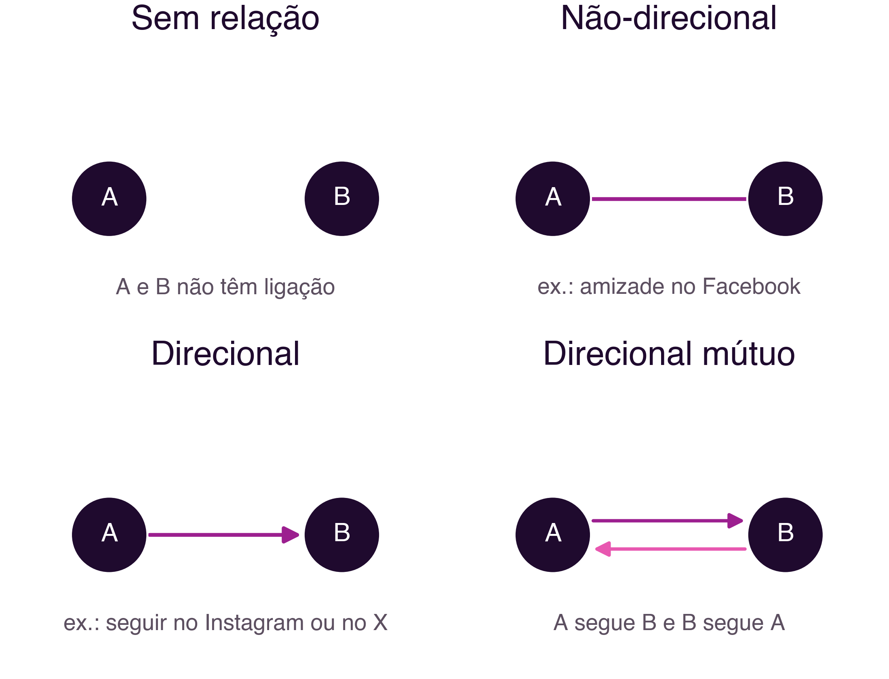
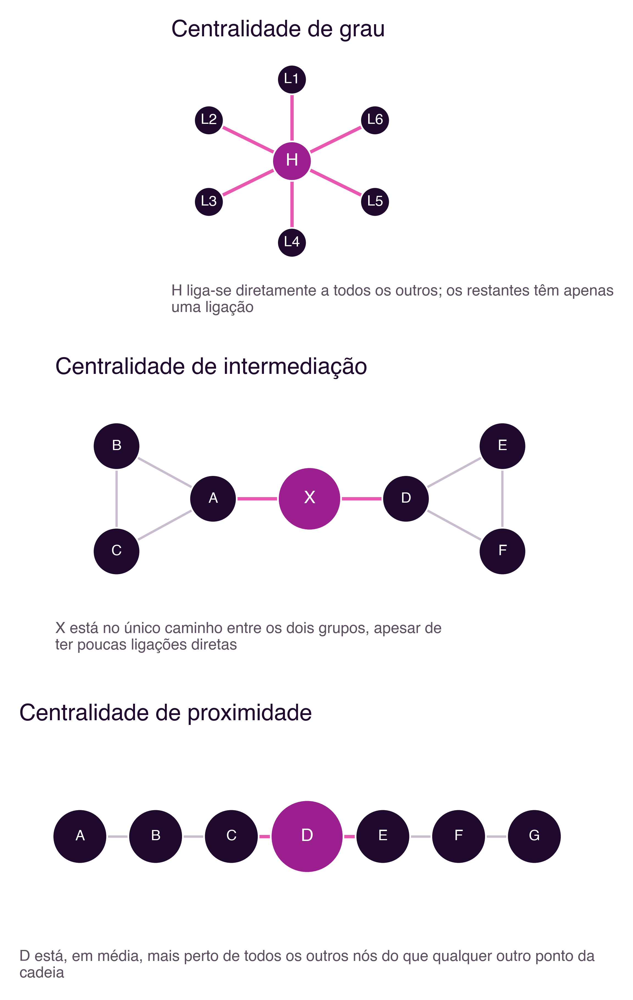
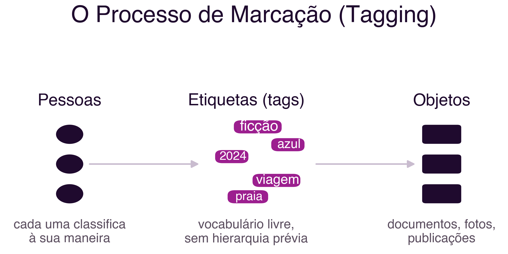
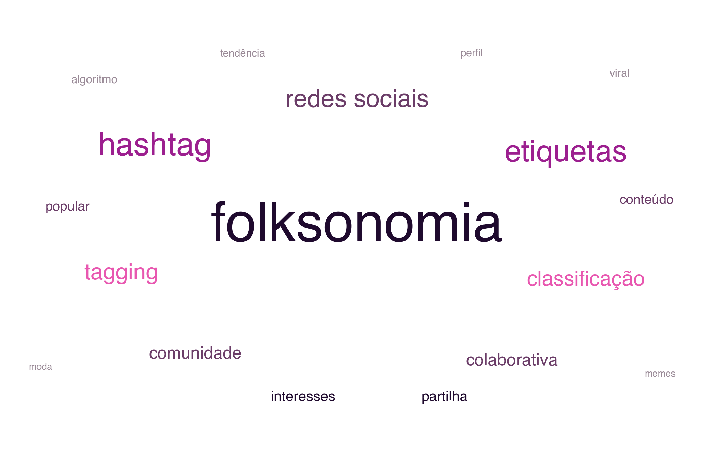

```{=html}
<div class="hero hero-chapter" style="background-image: linear-gradient(to top, rgba(31,10,46,0.88) 0%, rgba(31,10,46,0.6) 20%, rgba(31,10,46,0.15) 45%, rgba(31,10,46,0) 65%), url('../assets/images/heroes/cap03.jpg');">
  <div class="hero-badge">Capítulo 3</div>
  <h1>Redes Sociais: Métricas e Folksonomia</h1>
</div>
```

## Introdução {#sec-03-intro .unnumbered}

O capítulo anterior introduziu, a par do grafo social, um segundo modelo
de organização da informação em redes sociais: o grafo de interesses, em
que a proximidade relevante deixa de ser entre pessoas e passa a ser
entre uma pessoa e os temas com que interage (@sec-02-quarta-geracao).
Este capítulo desenvolve essa ideia em duas direções complementares.
Primeiro, mostra como analisar formalmente um grafo social, através de
métricas concretas que permitem responder a perguntas como "quem é mais
influente nesta rede?" ou "quão bem conectada está esta comunidade?".
Depois, aprofunda o outro lado da moeda, a organização de conteúdo por
temas, através da *folksonomia*, a classificação coletiva que estrutura
hoje praticamente todas as redes sociais através de **hashtag*s*.

## Representar uma Rede Social como Grafo {#sec-03-grafo}

Analisar uma rede social de forma sistemática exige, antes de mais,
representá-la como um **grafo**: um conjunto de nós, que representam pessoas
ou organizações, ligados por arestas, que representam as suas relações.
Esta é a mesma lógica de representação usada pelo **sociograma** de Moreno
(@sec-01-redes-nao-tecnologicas) e pelos grafos social e de interesses
discutidos no capítulo anterior.

Uma aresta, ou seja, uma ligação entre dois nós,  pode ser **não-direcional**, quando representa uma relação
mútua e simétrica (por exemplo, uma amizade no `Facebook`, em que ambas as
partes têm de aceitar a ligação), ou **direcional**, quando representa
uma relação que só é verdadeira num sentido (por exemplo, seguir alguém
no `Instagram` ou no `X`, o que não implica ser seguido de volta). Duas
pessoas podem também não ter relação alguma entre si. Esta distinção é
importante: a maioria das redes de amizade tradicionais (`Facebook`,
`LinkedIn`) usa ligações não-direcionais, enquanto a maioria das redes
centradas em conteúdo (`Instagram`, `X`, `YouTube`) usa ligações direcionais,
o que tem implicações diretas para as métricas que se seguem
(@fig-03-relacoes).

{#fig-03-relacoes}

## Métricas para Análise de Redes Sociais {#sec-03-metricas}

Uma vez representada como grafo, uma rede social pode ser analisada com
métricas quantitativas, um conjunto de ferramentas que constitui a
**Análise de Redes Sociais** (*Social Network Analysis*, SNA). As
métricas mais utilizadas são as seguintes:

### Caminho e distância {#sec-03-caminho}

Um **caminho** entre dois nós é qualquer sequência de arestas que os
liga, direta ou indiretamente. Numa rede social, existem tipicamente
muitos caminhos possíveis entre dois nós quaisquer. A **distância**
entre dois nós é o comprimento do caminho mais curto entre eles, medido
pelo número de arestas percorridas. Foi precisamente esta noção de
distância que a experiência de Milgram procurou medir empiricamente
(@sec-02-seis-graus): quantas ligações, em média, separam duas pessoas
escolhidas ao acaso.

### Centralidade como Poder Social {#sec-03-centralidade}

A **centralidade** mede o quão bem posicionado um nó está na rede,
sendo por isso também designada por poder social. Não existe uma única
forma de medir centralidade: o sociólogo Linton Freeman propôs, num
trabalho hoje considerado fundador da área, uma clarificação conceptual
que distingue pelo menos três noções distintas de centralidade
[@Freeman1978]:

- **Centralidade de grau** (*degree centrality*): quantas ligações
  diretas tem um nó. Um nó com muitas ligações está, à partida, mais
  central.
- **Centralidade de intermediação** (*betweenness centrality*): com que
  frequência um nó se encontra no caminho mais curto entre outros dois
  nós. Um nó com centralidade de intermediação elevada funciona como
  ponte ou corretor de informação entre partes da rede que, de outra
  forma, estariam mais distantes.
- **Centralidade de proximidade** (*closeness centrality*): quão perto,
  em média, um nó está de todos os outros nós da rede. Um nó com
  centralidade de proximidade elevada consegue alcançar o resto da rede
  rapidamente.

Estas três noções captam aspetos diferentes de "importância" numa rede,
e um nó pode ser central segundo uma medida e periférico segundo outra:
um bom exemplo é um intermediário que liga duas comunidades distintas,
mas que, dentro de cada uma delas, tem poucas ligações diretas, baixa
centralidade de grau, mas centralidade de intermediação muito elevada
(@fig-03-centralidade).

{#fig-03-centralidade}

### Popularidade: grau de entrada e de saída {#sec-03-popularidade}

Em grafos direcionais, é útil distinguir entre ligações que chegam a um
nó e ligações que saem dele. O **grau de entrada** (*in-degree*) é o
número de ligações que chegam a um nó, e é frequentemente usado como
medida direta de popularidade: no `Instagram` ou no `X`, corresponde,
essencialmente, ao número de seguidores. O **grau de saída**
(*out-degree*) é o número de ligações que saem de um nó, correspondendo,
nesse mesmo exemplo, ao número de contas que esse utilizador segue.

### Densidade {#sec-03-densidade}

A **densidade** de um nó, ou de uma rede, mede a proporção entre o
número de relações que efetivamente existem e o número de relações que
seriam possíveis. Se um nó tem apenas um terço das ligações que
poderia ter, dado o tamanho da rede, a sua densidade é de
aproximadamente 0,33 (@fig-03-densidade). Redes com densidade elevada
tendem a difundir informação mais depressa, mas também a ser mais
suscetíveis a fenómenos de câmara de eco, precisamente porque quase
todos estão ligados a quase todos.

{#fig-03-densidade}

## Folksonomia: Classificação Coletiva de Conteúdo {#sec-03-folksonomia}

Até agora, este capítulo tratou de como analisar relações **entre
pessoas**. Mas grande parte da estrutura de uma rede social moderna
resulta também de como o **conteúdo** é classificado e organizado, e é aqui que entra a
*folksonomia*.

O termo **folksonomia** (*folksonomy*) foi cunhado por Thomas Vander Wal
em 2007, a partir da junção de *folk* (povo, pessoas) com *taxonomy*
(taxonomia) [@VanderWal2007]. Designa a classificação de conteúdo através
de um processo de marcação (*tagging*) livre e coletivo, em vez de uma
hierarquia de categorias definida *a priori* por especialistas de domínio.

A diferença para uma **taxonomia** tradicional é estrutural: numa
taxonomia, um grupo de gestores define antecipadamente uma hierarquia de
categorias, e todo o conteúdo tem de se encaixar nela. Numa *folksonomia*,
não existe essa hierarquia prévia: as categorias, ou etiquetas
(*tags*), surgem à medida que os próprios utilizadores classificam o
conteúdo, sem qualquer controlo centralizado.

O processo de marcação pode representar-se de forma simples: um
conjunto de pessoas, ou uma única pessoa, associa um conjunto de
etiquetas a um conjunto de objetos (documentos, imagens, publicações)
(@fig-03-tagging). Como pessoas diferentes classificam o mesmo objeto de
formas diferentes, de acordo com a sua própria perspetiva, a
*folksonomia* resultante é rica e heterogénea, mas também pode conter
inconsistências.

{#fig-03-tagging}

Distinguem-se dois tipos de *folksonomia* [@VanderWal2007]: **larga**
(*broad folksonomy*), em que um grande número de utilizadores marca os
mesmos objetos, o que é útil para identificar os elementos mais
populares de um conjunto, e **estreita** (*narrow folksonomy*), em que
apenas uma ou poucas pessoas marcam cada objeto, tipicamente o próprio
autor do conteúdo, o que preserva um vocabulário mais pessoal, mas
dificulta a descoberta por terceiros.

Uma forma comum de visualizar o resultado agregado de uma *folksonomia* é
a **nuvem de etiquetas** (*tag cloud*), uma representação em que as
etiquetas mais usadas aparecem em destaque, tipicamente com letra maior
ou mais escura, permitindo identificar rapidamente os temas dominantes
de uma coleção (@fig-03-nuvem).

{#fig-03-nuvem}

### Vantagens e problemas {#sec-03-folksonomia-problemas}

A *folksonomia* tem vantagens claras: não depende de especialistas de
domínio para definir categorias, permite que cada utilizador categorize
livremente sem ter de aprender um vocabulário controlado, e captura o
vocabulário real de quem efetivamente usa o sistema, não o de quem o
desenhou.

Mas essa mesma liberdade gera problemas bem documentados: erros
ortográficos, variações morfológicas (por exemplo, "rede social" e
"redes sociais" registadas como etiquetas distintas), sinonímia (termos
diferentes para o mesmo conceito), polissemia (o mesmo termo com
significados diferentes consoante o contexto) e sobrecarga de
etiquetas pouco relevantes. As plataformas atuais mitigam parcialmente
estes problemas com correção ortográfica automática, sugestão de
etiquetas já usadas por outros, e agrupamento semiautomático de
etiquetas semanticamente próximas.

## Folksonomia na Prática: das Tags às hashtags {#sec-03-hashtags}

Quando o conceito de *folksonomia* se popularizou, por volta de 2007, os
exemplos de referência eram sistemas como o `Amazon`, o `YouTube`, o
`Flickr` e o `Del.icio.us`. Vale a pena perceber, em concreto, como a
mesma ideia, etiquetagem livre de conteúdo, dava origem a resultados
muito diferentes consoante quem tinha permissão para etiquetar.

No `Amazon`, até a funcionalidade ser descontinuada em 2013, qualquer
cliente podia associar etiquetas livres a um produto: um mesmo livro
podia ser marcado por clientes diferentes como "ficção científica",
"distopia" ou "leitura de praia". Como a etiquetagem estava aberta a
toda a base de clientes, formava-se uma **folksonomia larga**: muitas
vozes a classificar o mesmo objeto, o que tornava as etiquetas mais
repetidas um indicador razoável do consenso coletivo sobre o que aquele
produto realmente é.

No `YouTube`, o mecanismo é o oposto, e continua assim hoje: só quem
publica um vídeo pode associar-lhe etiquetas, através do `YouTube
Studio`. Quem apenas vê o vídeo não participa na sua classificação.
Trata-se, por isso, de uma **folksonomia estreita**: reflete a
perspetiva pessoal de quem publicou o conteúdo, não um consenso
coletivo entre quem o consome.

Também o `Del.icio.us`, um serviço de marcadores sociais que permitia
organizar e partilhar sítios web através de etiquetas, já não existe:
depois de mudar várias vezes de proprietário, deixou de aceitar novos
marcadores em 2017, quando foi adquirido pelo concorrente `Pinboard`,
que o transformou num arquivo apenas de leitura.

O mecanismo, contudo, sobreviveu à mudança de plataformas, apenas com
outro nome: a **hashtag**. Ao associar uma etiqueta precedida de "#" a
uma publicação no `Instagram`, no `TikTok` ou no `X`, cada utilizador está a
participar exatamente no mesmo processo de marcação coletiva descrito
por Vander Wal quase duas décadas antes destas plataformas dominarem o
mercado. Um estudo sobre as *hashtag*s do `Instagram` mostra precisamente
isso: a *folksonomia* gerada pelos utilizadores através de *hashtag*s pode
ser modelada como uma rede complexa, ligando publicações e perfis que
partilham os mesmos temas, sem que exista qualquer coordenação central
entre quem as usa [@IbbaEtAl2015].

A *hashtag* herda também as mesmas tensões da *folksonomia* clássica: no
`Instagram`, uma *hashtag* popular como `#food` tem uma *folksonomia* larga,
com milhões de contribuintes, mas pouco valor para encontrar algo
específico; uma *hashtag* de nicho, criada por uma comunidade pequena
para um evento ou interesse restrito, funciona de forma mais próxima de
uma *folksonomia* estreita, mais precisa, mas também menos descoberta por
quem não a conhece já.

## Síntese {#sec-03-sintese}

Este capítulo desenvolveu duas ferramentas complementares para
compreender a estrutura das redes sociais:

1. Uma rede social pode ser representada como um grafo, com arestas
   direcionais ou não-direcionais consoante o tipo de relação
2. As principais métricas de análise são caminho, distância,
   centralidade (de grau, de intermediação e de proximidade)
   [@Freeman1978], grau de entrada e de saída, e densidade
3. A *folksonomia* é a classificação coletiva de conteúdo através de
   marcação livre, distinta de uma taxonomia hierárquica definida a
   priori [@VanderWal2007]
4. A *folksonomia* larga e a estreita representam um compromisso entre
   alcance e precisão da classificação
5. A *hashtag* é a forma contemporânea da *folksonomia*, presente em
   praticamente todas as redes sociais atuais [@IbbaEtAl2015]

## Para Refletir {#sec-03-reflexao}

Pensa numa rede social que uses com frequência: consegues identificar,
nas pessoas que segues, alguém com centralidade de intermediação
elevada, ou seja, alguém que liga grupos de pessoas que de outra forma
não estariam em contacto?

E quanto às *hashtag*s que usas ou segues: são de *folksonomia* larga, uma
etiqueta genérica usada por milhões de pessoas, ou de *folksonomia*
estreita, específica de uma comunidade pequena? Que problemas de
sinonímia ou de variação morfológica já observaste em *hashtag*s (por
exemplo, duas grafias diferentes do mesmo tema a dividirem a mesma
conversa em duas)?

## Referências {#sec-03-referencias .unnumbered}

::: {#refs}
:::
