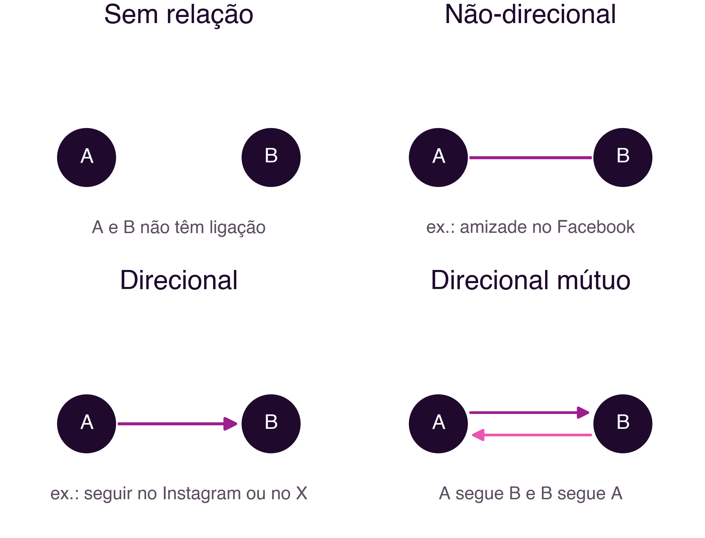
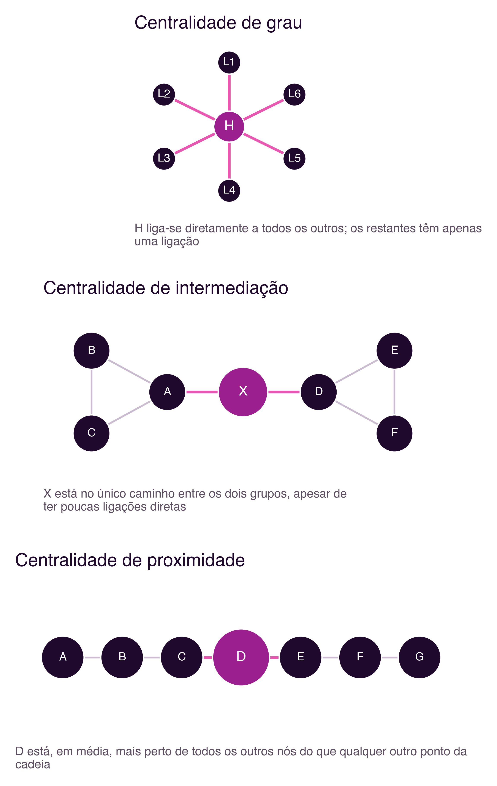
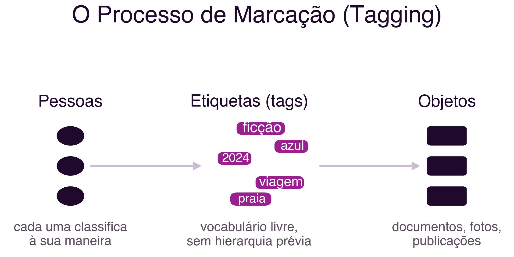
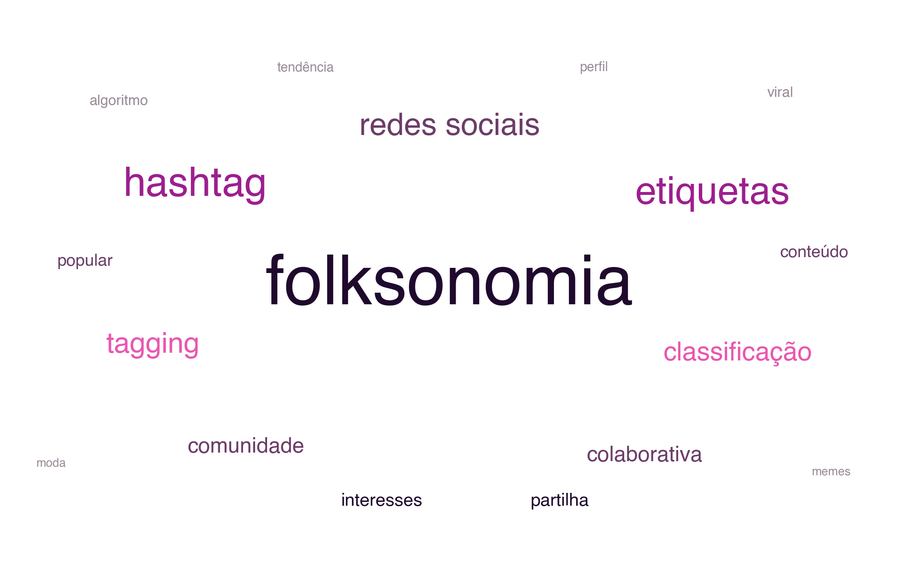

```{=html}
<div class="hero hero-chapter" style="background-image: linear-gradient(to top, rgba(31,10,46,0.88) 0%, rgba(31,10,46,0.6) 20%, rgba(31,10,46,0.15) 45%, rgba(31,10,46,0) 65%), url('../assets/images/heroes/cap03.jpg');">
  <div class="hero-badge">Capítulo 3</div>
  <h1>Redes Sociais: Métricas e Folksonomia</h1>
</div>
```

## Introdução {#sec-03-intro .unnumbered}

O capítulo anterior introduziu, a par do grafo social, um segundo modelo
de organização da informação em redes sociais: o grafo de interesses, em
que a proximidade relevante deixa de ser entre pessoas e passa a ser
entre uma pessoa e os temas com que interage (@sec-02-quarta-geracao).
Este capítulo desenvolve essa ideia em duas direções complementares.
Primeiro, apresenta a **Análise de Redes Sociais**: o seu propósito, o
método que permite passar de um conjunto de relações entre pessoas a um
sociograma, e as métricas concretas que respondem a perguntas como "quem
é mais influente nesta rede?", "quem liga grupos que de outra forma não
comunicariam?" ou "quão coesa é esta comunidade?". Um exemplo completo,
acompanhado do princípio ao fim, mostra como cada métrica se calcula e,
sobretudo, como se interpreta. Depois, aprofunda o outro lado da moeda,
a organização de conteúdo por temas, através da *folksonomia*, a
classificação coletiva que estrutura hoje praticamente todas as redes
sociais através de **hashtag*s*.

## Análise de Redes Sociais: Propósito e Método {#sec-03-metodo}

A **Análise de Redes Sociais** (*Social Network Analysis*, SNA) estuda
as relações entre as pessoas, e não as pessoas isoladamente. A maior
parte dos estudos sociais descreve cada indivíduo pelas suas
características próprias: idade, formação, rendimento, opiniões. A
análise de redes acrescenta outra pergunta: com quem se relaciona cada
pessoa, e que lugar ocupa no conjunto dessas relações
[@WassermanFaust1994].

Esta pergunta importa porque a posição na rede tem consequências
práticas. Dois estudantes com a mesma idade, o mesmo curso e as mesmas
notas podem ter experiências muito diferentes: um conhece colegas de
várias turmas e é dos primeiros a saber de um estágio ou de uma bolsa;
o outro relaciona-se apenas com um pequeno grupo e raramente recebe
informação nova. Nenhuma das características individuais explica esta
diferença; o que a explica é a **estrutura das relações**.

A análise de redes começou com os sociogramas de Moreno [@Moreno1934],
desenhados à mão para estudar grupos pequenos, como turmas. As
plataformas digitais mudaram a escala: cada ligação, seguidor ou
mensagem fica registado automaticamente, o que permite hoje analisar
redes com milhões de pessoas.

### Para que serve {#sec-03-proposito}

As perguntas a que a análise de redes responde surgem em contextos muito
diversos:

- **Educação:** identificar alunos que ninguém escolhe para trabalhar,
  perceber se uma turma está fragmentada em grupos fechados, formar
  equipas de trabalho mais equilibradas.
- **Organizações:** descobrir quem, na prática, faz circular a
  informação entre departamentos, independentemente do organigrama
  formal, e que conhecimento se perde se essa pessoa sair.
- **Saúde pública:** prever por onde uma doença contagiosa se propaga
  mais depressa e quem deve ser vacinado ou informado primeiro.
- **Plataformas digitais:** sugerir "pessoas que talvez conheças",
  identificar contas influentes, detetar redes coordenadas de contas
  falsas que amplificam artificialmente uma mensagem.

Em todos estes casos, a resposta não está nos atributos das pessoas, mas
na forma como estão ligadas.

### O método em cinco etapas {#sec-03-etapas}

Uma análise de redes sociais segue, de forma geral, cinco etapas:

1. **Definir a pergunta e a fronteira da rede.** Que relação interessa
   estudar (amizade, colaboração, troca de mensagens, coautoria) e quem
   faz parte da rede (uma turma, um departamento, os seguidores de uma
   conta). A mesma turma produz redes muito diferentes se a pergunta for
   "com quem almoças?" ou "a quem pedes ajuda para estudar?".
2. **Recolher os dados.** Pode fazer-se por **questionário
   sociométrico**, o método original de Moreno, em que cada pessoa
   indica com quem se relaciona; por **observação**; ou a partir de
   **registos digitais** (quem segue quem, quem responde a quem, quem
   escreveu com quem).
3. **Representar a rede.** Os dados organizam-se numa **matriz de
   adjacência** e desenham-se num **sociograma**, o grafo que torna a
   estrutura visível.
4. **Calcular as métricas.** Em redes pequenas, as contas fazem-se à
   mão; em redes maiores, recorre-se a ferramentas como o `Gephi` ou a
   biblioteca `NetworkX` da linguagem `Python`.
5. **Interpretar.** As métricas descrevem posições, não explicam
   motivos: um valor só ganha significado quando lido à luz da pergunta
   inicial e do contexto do grupo.

Para tornar cada etapa concreta, o resto desta secção acompanha um
exemplo único. Numa turma de nove alunos, identificados de A a I, cada
aluno respondeu à pergunta "Com que dois colegas gostarias de fazer o
próximo trabalho de grupo?". São, portanto, 18 escolhas no total, duas
por aluno.

Os dados sociométricos descrevem relações pessoais e são, por natureza,
sensíveis: saber que um aluno não foi escolhido por ninguém é uma
informação que pode magoar ou estigmatizar. Por isso, os resultados
devem ser anonimizados, como neste exemplo, e usados apenas para o fim
para que foram recolhidos.

## Representar uma Rede Social como Grafo {#sec-03-grafo}

Analisar uma rede social de forma sistemática exige, antes de mais,
representá-la como um **grafo**: um conjunto de nós, que representam pessoas
ou organizações, ligados por arestas, que representam as suas relações.
Esta é a mesma lógica de representação usada pelo **sociograma** de Moreno
(@sec-01-redes-nao-tecnologicas) e pelos grafos social e de interesses
discutidos no capítulo anterior.

Uma aresta, ou seja, uma ligação entre dois nós, pode ser **não-direcional**, quando representa uma relação
mútua e simétrica (por exemplo, uma amizade no `Facebook`, em que ambas as
partes têm de aceitar a ligação), ou **direcional**, quando representa
uma relação que só é verdadeira num sentido (por exemplo, seguir alguém
no `Instagram` ou no `X`, o que não implica ser seguido de volta). Duas
pessoas podem também não ter relação alguma entre si. Esta distinção é
importante: a maioria das redes de amizade tradicionais (`Facebook`,
`LinkedIn`) usa ligações não-direcionais, enquanto a maioria das redes
centradas em conteúdo (`Instagram`, `X`, `YouTube`) usa ligações direcionais,
o que tem implicações diretas para as métricas que se seguem
(@fig-03-relacoes).

{#fig-03-relacoes}

As arestas podem ainda ter um **peso**, que traduz a intensidade da
relação: o número de mensagens trocadas entre duas pessoas, o número de
vezes que interagiram, ou o número de trabalhos que escreveram em
conjunto. Numa rede de coautoria, por exemplo, dois autores que
assinaram três capítulos juntos têm uma ligação de peso 3, mais forte do
que a de dois autores que colaboraram uma única vez. Quando o peso não
interessa, todas as arestas valem 1.

### Da matriz de adjacência ao sociograma {#sec-03-matriz}

A forma mais simples de registar as relações de uma rede é a **matriz de
adjacência**: uma tabela com uma linha e uma coluna por pessoa, em que a
célula na linha *i* e coluna *j* vale 1 se *i* escolheu *j*, e fica
vazia caso contrário. Na turma do exemplo, as linhas indicam quem
escolhe e as colunas quem é escolhido (@tbl-03-matriz).

| Escolhe ↓ / Escolhido → | A | B | C | D | E | F | G | H | I |
|:-----------------------:|:-:|:-:|:-:|:-:|:-:|:-:|:-:|:-:|:-:|
| **A** |   | 1 | 1 |   |   |   |   |   |   |
| **B** | 1 |   | 1 |   |   |   |   |   |   |
| **C** | 1 | 1 |   |   |   |   |   |   |   |
| **D** | 1 |   | 1 |   |   |   |   |   |   |
| **E** |   |   | 1 |   |   | 1 |   |   |   |
| **F** |   |   |   |   | 1 |   | 1 |   |   |
| **G** |   |   |   |   |   | 1 |   | 1 |   |
| **H** |   |   |   |   |   | 1 | 1 |   |   |
| **I** | 1 |   |   | 1 |   |   |   |   |   |
| **Total de escolhas recebidas** | **4** | **2** | **4** | **1** | **1** | **3** | **2** | **1** | **0** |

: Matriz de adjacência da turma. Cada linha soma 2, porque cada aluno podia escolher dois colegas; a soma de cada coluna é o número de vezes que esse aluno foi escolhido. {#tbl-03-matriz}

A matriz já contém toda a informação da rede, mas é difícil de ler.
O **sociograma** desenha exatamente os mesmos dados como grafo, e a
estrutura salta à vista: há dois grupos distintos, ligados apenas
através do aluno E, e há um aluno, I, que escolheu colegas mas não foi
escolhido por ninguém (@fig-03-sociograma).

{#fig-03-sociograma}

Em redes de algumas dezenas de pessoas, a leitura visual do sociograma
ainda funciona. Em redes com milhares ou milhões de nós, como as das
plataformas digitais, o desenho torna-se uma mancha ilegível, e só as
métricas permitem descrever a estrutura.

## Métricas para Análise de Redes Sociais {#sec-03-metricas}

As métricas de análise de redes dividem-se em dois grupos: as que
descrevem a **posição de cada nó** (quem é popular, quem é central, quem
serve de ponte) e as que descrevem a **rede no seu conjunto** (quão
ligada, quão coesa, quão fragmentada). Nas definições que se seguem, *n*
representa o número de nós da rede; na turma do exemplo, *n* = 9. Salvo
indicação em contrário, as métricas de posição são calculadas sobre os
contactos de cada aluno, independentemente do sentido da escolha: A e D
estão ligados, quer tenha sido A a escolher D, quer o contrário.

### Popularidade: grau de entrada e de saída {#sec-03-popularidade}

O **grau** de um nó é o número de ligações que tem. Em grafos
direcionais, é útil distinguir entre ligações que chegam a um nó e
ligações que saem dele. O **grau de entrada** (*in-degree*) é o
número de ligações que chegam a um nó, e é frequentemente usado como
medida direta de popularidade: no `Instagram` ou no `X`, corresponde,
essencialmente, ao número de seguidores. O **grau de saída**
(*out-degree*) é o número de ligações que saem de um nó, correspondendo,
nesse mesmo exemplo, ao número de contas que esse utilizador segue, e
mede a **expansividade** de cada pessoa, a sua tendência para procurar
os outros.

Na turma (ver @fig-03-sociograma), o grau de entrada é a última linha da matriz: A e C são os
mais escolhidos (4 escolhas cada), seguidos de F (3); I não foi
escolhido por ninguém. O grau de saída, pelo contrário, não diz nada
neste exemplo: vale 2 para todos, porque a própria pergunta limitava
cada aluno a duas escolhas. Esta é uma primeira lição de método: a forma
como os dados são recolhidos condiciona o que as métricas conseguem
revelar.

### Densidade de um nó {#sec-03-densidade}

A **densidade de um nó** mede a proporção entre o número de relações que
esse nó efetivamente tem e o número de relações que poderia ter, ou
seja, o seu grau dividido por *n* − 1 (todos os outros nós da rede). Se
um nó tem apenas um terço das ligações que poderia ter, dado o tamanho
da rede, a sua densidade é de aproximadamente 0,33 (@fig-03-densidade).

{#fig-03-densidade}

Na turma (ver @fig-03-sociograma), A tem contactos com quatro colegas (B, C, D e I) dos oito
possíveis, uma densidade de 4/8 = 0,50; I tem contacto com dois (A e
D), uma densidade de 2/8 = 0,25. A densidade de um nó não deve ser
confundida com a densidade da rede, uma métrica global apresentada mais
adiante (@sec-03-densidade-rede).

### Centralidade como Poder Social {#sec-03-centralidade}

A **centralidade** mede o quão bem posicionado um nó está na rede,
sendo por isso também designada por poder social. Não existe uma única
forma de medir centralidade: o sociólogo Linton Freeman propôs, num
trabalho hoje considerado fundador da área, uma clarificação conceptual
que distingue pelo menos três noções distintas de centralidade
[@Freeman1978]:

- **Centralidade de grau** (*degree centrality*): quantas ligações
  diretas tem um nó. Um nó com muitas ligações está, à partida, mais
  central.
- **Centralidade de intermediação** (*betweenness centrality*): com que
  frequência um nó se encontra no caminho mais curto entre outros dois
  nós. Um nó com centralidade de intermediação elevada funciona como
  ponte ou corretor de informação entre partes da rede que, de outra
  forma, estariam mais distantes.
- **Centralidade de proximidade** (*closeness centrality*): quão perto,
  em média, um nó está de todos os outros nós da rede. Um nó com
  centralidade de proximidade elevada consegue alcançar o resto da rede
  rapidamente.

A estas três junta-se uma quarta, que responde a uma intuição diferente:
não importa só quantos contactos se tem, mas **quem** são esses
contactos.

- **Centralidade de vetor próprio** (*eigenvector centrality*): um nó é
  tanto mais central quanto mais centrais forem os nós a que está
  ligado [@Bonacich1987]. Estar ligado a duas pessoas muito bem
  relacionadas pode valer mais do que estar ligado a cinco pessoas
  isoladas. O **PageRank**, o algoritmo com que o `Google` começou a
  ordenar páginas *web*, assenta no mesmo princípio: uma página é
  importante se for apontada por outras páginas importantes
  [@BrinPage1998].

Estas quatro noções captam aspetos diferentes de "importância" numa rede,
e um nó pode ser central segundo uma medida e periférico segundo outra:
um bom exemplo é um intermediário que liga duas comunidades distintas,
mas que, dentro de cada uma delas, tem poucas ligações diretas, baixa
centralidade de grau, mas centralidade de intermediação muito elevada
(@fig-03-centralidade).

{#fig-03-centralidade}

Os valores de centralidade são normalmente apresentados numa escala de
0 a 1, o que permite comparar nós entre si. Na turma, cada medida
aponta para um aluno diferente:

- em **grau**, A e C empatam, com quatro contactos cada;
- em **intermediação**, C lidera (0,59), mas logo seguido de E (0,54),
  que tem apenas dois contactos: E está no único caminho entre os dois
  grupos, pelo que qualquer informação que circule de um grupo para o
  outro tem de passar por ele;
- em **proximidade**, C volta a liderar (0,57), por estar a poucos
  passos de todos;
- em **vetor próprio**, A fica à frente (0,53), porque os seus contactos
  (B, C, D, I) estão todos no grupo mais denso, enquanto C "gasta" uma
  das suas ligações com E, que tem poucos contactos.

### Coeficiente de agrupamento {#sec-03-agrupamento}

O **coeficiente de agrupamento** (*clustering coefficient*) de um nó
mede a proporção de pares dos seus contactos que também estão ligados
entre si [@WattsStrogatz1998]. Traduz a pergunta "os amigos dos meus
amigos são meus amigos?". Um valor de 1 indica que o nó pertence a um
grupo fechado, em que todos se conhecem; um valor de 0 indica que os seus
contactos não se conhecem entre si, o que é típico de quem faz a ponte
entre mundos diferentes.

Na turma, B tem coeficiente 1: os seus dois contactos, A e C, estão
ligados entre si. E tem coeficiente 0: os seus contactos, C e F, não se
relacionam. É este mecanismo que as plataformas exploram quando sugerem
"pessoas que talvez conheças": se duas pessoas têm muitos amigos em
comum, é provável que também elas se conheçam.

### Caminho e distância {#sec-03-caminho}

Um **caminho** entre dois nós é qualquer sequência de arestas que os
liga, direta ou indiretamente. Numa rede social, existem tipicamente
muitos caminhos possíveis entre dois nós quaisquer. A **distância**
entre dois nós é o comprimento do caminho mais curto entre eles, medido
pelo número de arestas percorridas. Foi precisamente esta noção de
distância que a experiência de Milgram procurou medir empiricamente
(@sec-02-seis-graus): quantas ligações, em média, separam duas pessoas
escolhidas ao acaso.

Duas métricas globais derivam desta noção. O **diâmetro** é a maior
distância entre quaisquer dois nós da rede: indica quanto tempo, no pior
caso, uma informação demora a atravessá-la. A **distância média** é a
média das distâncias entre todos os pares de nós. Na turma, o diâmetro é
5 (de I a H, por exemplo, o caminho mais curto é I, A, C, E, F, H) e a
distância média é de cerca de 2,4 passos.

### Densidade da rede {#sec-03-densidade-rede}

A **densidade da rede** mede a proporção entre o número de ligações que
existem em toda a rede e o número de ligações que seriam possíveis se
todos estivessem ligados a todos. Numa rede direcional com *n* nós,
cada nó pode escolher *n* − 1 outros, pelo que o máximo é
*n* × (*n* − 1) ligações. Redes com densidade elevada tendem a difundir
informação mais depressa, mas também a ser mais suscetíveis a fenómenos
de câmara de eco, precisamente porque quase todos estão ligados a quase
todos.

Na turma, existem 18 escolhas entre 9 × 8 = 72 possíveis, uma densidade
de 18/72 = 0,25. Este valor, porém, exige cuidado na interpretação: como
cada aluno só podia escolher dois colegas, 0,25 é o máximo que esta
pergunta permitia obter. A densidade é útil para comparar redes
recolhidas da mesma forma (por exemplo, a mesma turma no início e no fim
do semestre), não para comparar redes recolhidas com regras diferentes.

### Reciprocidade {#sec-03-reciprocidade}

Em redes direcionais, a **reciprocidade** é a proporção de ligações que
são correspondidas: se A escolhe B, B também escolhe A? Uma
reciprocidade elevada indica relações equilibradas e estáveis; uma
reciprocidade baixa é típica de redes de popularidade, como as de
seguidores, em que muitos seguem poucos sem serem seguidos de volta.

Na turma (ver @fig-03-sociograma), 12 das 18 escolhas são recíprocas (A e B, A e C, B e C, E e F,
F e G, G e H), uma reciprocidade de 0,67. As seis escolhas não
retribuídas são igualmente informativas: D escolheu A e C sem ser
escolhido por nenhum deles, e I escolheu A e D sem ser escolhido por
ninguém.

### Componentes, cliques e sub-redes {#sec-03-subredes}

Uma rede pode estar partida em várias partes sem qualquer ligação entre
si, chamadas **componentes**. Dentro de uma componente, identificam-se
estruturas mais coesas:

- uma **clique** é um conjunto de nós em que todos estão ligados a
  todos; a mais pequena é o triângulo, com três nós;
- uma **sub-rede** ou **comunidade** é um grupo de nós com muitas
  ligações entre si e poucas para o exterior; identificá-las
  corresponde a encontrar os "grupos" de uma rede.

A turma forma uma única componente (ver @fig-03-sociograma): todos os alunos estão ligados, ainda
que indiretamente. Contém quatro cliques de três elementos (A-B-C,
A-C-D, A-D-I e F-G-H) e divide-se em duas sub-redes: {A, B, C, D, I} e
{E, F, G, H}.

### Laços fortes, laços fracos e buracos estruturais {#sec-03-lacos}

As métricas anteriores ganham um sentido mais profundo à luz de duas
teorias clássicas da sociologia das redes.

O sociólogo Mark Granovetter mostrou que, contra a intuição, as
oportunidades novas (um emprego, uma ideia, uma informação que ainda não
circula no grupo) chegam com mais frequência através de **laços
fracos**, conhecidos e contactos ocasionais, do que através de **laços
fortes**, amigos próximos e família [@Granovetter1973]. A razão é
estrutural: os amigos próximos conhecem-se quase todos entre si e sabem
mais ou menos o mesmo; são os laços fracos que fazem de **ponte** para
outros círculos, com informação diferente. Uma ponte é uma ligação cuja
remoção separa a rede em partes desligadas.

Ronald Burt chamou **buracos estruturais** (*structural holes*) aos
espaços vazios entre grupos que não comunicam entre si, e mostrou que
quem ocupa a posição que os atravessa, o **corretor** (*broker*), tem
uma vantagem: acede primeiro a informação dos dois lados e controla o que
passa de um para o outro [@Burt1992]. É esta posição que a centralidade
de intermediação mede.

Na turma (ver @fig-03-sociograma), as ligações C-E e E-F são as duas únicas pontes da rede, e E é
o corretor entre as duas sub-redes. A posição tem uma consequência
prática: se E faltar, ou mudar de turma, os dois grupos deixam de ter
qualquer ligação.

Por fim, as sub-redes raramente se formam ao acaso. A **homofilia** é a
tendência das pessoas para se ligarem a outras semelhantes a si, em
idade, interesses, opiniões ou origem [@McPhersonEtAl2001]. Ajuda a
explicar porque se formam grupos fechados e, nas plataformas digitais,
porque é que os algoritmos de recomendação, ao sugerirem conteúdos e
contactos parecidos com os que já se tem, tendem a reforçar as câmaras
de eco.

## Leitura Completa de um Sociograma {#sec-03-leitura}

Reunindo as métricas de posição de todos os alunos numa única tabela, o
retrato da turma fica completo (@tbl-03-metricas).

| Aluno | Escolhas recebidas | Contactos | Densidade do nó | Intermediação | Proximidade | Vetor próprio | Agrupamento |
|:-----:|:------------------:|:---------:|:---------------:|:-------------:|:-----------:|:-------------:|:-----------:|
| A | **4** | **4** | **0,50** | 0,14 | 0,47 | **0,53** | 0,50 |
| B | 2 | 2 | 0,25 | 0,00 | 0,42 | 0,34 | 1,00 |
| C | **4** | **4** | **0,50** | **0,59** | **0,57** | 0,50 | 0,33 |
| D | 1 | 3 | 0,38 | 0,09 | 0,44 | 0,45 | 0,67 |
| E | 1 | 2 | 0,25 | 0,54 | 0,53 | 0,20 | 0,00 |
| F | 3 | 3 | 0,38 | 0,43 | 0,44 | 0,10 | 0,33 |
| G | 2 | 2 | 0,25 | 0,00 | 0,33 | 0,05 | 1,00 |
| H | 1 | 2 | 0,25 | 0,00 | 0,33 | 0,05 | 1,00 |
| I | 0 | 2 | 0,25 | 0,00 | 0,35 | 0,32 | 1,00 |

: Métricas de posição dos nove alunos, calculadas sobre o sociograma da turma. A negrito, os valores mais elevados de popularidade e de centralidade. {#tbl-03-metricas}

Lidas em conjunto, as métricas contam uma história que nenhuma delas
conta sozinha:

- **A** é o aluno mais popular do grupo maior e o mais bem relacionado
  com colegas também eles bem relacionados (vetor próprio mais alto), mas
  quase não serve de ponte para ninguém.
- **C** é igualmente popular e, além disso, a posição mais estratégica
  da turma: é quem está mais perto de todos e quem mais aparece nos
  caminhos entre colegas.
- **E** é o caso mais interessante: foi escolhido uma única vez e tem
  apenas dois contactos, mas é o corretor entre as duas sub-redes. Uma
  análise baseada só na popularidade nunca o teria destacado.
- **I** tem um grau de entrada nulo: escolheu dois colegas e não foi
  escolhido por nenhum. Não está isolado, porque tem ligações de
  saída, mas a sua posição merece atenção.

A interpretação deve ser feita com cuidado. As métricas descrevem
posições numa rede e não **intenções nem qualidades pessoais**. A pergunta
feita à turma só recolhia escolhas positivas: o facto de ninguém ter
escolhido I não significa que I seja rejeitado, apenas que não está nas
primeiras preferências de ninguém. Moreno, precisamente por isso,
perguntava também "com quem **não** gostarias de trabalhar?"
[@Moreno1934]. Uma boa análise volta sempre ao início do método: que
pergunta foi feita, a quem, e o que os dados permitem, ou não permitem,
concluir.

## Folksonomia: Classificação Coletiva de Conteúdo {#sec-03-folksonomia}

Até agora, este capítulo tratou de como analisar relações **entre
pessoas**. Mas grande parte da estrutura de uma rede social moderna
resulta também de como o **conteúdo** é classificado e organizado, e é aqui que entra a
*folksonomia*.

O termo **folksonomia** (*folksonomy*) foi cunhado por Thomas Vander Wal
em 2007, a partir da junção de *folk* (povo, pessoas) com *taxonomy*
(taxonomia) [@VanderWal2007]. Designa a classificação de conteúdo através
de um processo de marcação (*tagging*) livre e coletivo, em vez de uma
hierarquia de categorias definida *a priori* por especialistas de domínio.

A diferença para uma **taxonomia** tradicional é estrutural: numa
taxonomia, um grupo de gestores define antecipadamente uma hierarquia de
categorias, e todo o conteúdo tem de se encaixar nela. Numa *folksonomia*,
não existe essa hierarquia prévia: as categorias, ou etiquetas
(*tags*), surgem à medida que os próprios utilizadores classificam o
conteúdo, sem qualquer controlo centralizado.

O processo de marcação pode representar-se de forma simples: um
conjunto de pessoas, ou uma única pessoa, associa um conjunto de
etiquetas a um conjunto de objetos (documentos, imagens, publicações)
(@fig-03-tagging). Como pessoas diferentes classificam o mesmo objeto de
formas diferentes, de acordo com a sua própria perspetiva, a
*folksonomia* resultante é rica e heterogénea, mas também pode conter
inconsistências.

{#fig-03-tagging}

Distinguem-se dois tipos de *folksonomia* [@VanderWal2007]: **larga**
(*broad folksonomy*), em que um grande número de utilizadores marca os
mesmos objetos, o que é útil para identificar os elementos mais
populares de um conjunto, e **estreita** (*narrow folksonomy*), em que
apenas uma ou poucas pessoas marcam cada objeto, tipicamente o próprio
autor do conteúdo, o que preserva um vocabulário mais pessoal, mas
dificulta a descoberta por terceiros.

Uma forma comum de visualizar o resultado agregado de uma *folksonomia* é
a **nuvem de etiquetas** (*tag cloud*), uma representação em que as
etiquetas mais usadas aparecem em destaque, tipicamente com letra maior
ou mais escura, permitindo identificar rapidamente os temas dominantes
de uma coleção (@fig-03-nuvem).

{#fig-03-nuvem}

### Vantagens e problemas {#sec-03-folksonomia-problemas}

A *folksonomia* tem vantagens claras: não depende de especialistas de
domínio para definir categorias, permite que cada utilizador categorize
livremente sem ter de aprender um vocabulário controlado, e captura o
vocabulário real de quem efetivamente usa o sistema, não o de quem o
desenhou.

Mas essa mesma liberdade gera problemas bem documentados: erros
ortográficos, variações morfológicas (por exemplo, "rede social" e
"redes sociais" registadas como etiquetas distintas), sinonímia (termos
diferentes para o mesmo conceito), polissemia (o mesmo termo com
significados diferentes consoante o contexto) e sobrecarga de
etiquetas pouco relevantes. As plataformas atuais mitigam parcialmente
estes problemas com correção ortográfica automática, sugestão de
etiquetas já usadas por outros, e agrupamento semiautomático de
etiquetas semanticamente próximas.

## Folksonomia na Prática: das Tags às hashtags {#sec-03-hashtags}

Quando o conceito de *folksonomia* se popularizou, por volta de 2007, os
exemplos de referência eram sistemas como o `Amazon`, o `YouTube`, o
`Flickr` e o `Del.icio.us`. Vale a pena perceber, em concreto, como a
mesma ideia, etiquetagem livre de conteúdo, dava origem a resultados
muito diferentes consoante quem tinha permissão para etiquetar.

No `Amazon`, até a funcionalidade ser descontinuada em 2013, qualquer
cliente podia associar etiquetas livres a um produto: um mesmo livro
podia ser marcado por clientes diferentes como "ficção científica",
"distopia" ou "leitura de praia". Como a etiquetagem estava aberta a
toda a base de clientes, formava-se uma **folksonomia larga**: muitas
vozes a classificar o mesmo objeto, o que tornava as etiquetas mais
repetidas um indicador razoável do consenso coletivo sobre o que aquele
produto realmente é.

No `YouTube`, o mecanismo é o oposto, e continua assim hoje: só quem
publica um vídeo pode associar-lhe etiquetas, através do `YouTube
Studio`. Quem apenas vê o vídeo não participa na sua classificação.
Trata-se, por isso, de uma **folksonomia estreita**: reflete a
perspetiva pessoal de quem publicou o conteúdo, não um consenso
coletivo entre quem o consome.

Também o `Del.icio.us`, um serviço de marcadores sociais que permitia
organizar e partilhar sítios web através de etiquetas, já não existe:
depois de mudar várias vezes de proprietário, deixou de aceitar novos
marcadores em 2017, quando foi adquirido pelo concorrente `Pinboard`,
que o transformou num arquivo apenas de leitura.

O mecanismo, contudo, sobreviveu à mudança de plataformas, apenas com
outro nome: a **hashtag**. Ao associar uma etiqueta precedida de "#" a
uma publicação no `Instagram`, no `TikTok` ou no `X`, cada utilizador está a
participar exatamente no mesmo processo de marcação coletiva descrito
por Vander Wal quase duas décadas antes destas plataformas dominarem o
mercado. Um estudo sobre as *hashtag*s do `Instagram` mostra precisamente
isso: a *folksonomia* gerada pelos utilizadores através de *hashtag*s pode
ser modelada como uma rede complexa, ligando publicações e perfis que
partilham os mesmos temas, sem que exista qualquer coordenação central
entre quem as usa [@IbbaEtAl2015].

A *hashtag* herda também as mesmas tensões da *folksonomia* clássica: no
`Instagram`, uma *hashtag* popular como `#food` tem uma *folksonomia* larga,
com milhões de contribuintes, mas pouco valor para encontrar algo
específico; uma *hashtag* de nicho, criada por uma comunidade pequena
para um evento ou interesse restrito, funciona de forma mais próxima de
uma *folksonomia* estreita, mais precisa, mas também menos descoberta por
quem não a conhece já.

## Síntese {#sec-03-sintese}

Este capítulo desenvolveu duas ferramentas complementares para
compreender a estrutura das redes sociais:

1. A Análise de Redes Sociais estuda a estrutura das relações entre
   pessoas e segue cinco etapas: definir a pergunta e a fronteira da
   rede, recolher os dados, representá-los numa matriz de adjacência e
   num sociograma, calcular métricas e interpretá-las [@WassermanFaust1994]
2. Uma rede social pode ser representada como um grafo, com arestas
   direcionais ou não-direcionais, e com ou sem peso, consoante o tipo
   de relação
3. As métricas de posição de um nó são o grau de entrada (popularidade)
   e de saída, a densidade do nó, a centralidade de grau, de
   intermediação, de proximidade [@Freeman1978] e de vetor próprio
   [@Bonacich1987], e o coeficiente de agrupamento
4. As métricas globais da rede são a distância média e o diâmetro, a
   densidade da rede, a reciprocidade, e a divisão em componentes,
   cliques e sub-redes
5. Os laços fracos e os corretores que atravessam buracos estruturais
   ligam grupos que de outra forma não comunicariam
   [@Granovetter1973; @Burt1992]
6. As métricas descrevem posições, não intenções: a sua interpretação
   depende sempre da pergunta que originou os dados
7. A *folksonomia* é a classificação coletiva de conteúdo através de
   marcação livre, distinta de uma taxonomia hierárquica definida a
   priori [@VanderWal2007]
8. A *folksonomia* larga e a estreita representam um compromisso entre
   alcance e precisão da classificação
9. A *hashtag* é a forma contemporânea da *folksonomia*, presente em
   praticamente todas as redes sociais atuais [@IbbaEtAl2015]

## Para Refletir {#sec-03-reflexao}

Pensa numa rede social que uses com frequência: consegues identificar,
nas pessoas que segues, alguém com centralidade de intermediação
elevada, ou seja, alguém que liga grupos de pessoas que de outra forma
não estariam em contacto? Se desenhasses o sociograma da tua turma a
partir da pergunta "a quem pedes ajuda para estudar?", que alunos
esperarias encontrar com grau de entrada elevado, e quais com
intermediação elevada? Seriam os mesmos?

E quanto às *hashtag*s que usas ou segues: são de *folksonomia* larga, uma
etiqueta genérica usada por milhões de pessoas, ou de *folksonomia*
estreita, específica de uma comunidade pequena? Que problemas de
sinonímia ou de variação morfológica já observaste em *hashtag*s (por
exemplo, duas grafias diferentes do mesmo tema a dividirem a mesma
conversa em duas)?

## Referências {#sec-03-referencias .unnumbered}

::: {#refs}
:::
