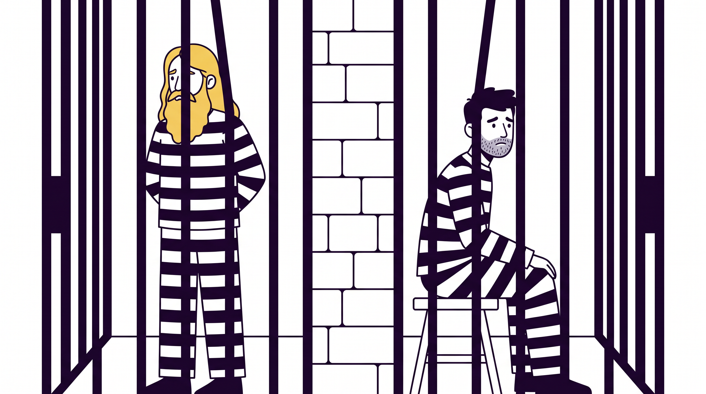
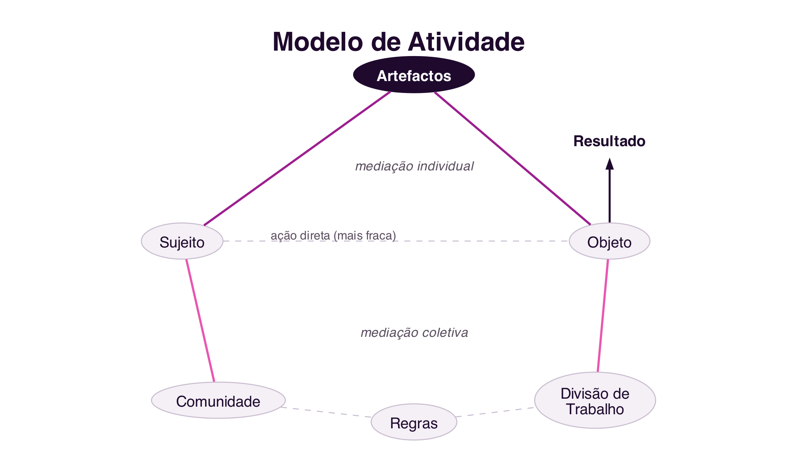
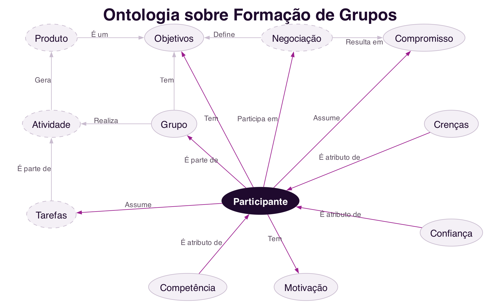
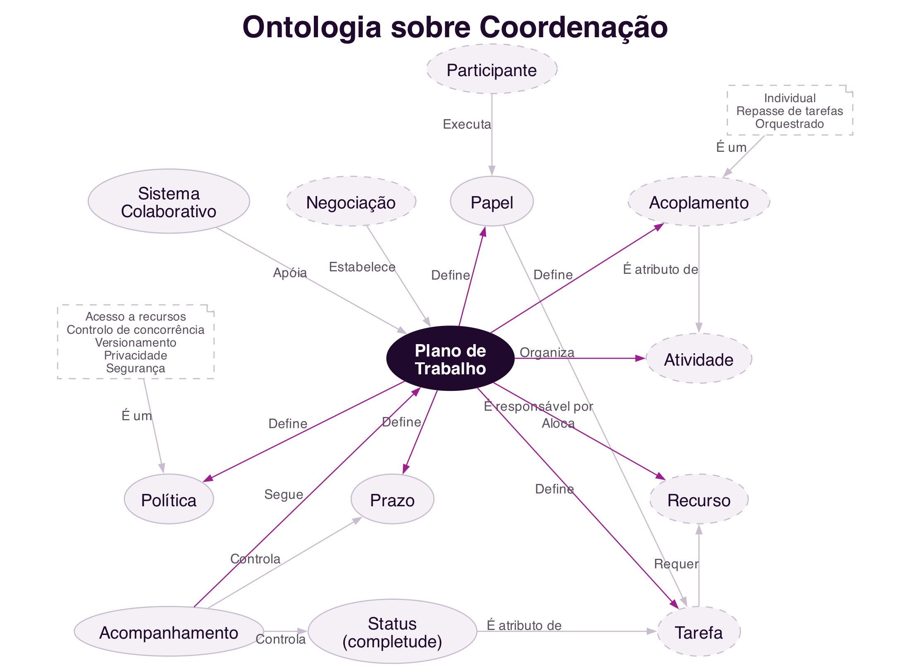
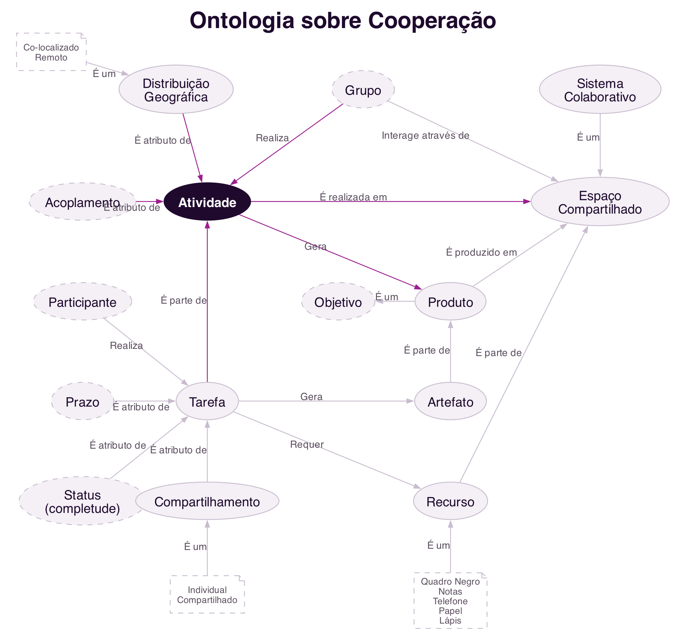
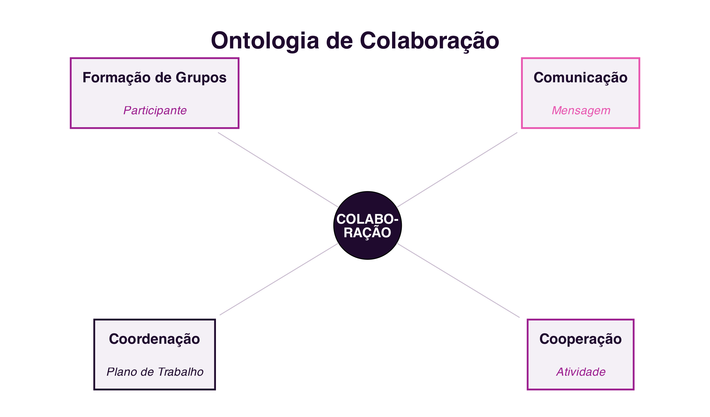

```{=html}
<div class="hero hero-chapter" style="background-image: linear-gradient(to top, rgba(31,10,46,0.88) 0%, rgba(31,10,46,0.6) 20%, rgba(31,10,46,0.15) 45%, rgba(31,10,46,0) 65%), url('../assets/images/heroes/cap04.jpg');">
  <div class="hero-badge">Capítulo 4</div>
  <h1>Teorias e Modelos de Colaboração</h1>
</div>
```

## Introdução {#sec-04-intro .unnumbered}

Os três capítulos anteriores trataram das **plataformas sociais**:
como a sociedade se organiza em rede, como essas redes se tornaram
plataformas digitais, e como analisá-las através de métricas e de
folksonomia. Este capítulo inicia um novo bloco, dedicado às
**plataformas colaborativas**, cujo objeto de estudo já não é a rede
social em si, mas o **trabalho em grupo** que ela pode suportar.

Antes de desenhar ou avaliar qualquer sistema colaborativo, é preciso
perceber que a colaboração não é um fenómeno vago ou puramente
intuitivo: pode ser **modelada**, isto é, descrita através de teorias e
modelos formais que ajudam a compreender porque as pessoas colaboram, o
que a colaboração exige, e onde tende a falhar. Este capítulo apresenta
quatro desses modelos: a Teoria dos Jogos, a Teoria da Atividade, o
Modelo 3C de Colaboração e uma ontologia de colaboração que integra os
conceitos anteriores [@FuksEtAl2011; @VivacquaGarcia2011].

## Porque Modelar a Colaboração? {#sec-04-modelar}

Um **modelo científico** é uma representação abstrata, lógica ou
matemática, de um fenómeno, construída para explicar, analisar e prever
esse fenómeno de forma sistemática [@FuksEtAl2011]. Uma das formas mais conhecidas de definir um modelo é através de uma fórmula matemática, mas também podem ser modelos gráficos, diagramas ou esquemas, como os que se seguem. Modelar a colaboração permite: em vez de decidir por
intuição como apoiar o trabalho de um grupo, é possível analisar
**que tipo** de trabalho está a ser feito, comparar situações diferentes
com os mesmos conceitos, e escolher ou desenhar sistemas colaborativos
com base nessa análise.

Os modelos apresentados neste capítulo respondem a perguntas diferentes,
mas complementares:

- A **Teoria dos Jogos** explica porque é racional colaborar, ou não
  colaborar, quando o resultado de cada participante depende também das
  decisões dos outros.
- A **Teoria da Atividade** explica como um ser humano, individualmente
  ou em grupo, realiza uma atividade mediada por ferramentas, numa
  comunidade regida por regras.
- O **Modelo 3C** decompõe qualquer trabalho colaborativo em três
  dimensões, comunicação, coordenação e cooperação, que qualquer sistema
  de suporte à colaboração tem de contemplar.
- A **Ontologia de Colaboração** integra estes conceitos numa rede de
  termos comuns, útil para quem projeta sistemas colaborativos.

## Teoria dos Jogos {#sec-04-jogos}

A **Teoria dos Jogos** estuda cenários de tomada de decisão estratégica,
em que o resultado final de cada participante depende não só da sua
própria decisão, mas também das decisões dos restantes participantes.
Cada jogador escolhe a sua estratégia depois de avaliar a situação dos
adversários e de antecipar as estratégias que estes poderão adotar
[@FuksEtAl2011]. A teoria tem origem na matemática e na economia, e os
seus primeiros estudos remontam ao século XVIII, mas foi sobretudo a
partir da publicação de *The Theory of Games and Economic Behavior*, por
John von Neumann e Oscar Morgenstern em 1944, e da noção de equilíbrio
proposta por John Nash na década de 1950, que se consolidou como área
autónoma.

Um conceito central para classificar estes cenários é a soma dos ganhos
de todos os jogadores. Num **jogo de soma nula** (*zero-sum game*), o
ganho de um jogador corresponde exatamente à perda dos restantes, a soma
total mantém-se sempre igual a zero: é o caso de um jogo de xadrez, ou
de uma partida de póker. Num
**jogo de soma não nula** (*non-zero-sum game*), o resultado global pode
variar consoante as decisões tomadas: é possível que todos os jogadores
ganhem, ou percam, em conjunto. Como se vê a seguir, o Dilema dos
Prisioneiros é um exemplo clássico de jogo de soma não nula.

### O Dilema dos Prisioneiros {#sec-04-dilema}

O exemplo mais conhecido da Teoria dos Jogos aplicado à colaboração é o
**Dilema dos Prisioneiros**, formalizado pelo matemático Albert W. Tucker.
Dois suspeitos são detidos pela polícia e interrogados em salas
separadas, sem poderem comunicar entre si. Não há provas suficientes
para os condenar por um crime maior, apenas por uma acusação menor, a
menos que um deles confesse. A cada um é proposto o mesmo acordo:

- Se **ambos ficarem em silêncio**, cada um cumpre 6 meses de prisão.
- Se **um confessar e o outro ficar em silêncio**, quem confessa fica
  livre e quem se cala cumpre 10 anos.
- Se **ambos confessarem**, cada um cumpre 6 anos.

{#fig-04-dilema-cena}

Estas quatro situações formam a **matriz de ganhos** do jogo
(@fig-04-dilema). Analisada individualmente, a melhor estratégia para
qualquer um dos suspeitos é confessar: se o cúmplice ficar em silêncio,
confessar liberta-o de imediato; se o cúmplice também confessar, ainda
assim confessar dá uma pena menor do que ficar calado sozinho. O
paradoxo é que, se **ambos** raciocinarem desta forma individualmente
racional, ambos confessam e cumprem 6 anos, um resultado pior para os
dois do que se tivessem colaborado e ficado ambos em silêncio, cumprindo
apenas 6 meses [@FuksEtAl2011].

{#fig-04-dilema}

O Dilema dos Prisioneiros mostra como a Teoria dos Jogos apoia a
compreensão de situações reais de colaboração: esclarece conceitos como
autointeresse, matriz de ganhos e jogos de soma não nula. Aplica-se a
cenários tão diversos como a negociação entre empresas concorrentes, a
gestão de um recurso partilhado por vários utilizadores, ou a decisão de
contribuir, ou não, para um projeto coletivo.

### *Tit-for-Tat*: a Evolução da Colaboração {#sec-04-tft}

Se, isoladamente, o Dilema dos Prisioneiros sugere que confessar,
traindo o cúmplice, é sempre a estratégia racional, a situação muda
quando o mesmo jogo se repete várias vezes entre os mesmos participantes.
Na década de 1970, o cientista político Robert Axelrod organizou
competições em que investigadores submetiam estratégias para versões
repetidas do Dilema dos Prisioneiros, competindo umas contra as outras ao
longo de muitas rondas. A estratégia vencedora, batizada
***tit-for-tat*** ("olho por olho"), foi proposta pelo matemático Anatol
Rapoport e segue apenas três regras [@Axelrod1984]:

1. Contribui primeiro: nunca sejas o primeiro a trair.
2. Se fores traído, retalia na ronda seguinte.
3. Depois de retaliar, está disposto a perdoar e a voltar a colaborar.

Numa versão repetida do jogo, colaborar deixa de ser irracional: a
expectativa de voltar a encontrar o mesmo adversário faz com que a
traição tenha um custo futuro, a retaliação do outro jogador. O
*tit-for-tat* mostrou-se, em repetidas simulações, mais eficaz a longo
prazo do que estratégias puramente egoístas, e é usado até hoje como
explicação de como a colaboração pode emergir e manter-se num cenário
competitivo, sem qualquer autoridade central a impor cooperação
[@Axelrod1984]. A mesma lógica ajuda a entender fenómenos tão distintos
como acordos comerciais informais entre empresas ou a reciprocidade
observada no comportamento de vários animais sociais.

### A Tragédia dos Comuns {#sec-04-comuns}

Nem todos os jogos relacionados com colaboração opõem apenas dois
jogadores. A **Tragédia dos Comuns** (*tragedy of the commons*),
descrita pelo ecologista Garrett Hardin em 1968 [@Hardin1968], ilustra o
que acontece quando vários participantes partilham um recurso comum e
limitado.

Imagine-se um terreno de pastagem partilhado por vários pastores, cada
um com o seu próprio rebanho. Para cada pastor, individualmente,
acrescentar mais uma ovelha ao seu rebanho é sempre vantajoso: o lucro
dessa ovelha extra é inteiramente seu, enquanto o custo do desgaste da
pastagem é repartido por todos os pastores que a partilham. Como este
raciocínio é válido para qualquer pastor, todos tendem a acrescentar o
máximo de animais que conseguirem. Chegado a determinado ponto, porém, o
número total de animais ultrapassa a capacidade da pastagem para se
regenerar: o pasto deixa de crescer, deixa de alimentar qualquer animal,
e todos os pastores saem a perder, incluindo aqueles que tinham sido
mais comedidos.

A Tragédia dos Comuns mostra que, quando o ganho de uma decisão
individual é privado mas o custo é partilhado por todo o grupo, a soma
das decisões racionais de cada participante pode destruir o próprio
recurso de que todos dependem. Por este motivo, a colaboração
sustentável em torno de um recurso partilhado raramente sobrevive apenas
com base na boa vontade: exige regras explícitas, aceites por todo o
grupo, e mecanismos que penalizem quem as viole, desde a reprovação
social até sanções formais, como multas ou a exclusão do grupo. É
precisamente este papel das regras enquanto elemento da colaboração que
a Teoria da Atividade, discutida de seguida, formaliza.

## Teoria da Atividade {#sec-04-atividade}

Enquanto a Teoria dos Jogos se concentra na decisão estratégica, a
**Teoria da Atividade** explica como os seres humanos realizam
atividades em situações do quotidiano, individualmente e em sociedade,
sendo particularmente útil para compreender a colaboração mediada por
tecnologia [@FuksEtAl2011].

Nesta teoria, a **atividade** é a unidade mínima de significado para
compreender as ações de um **sujeito**, uma pessoa ou um grupo, que age
sobre um **objeto**, algo concreto como um documento, ou abstrato como
uma decisão a tomar, com o fim de alcançar um objetivo. Um conceito
central da teoria é que essa ação nunca é direta: é sempre **mediada por
artefactos**, ferramentas físicas, como um computador, ou cognitivas,
como uma linguagem ou uma notação matemática. O artefacto atua sobre o
objeto, mas também tem uma ação reversa sobre o próprio sujeito,
molda a forma como este pensa e resolve problemas [@FuksEtAl2011].

Numa perspetiva coletiva, o sujeito não age isolado: está inserido numa
**comunidade**. Essa dimensão coletiva acrescenta dois novos elementos
de mediação: a **divisão de trabalho**, que organiza como o objeto é
transformado em resultado entre os vários sujeitos da comunidade, e as
**regras**, normas implícitas ou explícitas, convenções e relações
sociais estabelecidas na comunidade. O modelo completo, adaptado de
Yrjö Engeström [@Engestrom1987], é representado na @fig-04-atividade.

{#fig-04-atividade}

Um exemplo aplicado à sala de aula ilustra o modelo: o sujeito é um
estudante ou um grupo de estudantes; o objeto é o problema ou o trabalho
a realizar; o artefacto é o sistema computacional, o computador, ou
mesmo a linguagem usada para comunicar; a comunidade é a turma; a
divisão de trabalho é a forma como as tarefas do trabalho de grupo são
repartidas; e as regras são, por exemplo, os critérios de avaliação
definidos pelo docente. Ao introduzir um novo artefacto, como uma
plataforma colaborativa, muda-se a forma como a atividade é realizada, o
que pode criar novos problemas mas também novas possibilidades, e é
exatamente aqui que o desenho de sistemas colaborativos intervém.

## Modelo 3C de Colaboração {#sec-04-3c}

O **Modelo 3C de Colaboração** analisa qualquer trabalho em grupo em
três dimensões: **comunicação**, **coordenação** e **cooperação**. Tem
origem numa classificação proposta por Ellis, Gibbs e Rein em 1991 para
os sistemas de suporte ao trabalho em grupo [@EllisEtAl1991], mais tarde
formalizada como modelo próprio:

- **Comunicação**: a troca de mensagens entre pessoas, através da qual
  se negoceia e se assumem compromissos.
- **Coordenação**: a gestão de pessoas, atividades e recursos, para que
  o trabalho de vários participantes se articule sem conflitos nem
  desperdício de esforço.
- **Cooperação**: a atuação conjunta no espaço de trabalho partilhado,
  para a produção efetiva de objetos ou informação.

Estas três dimensões não são independentes: inter-relacionam-se para
que a colaboração aconteça (@fig-04-3c). Ao comunicar, os participantes
tomam decisões que exigem coordenação; ao coordenar, reorganizam tarefas
que podem exigir nova comunicação; e a cooperação efetiva no espaço
partilhado gera informação que realimenta tanto a coordenação como a
comunicação.

{#fig-04-3c}

A colaboração não é a única forma de organizar o trabalho em grupo. Um
modelo alternativo, típico de organizações militares e da linha de
montagem industrial clássica, é o de **Comando e Controlo** (C2): uma
autoridade central decide o que deve ser feito e define previamente
todas as tarefas, substituindo a coordenação distribuída pela supervisão
direta, e eliminando praticamente a necessidade de comunicação e
negociação entre quem executa o trabalho. Para que um trabalho em grupo
seja verdadeiramente caracterizado como colaboração, e não apenas como
execução coordenada de ordens, é preciso que ocorram, de facto,
comunicação, coordenação **e** cooperação, tal como representado no
Modelo 3C.

## Ontologia de Colaboração {#sec-04-ontologia}

Os três modelos anteriores explicam aspetos distintos da colaboração,
mas usam, por vezes, termos e níveis de detalhe diferentes. Uma
**ontologia** é a descrição de um domínio, negociada por uma comunidade,
para um determinado fim: cria uma base terminológica comum, o que
facilita a comunicação entre quem trabalha na área e permite que
sistemas computacionais produzam informação de forma inteligível sobre
esse domínio [@VivacquaGarcia2011].

Partindo do mesmo modelo de Ellis e colaboradores usado no Modelo 3C
[@EllisEtAl1991], a ontologia de colaboração organiza-se em quatro
partes, cada uma com um conceito central [@VivacquaGarcia2011]: a
**formação de grupos**, a **comunicação**, a **coordenação** e a
**cooperação**.

### Formação de Grupos {#sec-04-ontologia-grupos}

O elemento central desta parte é o **participante**. Um participante
assume tarefas, é parte de um grupo e participa nas negociações que
definem os objetivos comuns; para tal, requer duas coisas essenciais:
**confiança**, a crença partilhada de que se pode contar com os outros
participantes, e **motivação**, sem a qual dificilmente se compromete
com uma proposta. O grupo, por sua vez, realiza uma atividade que gera
um produto, e esse produto é ele próprio um tipo de objetivo
(@fig-04-ontologia-grupos).

{#fig-04-ontologia-grupos}

### Comunicação {#sec-04-ontologia-comunicacao}

O elemento central é a **mensagem**. Um emissor codifica e envia uma
mensagem, que segue um protocolo de comunicação partilhado com o
recetor, e que o recetor recebe e interpreta; ambos partilham ainda um
senso comum que torna a interpretação possível. A mensagem tem também
três atributos que a condicionam: a **forma** (linguística, simbólica,
corporal, entre outras), o **meio de transmissão** (desde o presencial
ao sistema computacional) e o **síncronismo** (síncrona ou assíncrona).
É através da mensagem que a negociação se realiza, e é dela que
resultam os compromissos assumidos pelos participantes
(@fig-04-ontologia-comunicacao).

{#fig-04-ontologia-comunicacao}

### Coordenação {#sec-04-ontologia-coordenacao}

O elemento central é o **plano de trabalho**, apoiado pelo sistema
colaborativo e estabelecido pela negociação. O plano de trabalho define
os papéis de cada participante e o acoplamento entre atividades, define
ainda políticas, prazos e a alocação de recursos, e organiza a
atividade em tarefas concretas. O acompanhamento controla o cumprimento
dos prazos e o estado de completude de cada tarefa, que por sua vez
requer os recursos necessários à sua execução (@fig-04-ontologia-coordenacao).

{#fig-04-ontologia-coordenacao}

### Cooperação {#sec-04-ontologia-cooperacao}

O elemento central é a **atividade**, realizada por um grupo com uma
determinada distribuição geográfica (colocalizada ou remota) e um
determinado acoplamento entre participantes. A atividade é realizada
num espaço de trabalho partilhado, e gera um produto, composto por
artefactos concretos. Essa produção decompõe-se em tarefas, que
requerem recursos e que podem ser individuais ou partilhadas por vários
participantes em simultâneo (@fig-04-ontologia-cooperacao).

{#fig-04-ontologia-cooperacao}

### Síntese da Ontologia {#sec-04-ontologia-sintese}

A @fig-04-ontologia sintetiza estas quatro partes: a colaboração
acontece quando participantes motivados se agrupam em torno de um
objetivo comum, comunicam através de mensagens para negociar tarefas e
assumir compromissos, coordenam o trabalho através de um plano que
organiza essas tarefas, e cooperam, produzindo artefactos num espaço
partilhado. Sem qualquer um destes quatro elementos, dificilmente há
colaboração [@VivacquaGarcia2011].

{#fig-04-ontologia}

Uma ontologia de colaboração é útil sobretudo para quem projeta sistemas
colaborativos: ajuda a verificar que aspetos importantes do trabalho em
grupo, como a confiança entre participantes ou a existência de um plano
de trabalho explícito, não estão a ser esquecidos no desenho de um novo
sistema.

## Síntese {#sec-04-sintese}

Este capítulo apresentou quatro modelos que fundamentam o estudo da
colaboração:

1. A **Teoria dos Jogos** distingue jogos de soma nula, em que o ganho
   de um implica a perda equivalente de outro, de jogos de soma não
   nula, em que o resultado global pode variar; o **Dilema dos
   Prisioneiros** é um exemplo do segundo tipo, e mostra que a decisão
   individualmente racional pode ser coletivamente pior do que colaborar
   [@FuksEtAl2011]
2. Em versões repetidas do jogo, a estratégia *tit-for-tat* mostra como
   a colaboração pode emergir e manter-se sem autoridade central
   [@Axelrod1984]
3. A **Tragédia dos Comuns** mostra que a soma de decisões
   individualmente racionais pode destruir um recurso partilhado,
   justificando a necessidade de regras e penalizações na colaboração
   [@Hardin1968]
4. A **Teoria da Atividade** descreve como um sujeito age sobre um
   objeto, sempre mediado por artefactos e, na dimensão coletiva,
   também pela divisão de trabalho e pelas regras da comunidade
   [@Engestrom1987]
5. O **Modelo 3C** decompõe a colaboração em comunicação, coordenação e
   cooperação, distinguindo-a do modelo de Comando e Controlo
   [@EllisEtAl1991]
6. A **Ontologia de Colaboração** integra estes conceitos, atribuindo um
   elemento central a cada uma das quatro partes: participante, mensagem,
   plano de trabalho e atividade [@VivacquaGarcia2011]

## Para Refletir {#sec-04-reflexao}

Pensa num trabalho de grupo em que participaste recentemente: consegues
identificar, nesse trabalho, os três Cs, comunicação, coordenação e
cooperação? Havia algum deles claramente mais fraco do que os outros, e
que problemas concretos é que isso causou?

E quanto ao *tit-for-tat*: consegues pensar nalguma relação, de
trabalho, de amizade ou entre organizações, em que a colaboração se
mantém precisamente porque se espera voltar a interagir com a outra
parte no futuro? Consegues também pensar num exemplo de Tragédia dos
Comuns que tenhas observado, e que regras ou penalizações, formais ou
informais, existem, ou deveriam existir, para o evitar?

## Referências {#sec-04-referencias .unnumbered}

::: {#refs}
:::
