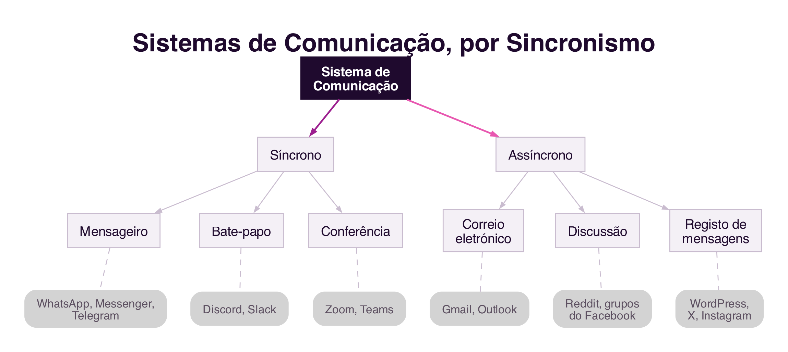

```{=html}
<div class="hero hero-chapter" style="background-image: linear-gradient(to top, rgba(31,10,46,0.88) 0%, rgba(31,10,46,0.6) 20%, rgba(31,10,46,0.15) 45%, rgba(31,10,46,0) 65%), url('../assets/images/heroes/cap05.jpg');">
  <div class="hero-badge">Capítulo 5</div>
  <h1>Sistemas de Comunicação para Colaboração</h1>
</div>
```

## Introdução {#sec-05-intro .unnumbered}

O capítulo anterior identificou a **comunicação** como uma das três
dimensões do Modelo 3C, a troca de mensagens através da qual os
participantes negoceiam e assumem compromissos sobre o trabalho a
realizar (@sec-04-3c). Este capítulo aprofunda essa dimensão: que
características distinguem a comunicação mediada por computador da
comunicação presencial, como classificar os diferentes sistemas de
comunicação, e como a linguagem que usamos para comunicar pode, ela
própria, ser uma forma de agir. Fecha com um olhar breve sobre os
sistemas que apoiam as outras duas dimensões do Modelo 3C, a
coordenação e a cooperação, para completar o quadro.

## Comunicação Mediada por Computador {#sec-05-cmc}

O computador tornou-se, sobretudo depois da interligação em rede, um
meio de comunicação humana. O **século XX** foi marcado pelos meios de
comunicação de massa, como a imprensa, a rádio e a televisão,
caracterizados pela difusão de informação a partir de uma central
editorial de grande porte, sem possibilidade de interação com a    audiência.
O **século XXI** é marcado pelas mídias sociais, caracterizadas pela produção
de conteúdo pelos próprios utilizadores e pela conversação entre
multidões, tal como discutido nos capítulos anteriores a propósito das
redes sociais [@PimentelEtAl2011].

A **Comunicação Mediada por Computador** (CMC) trouxe possibilidades
novas para a interação social: assincronicidade, ausência de interação
face a face, anonimato, privacidade, contacto contínuo com
interlocutores, comunidades virtuais, e conversação entre
multidões que nunca se encontram presencialmente. É também objeto de
investigação em CMC a diferença entre a interação *online* e
*offline*, e a cultura própria dos novos meios de comunicação
[@PimentelEtAl2011].

### O dialeto da internet {#sec-05-reoralizacao}

Um dos fenómenos mais estudados em CMC é a tentativa de textualizar a
informalidade da conversa presencial, um processo a que se chama
**reoralização** da linguagem escrita [@PimentelEtAl2011]. A ausência do
olhar, do tom de voz e da linguagem corporal é parcialmente compensada
por um conjunto de recursos linguísticos próprios da comunicação escrita
mediada por computador: *emoticons* e *emojis*, abreviações (`vc`, `pfv`),
onomatopeias (`kkkk`, `hahaha`), alongamentos vocálicos (`aaah`),
pontuação exagerada (`!!!`), maiúsculas para GRITAR, e a grafia fonética
de palavras (`aki` em vez de "aqui",  `tb pq` em vez de "Também porque" e muitas outras ). GIFs e figurinhas de reação
cumprem hoje uma função semelhante, substituindo por imagem aquilo que a expressão facial faria numa conversa presencial.

Este dialeto não é um desvio a corrigir, mas uma adaptação funcional ao
meio: representa uma tentativa de recuperar, através do texto, pistas
que a conversa presencial oferece gratuitamente. Conhecê-lo é necessário
para comunicar adequadamente através dos diferentes sistemas
computacionais de comunicação [@PimentelEtAl2011].

## Síncrono e Assíncrono {#sec-05-sincronismo}

Uma das formas mais tradicionais de classificar vv um sistema de
comunicação cruza duas dimensões independentes: o **tempo**, que
distingue comunicação **síncrona** (os interlocutores estão presentes
ao mesmo tempo no meio de comunicação e a mensagem é recebida de imediato), de comunicação
**assíncrona** (a mensagem é armazenada e pode ser recuperada mais
tarde); e o **local**, que distingue interlocutores colocados no mesmo
espaço físico de interlocutores em locais remotos [@EllisEtAl1991]
(@fig-05-espacotempo).

{#fig-05-espacotempo}

A conversa presencial é **síncrona**, com as pessoas partilhando em simultâneo o mesmo local onde se desenrola a comunicação; um *post-it* deixado na
secretária de alguém é **assíncrono** mas presencial - as pessoas atuam fisicamente no local da mensagem, mas não no mesmo tempo. A generalidade dos
sistemas de comunicação para colaboração, porém, situa-se na coluna
remota: o mensageiro instantâneo, o *chat* e a videoconferência são
síncronos e remotos, enquanto o correio eletrónico, os sistemas de
discussão, o *blog* e o *microblog* são assíncronos e remotos.

Esta distinção tem uma implicação técnica muitas vezes invisível para
quem usa estes sistemas: a comunicação síncrona remota depende, momento a
momento, da qualidade da ligação à rede entre os interlocutores. Se a
rede for lenta ou perder informação, mesmo que por um instante, a
videochamada congela, o áudio corta ou a mensagem chega fora de tempo,
porque não há margem para reenviar ou esperar sem quebrar a experiência
de tempo real. A comunicação assíncrona tolera muito melhor uma rede
instável, precisamente porque a mensagem pode ser armazenada e entregue
mais tarde sem que isso comprometa a comunicação: um correio eletrónico
que demore mais alguns segundos a chegar não altera em nada a
experiência de quem o lê. Este compromisso entre imediatismo e
fiabilidade acompanha, ainda hoje, a escolha entre sistemas síncronos e
assíncronos para uma dada tarefa colaborativa.

## Atos de Fala e a Conversação para Ação {#sec-05-atos-fala}

A teoria dos **Atos de Fala** (*speech acts*) mostra que a linguagem,
além de servir para descrever o mundo, também serve para **realizar
ações**. Um enunciado pode ser **constatativo**, uma afirmação, descrição
ou relato, ou **performativo**, uma frase que realiza uma **ação** com
consequências no momento em que é enunciada: ao dizer "declaro a sessão
aberta", o objetivo não é informar, mas sim, precisamente, abrir a
sessão. Esta teoria foi fundamentada nas conferências de John L. Austin
em Harvard, em 1955, publicadas postumamente em 1962 no livro *How to Do
Things with Words* [@Austin1962].

Na área dos sistemas colaborativos, um dos estudos mais conhecidos sobre
comunicação é a **conversação para ação**: os interlocutores trocam
mensagens para negociar e assumir compromissos sobre um trabalho a
realizar. Terry Winograd modelou este processo como uma sequência de
estados, em que cada transição de estado ocorre através de um ato de
fala [@Winograd1987] (@fig-05-conversacao).

{#fig-05-conversacao}

O processo inicia-se quando um interlocutor **solicita** uma tarefa a
outro. O segundo interlocutor pode **prometer** realizá-la, dando início
a um período de execução que termina quando o primeiro interlocutor
**afirma** estar satisfeito com o resultado e **declara** o processo
concluído. Em qualquer etapa, porém, o segundo interlocutor pode
**rejeitar** a solicitação, terminando o processo por um caminho
diferente. Este modelo mostra que, mesmo numa troca de mensagens
aparentemente simples, existe uma estrutura de negociação subjacente,
composta por atos de fala sucessivos que vão comprometendo os
interlocutores com o trabalho a realizar.

## Flaming, Trollagem e a Ausência de Pistas Sociais {#sec-05-flaming}

A investigação em CMC estuda também fenómenos negativos associados aos
novos meios de comunicação, como o **flaming** (mensagens agressivas e
discussões acaloradas) e a **trollagem**, a provocação deliberada de
outros interlocutores com o objetivo de gerar reações emocionais ou
perturbar uma conversa. Ambos os fenómenos são atribuídos principalmente
ao anonimato e à comunicação baseada apenas em texto, com ausência do
olho no olho e da linguagem não verbal que, numa conversa presencial,
moderam naturalmente o tom da interação [@PimentelEtAl2011].

Estes fenómenos distinguem-se do **cyberbullying**, já discutido no
Cap.1 (@sec-01-cyberbullying): o *cyberbullying* é um padrão sustentado de
assédio dirigido a uma vítima específica, com o objetivo de a magoar
repetidamente, enquanto o *flaming* e a *trollagem* podem ocorrer de forma
pontual, numa única troca de mensagens, sem que exista necessariamente
um alvo fixo ou a intenção de causar dano continuado. As mesmas
condições do meio, o anonimato e a ausência de pistas não verbais,
explicam a origem de ambos os fenómenos, mas a sua gravidade e
persistência são muito diferentes.

Devido ao facto de os utilizadores das plataformas de comunicação atuais não necessitarem de comprovar a sua entidade, é facilitada a expressão de opiniões e ideias, o que também pode levar a comportamentos agressivos ou provocatórios, como o *flaming* e a *trollagem*. As plataformas em uso, maioritariamente norte-americanas e chinesas, não têm mecanismos eficazes de identificação de identidade o que em muitos casos impossibilita a responsabilização dos agressores.

Na Europa, a legislação atual obriga as plataformas a identificar os seus utilizadores, o que reduz estes fenómenos. Por exemplo, em alternativa a um sistema como o `X`,  está em fase final de lançamento a plataforma social  `W social` ([https://wsocial.news](https://wsocial.news)), que permite a comunicação anónima, mas com a identificação dos utilizadores verificada obrigatóriamente com base em documentos de identidade formais (cartão de cidadão ou passaporte), que pode intervir em caso de abuso.

## Breve Evolução dos Sistemas de Comunicação {#sec-05-evolucao}

Os sistemas de comunicação para colaboração organizam-se em famílias,
consoante o género de conversação que estabelecem entre os
interlocutores: correio eletrónico, sistemas de discussão (lista,
fórum), mensageiro instantâneo, *chat*, áudio e videoconferência, 
registo de mensagens (*blog*, *microblog*) [@PimentelEtAl2011]. Cada família
partilha características e evolui de forma influenciada pelas famílias
anteriores, tal como uma espécie é influenciada pelas espécies de que
descende (@fig-05-tipos).

{#fig-05-tipos}

O correio eletrónico, entre os primeiros sistemas de comunicação da
internet, continua hoje central (`Gmail`, `Outlook`), embora tenha
incorporado características de outros sistemas, como o *chat*. Os
sistemas de discussão evoluíram das listas de correio para os grupos e
comunidades das redes sociais atuais, como os grupos do `Facebook` ou o
`Reddit`. O mensageiro instantâneo, que já existia antes da própria
internet como a conhecemos hoje, tem em aplicações como `WhatsApp`,
`Messenger` e `Telegram` os seus representantes mais populares. O
*chat* em grupo, historicamente associado ao IRC, sobrevive hoje em
plataformas como o `Discord` e o `Slack`. E o *blog*, o "diário de bordo"
pessoal dos anos 1990, deu origem ao *microblog*, hoje dominado por
plataformas como o `X` e o `Instagram`. 

Independentemente do sistema concreto, a análise comparativa mantém-se
válida: o sincronismo da comunicação, a quantidade de interlocutores
envolvidos, a linguagem usada, o tamanho das mensagens e a estruturação
do discurso continuam a determinar as características de qualquer novo
sistema de comunicação que venha a surgir.

## Sistemas de Coordenação e de Cooperação {#sec-05-coord-coop}

O Modelo 3C, apresentado no capítulo anterior, decompõe a colaboração em
três dimensões: comunicação, coordenação e cooperação (@sec-04-3c). Este
capítulo debruçou-se sobre a primeira; faz-se agora uma breve referência aos
sistemas que apoiam as outras duas.

### Sistemas de Coordenação {#sec-05-coordenacao}

A **coordenação** é o planeamento do trabalho em grupo [@SantoroEtAl2011].
Uma das formas mais comuns de apoiar a coordenação é através de
**processos de negócio**: um conjunto definido de passos para realizar
um trabalho, com objetivos, atividades, responsáveis e regras que
estabelecem a ordem de execução. Os sistemas de gestão de processos de
negócio, ou **BPMS** (*Business Process Management System*), são
sistemas colaborativos que apoiam a definição, a execução e o
acompanhamento destes processos, coordenando os diferentes participantes
envolvidos e mantendo um registo do estado de cada atividade
[@SantoroEtAl2011].

### Sistemas de Cooperação {#sec-05-cooperacao}

A **cooperação** exige que os participantes tenham **percepção**
(*awareness*) do que os outros estão a fazer no espaço de trabalho
partilhado, um estado mental de compreensão das ações e da presença dos
outros [@VieiraEtAl2011; @DourishBellotti1992]. Numa interação
presencial, esta perceção surge naturalmente, através da visão e da
audição; num sistema colaborativo, tem de ser explicitamente
comunicada, tipicamente através de notificações estruturadas em torno de
seis questões: quem, o quê, onde, quando, como e porquê.

A percepção reduz o isolamento e evita duplicação de trabalho e
conflitos, mas tem de ser desenhada com cuidado: em excesso, gera
sobrecarga de informação e é intrusiva. Um exemplo conhecido desta
tensão é o do assistente `Clippy` do `Microsoft Office`, rejeitado pelos
utilizadores por interromper constantemente o seu trabalho com sugestões
não solicitadas, substituído mais tarde por sugestões discretas,
ativadas apenas quando o próprio utilizador as procura
[@VieiraEtAl2011].

## Síntese {#sec-05-sintese}

Este capítulo caracterizou os sistemas de comunicação que suportam a
colaboração:

1. A **Comunicação Mediada por Computador** trouxe assincronicidade,
   anonimato e comunidades virtuais, e deu origem a um dialeto próprio,
   a **reoralização** da linguagem escrita [@PimentelEtAl2011]
2. A classificação **espaço-tempo** cruza sincronismo (síncrono ou
   assíncrono) com localização (colocado ou remoto); a comunicação
   síncrona depende, de forma mais crítica, da qualidade da rede
   [@EllisEtAl1991]
3. A teoria dos **Atos de Fala** mostra que a linguagem também realiza
   ações [@Austin1962]; o modelo da **conversação para ação**, de
   Winograd, descreve a negociação de um trabalho como uma sequência de
   atos de fala [@Winograd1987]
4. O **flaming** e a **trollagem** resultam do anonimato e da ausência
   de pistas não verbais na comunicação por texto, distintos do
   cyberbullying (@sec-01-cyberbullying) pela ausência de um padrão
   sustentado dirigido a uma vítima
5. Os sistemas de comunicação organizam-se em famílias (correio
   eletrónico, discussão, mensageiro, chat, conferência, registo de
   mensagens), cada uma evoluindo de forma influenciada pelas anteriores
   [@PimentelEtAl2011]
6. As outras duas dimensões do Modelo 3C também têm sistemas próprios:
   a **coordenação** apoia-se em processos de negócio e sistemas BPMS
   [@SantoroEtAl2011]; a **cooperação** exige **percepção** do que os
   outros participantes fazem no espaço partilhado, desenhada com
   cuidado para não se tornar intrusiva [@VieiraEtAl2011]

## Para Refletir {#sec-05-reflexao}

Pensa numa conversa recente por mensageiro instantâneo: consegues
identificar exemplos do "dialeto da internet" que usaste, emoticons,
abreviações, maiúsculas para dar ênfase? O que estarias a comunicar de
forma diferente se essa mesma conversa fosse por correio eletrónico, ou
presencialmente?

E quanto à conversação para ação: da próxima vez que pedires algo a
alguém por mensagem, repara nos atos de fala que usam, sem se
aperceberem, para negociar o compromisso, o pedido, a promessa, a
confirmação.

Toma como exemplo o `Whatsapp`: identifica as componentes do modelo 3C na forma como os grupos de conversa funcionam, e como a plataforma suporta cada uma delas. Pensa também nos mecanismos de percepção que a plataforma oferece, e como eles ajudam a coordenar o trabalho em grupo.

## Referências {#sec-05-referencias .unnumbered}

::: {#refs}
:::
