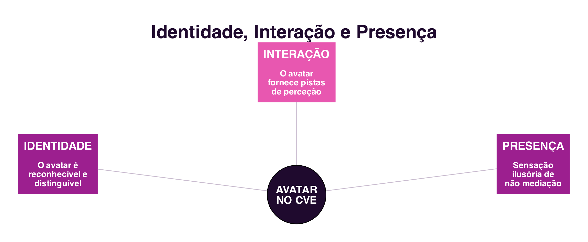

```{=html}
<div class="hero hero-chapter" style="background-image: linear-gradient(to top, rgba(31,10,46,0.88) 0%, rgba(31,10,46,0.6) 20%, rgba(31,10,46,0.15) 45%, rgba(31,10,46,0) 65%), url('../assets/images/heroes/cap06.jpg');">
  <div class="hero-badge">Capítulo 6</div>
  <h1>Ambientes Virtuais Colaborativos</h1>
</div>
```

## Introdução {#sec-06-intro .unnumbered}

Os dois capítulos anteriores trataram da colaboração mediada por texto e
por voz, os sistemas de comunicação (@sec-05-cmc) e os sistemas que
apoiam a coordenação e a cooperação (@sec-05-coord-coop). Este capítulo
explora uma forma diferente de mediar a colaboração: em vez de um canal
por onde passam mensagens, o computador passa a simular um **mundo
partilhado**, dentro do qual os participantes se encontram, navegam e
interagem. É essa mudança de metáfora, de canal de comunicação para
espaço partilhado, que distingue os Ambientes Virtuais Colaborativos.

## O que é um Ambiente Virtual Colaborativo? {#sec-06-cve}

Um **Ambiente Virtual Colaborativo**, ou **CVE** (*Collaborative Virtual
Environment*), é um sistema de realidade virtual distribuído que simula
graficamente, em tempo real, um mundo real ou imaginário, onde
utilizadores, representados pelos seus **avatares**, estão
simultaneamente presentes, navegam e interagem com objetos e com outros
utilizadores [@Raposo2011].

O conceito de CVE começou a popularizar-se junto com o termo
**ciberespaço**, cunhado por William Gibson no romance *Neuromancer*
[@Gibson1984] e já discutido no Cap.1 (@sec-01-sociedade-rede-castells).
Embora a origem seja a ficção científica, e a imersão física mostrada em
filmes como *Matrix* e *Avatar* continue distante da tecnologia real, o
conceito popularizado por Gibson influenciou de forma significativa
tanto os investigadores como os programadores de sistemas de realidade
virtual.

## Elementos de um CVE {#sec-06-elementos}

Três elementos são comuns a qualquer CVE, independentemente do nome que
a literatura lhe dê, *Networked Virtual Environment*, *Metaverse*, entre
outros (@fig-06-elementos):

- **Mundo virtual**: o elemento fundamental de um CVE, um espaço
  imaginário composto por uma descrição de objetos e pelas regras que os
  governam. A relação entre a descrição do mundo e a sua execução
  computacional é comparável à relação entre o guião de uma peça de
  teatro e a sua encenação em palco, com a diferença de que, num CVE, os
  utilizadores são também atores.
- **Avatares**: os objetos virtuais usados para representar cada
  participante. Cada mundo virtual é diferente, e para atuar nele é
  preciso incorporar um avatar próprio desse mundo.
- **Interatividade**: a capacidade de o mundo virtual responder às
  ações dos utilizadores, seja quando estes navegam e modificam a sua
  posição, seja quando selecionam e manipulam objetos. É a interatividade
  que distingue estar num CVE de assistir a um filme de animação.

{#fig-06-elementos}

## Imersão {#sec-06-imersao}

A soma de uma representação gráfica adequada do mundo virtual com uma
boa interatividade contribui para o sentimento de **imersão**, a
sensação de "estar lá" dentro do mundo virtual. Distinguem-se dois tipos
de imersão [@Raposo2011]:

- **Imersão mental**: o objetivo dos criadores de conteúdo desde muito
  antes dos CVEs existirem, o engajamento e o envolvimento do
  consumidor com esse conteúdo. A imersão mental pode ocorrer, por
  exemplo, ao ler-se um bom livro, sem qualquer representação física.
- **Imersão física**: estimula sinteticamente os sentidos, por meio da
  tecnologia, para fazer crer que o próprio corpo está no mundo virtual.
  Atualmente, é estimulada principalmente pela representação visual
  tridimensional (estereoscopia), pelo áudio espacial e por dispositivos
  de interação que captam os movimentos do utilizador. Os capacetes de
  realidade virtual atuais, como o `Meta Quest` ou o `Apple Vision Pro`,
  são a forma mais acessível, hoje, de obter imersão física.

Os CVEs vão além da imersão mental por investirem também na imersão
física. Na ficção científica, como nos filmes já referidos, a imersão
física é completa, ao ponto de o corpo real do utilizador deixar de ser
distinguível do avatar. Na prática, a maioria dos CVEs atuais ainda não
possui recursos de estereoscopia, mesmo sendo mundos virtuais em três
dimensões: não se deve confundir um CVE 3D, um espaço com três
dimensões de navegação, com um "filme em 3D" ou com um dispositivo de
realidade virtual estereoscópico, ainda que nada impeça que um CVE seja
também estereoscópico.

## Breve História dos CVEs {#sec-06-historia}

O primeiro CVE de que há registo, o *Maze War*, foi criado em 1974 num
centro de investigação da NASA: um jogo em que os utilizadores andavam
por um labirinto atirando uns nos outros, e que já continha ideias que
se tornariam padrão nos CVEs, a navegação em primeira pessoa e a
comunicação por mensagens instantâneas. Os esforços mais massivos
partiram do Departamento de Defesa dos Estados Unidos: o `SIMNET`,
desenvolvido a partir de 1983, treinava unidades militares em batalhas
virtuais simuladas, e deu origem a normas técnicas ainda hoje
influentes na simulação distribuída (@fig-06-historia).

{#fig-06-historia}

Entre os CVEs mais influentes da sua época contam-se o Second Life (2003, Linden Lab) e o World of Warcraft (2004, Blizzard). Ambos partilham a definição de CVE, mas têm
propósitos muito diferentes: o `World of Warcraft` é um jogo, com um
mundo de fantasia definido pelos seus criadores, enquanto o `Second
Life` é um CVE de "propósito geral", construído pelos próprios
utilizadores, com uma economia virtual própria convertível em moeda
real. Mais recentemente, plataformas como o `VRChat`, o `Meta Horizon
Worlds` e o `Roblox` retomam esta mesma ideia de mundo social massivo,
agora com suporte nativo para dispositivos de realidade virtual.

## Identidade, Interação e Presença {#sec-06-identidade}

Uma das ideias centrais por trás dos CVEs não é inventar novas
metáforas, mas sim reproduzir, no mundo virtual, noções já existentes no
mundo real: identidade, localização, presença e o andamento das
atividades dos outros participantes (@fig-06-ipp) [@Raposo2011].

{#fig-06-ipp}

A **identidade** está relacionada com o avatar do utilizador: espera-se
que este seja reconhecível de imediato como um avatar, e distinguível de
outros avatares, tal como reconhecemos de imediato outra pessoa e a
distinguimos de outras pessoas no mundo real.

A **interação** entre utilizadores de um CVE depende diretamente da
representação do avatar, que fornece as principais informações de
perceção sobre os outros participantes, a localização, a orientação e a
disponibilidade, num sentido muito próximo ao já discutido a propósito
da perceção em sistemas de cooperação (@sec-05-cooperacao). A
movimentação de um avatar antecipa as intenções do utilizador que
representa: virar as costas durante uma conversa mostra desinteresse,
tal como aproximar-se de outro avatar pode indicar vontade de interagir
com ele.

A **presença**, originalmente chamada de "telepresença", é "a perceção
ilusória de não mediação" [@LombardDitton1997]: o utilizador não
perceciona um meio durante a sua interação, comportando-se como se esse
meio não existisse. Distinguem-se a presença física, a sensação de estar
num lugar real ou virtual, e a presença social, a sensação de estar,
física ou psicologicamente, com outra pessoa. Num CVE, a presença
envolve as duas dimensões: a sensação de estar no mundo virtual
(imersão) e, ao mesmo tempo, a sensação de lá estar acompanhado.

## Comunidades Virtuais {#sec-06-comunidades}

Seja qual for o seu propósito, jogo, socialização, educação ou
economia, um CVE dá quase sempre origem a uma **comunidade virtual**,
com regras sociais próprias e uma cultura particular. A metáfora
espacial dos CVEs promove tanto encontros casuais entre desconhecidos
como a colaboração entre conhecidos, de uma forma geralmente mais
motivadora do que os sistemas colaborativos desktop discutidos nos
capítulos anteriores.

Como em qualquer sociedade, comportamentos inadequados também
acontecem nos CVEs: vandalismo, perturbação de outros utilizadores, ou
mesmo assédio, ecos, num espaço tridimensional, do *flaming*, da
trollagem e do cyberbullying já discutidos a propósito da comunicação
por texto (@sec-05-flaming, @sec-01-cyberbullying). As empresas
responsáveis por estes ambientes precisam de lidar com estes
comportamentos tal como qualquer outra plataforma social.

## Síntese {#sec-06-sintese}

Este capítulo introduziu os Ambientes Virtuais Colaborativos:

1. Um **CVE** simula um mundo partilhado, em vez de servir apenas como
   canal de comunicação, composto por um mundo virtual, avatares e
   interatividade [@Raposo2011]
2. A **imersão** pode ser mental (o engajamento com o conteúdo) ou
   física (a estimulação sintética dos sentidos, hoje sobretudo através
   de capacetes ou óculos de realidade virtual)
3. O primeiro CVE de que há registo foi o `Maze War` (1974); o `SIMNET`
   (1983) trouxe os primeiros esforços massivos de desenvolvimento; o
   `Second Life` e o `World of Warcraft` continuam, décadas depois, entre
   os CVEs mais bem-sucedidos
4. Os CVEs reproduzem noções do mundo real: **identidade** (o
   reconhecimento do avatar), **interação** (mediada pela perceção que o
   avatar fornece) e **presença** (a sensação ilusória de não mediação)
   [@LombardDitton1997]
5. Todo o CVE dá origem a uma **comunidade virtual**, com regras
   sociais próprias, onde também podem ocorrer comportamentos
   inadequados

## Para Refletir {#sec-06-reflexao}

Se já usaste algum ambiente virtual colaborativo, um jogo multijogador,
uma reunião em realidade virtual, ou uma plataforma como o `Roblox` ou o
`VRChat`, pensa no teu avatar: até que ponto ele representa a tua
identidade real? O que escolheste mudar, e porquê?

E quanto à presença social: consegues identificar um momento em que te
sentiste genuinamente "acompanhado" num espaço virtual, mesmo sabendo
que as outras pessoas estavam fisicamente longe?

## Referências {#sec-06-referencias .unnumbered}

::: {#refs}
:::
