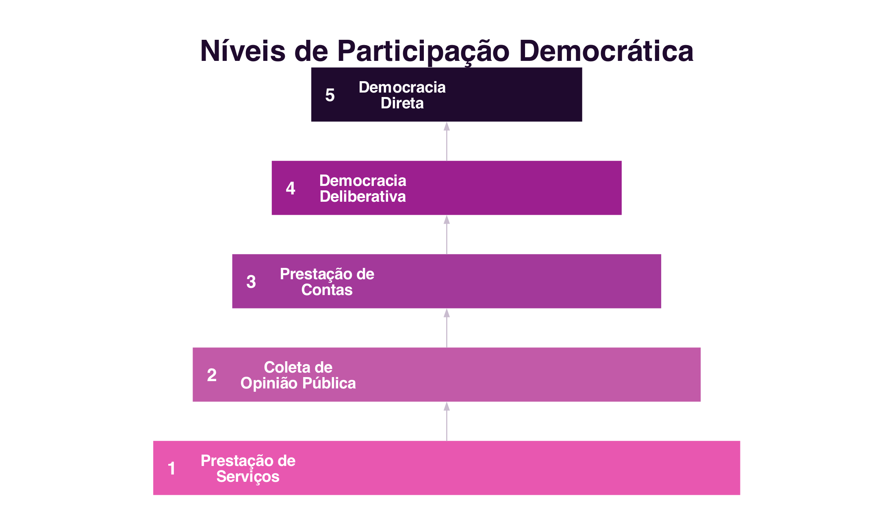

```{=html}
<div class="hero hero-chapter" style="background-image: linear-gradient(to top, rgba(31,10,46,0.88) 0%, rgba(31,10,46,0.6) 20%, rgba(31,10,46,0.15) 45%, rgba(31,10,46,0) 65%), url('../assets/images/heroes/cap07.jpg');">
  <div class="hero-badge">Capítulo 7</div>
  <h1>Democracia Eletrónica</h1>
</div>
```

## Introdução {#sec-07-intro .unnumbered}

O capítulo anterior mostrou como os Ambientes Virtuais Colaborativos
recriam, no espaço digital, formas de identidade, interação e presença
próprias do mundo real (@sec-06-identidade). Este capítulo aplica uma
lógica semelhante a um domínio distinto: a participação política. As
mesmas tecnologias de interação social que ligam comunidades virtuais
podem também mediar a relação entre cidadãos e governo, mas fazê-lo não
é automático: a tecnologia, por si só, não gera mais democracia. O
que determina o resultado é o **nível de participação** desenhado no
sistema.

## Governo Eletrónico e Democracia Eletrónica {#sec-07-governo-eletronico}

As tecnologias de interação social têm possibilitado novas formas de
expressão e mobilização política dos cidadãos. Um caso histórico
ilustra bem este potencial: em 2009, durante os protestos que se
seguiram à reeleição contestada do presidente do Irão, os
manifestantes contornaram a censura estatal e usaram o `Twitter` para
relatar, em tempo real, o que acontecia no país, numa altura em que o
governo tinha bloqueado o acesso às redes sociais [@AraujoEtAl2011].
Este episódio tornou-se uma referência sobre o potencial político das
redes sociais, embora, como se verá adiante, a tecnologia sozinha não
seja garantia de participação democrática efetiva.

É importante distinguir dois conceitos próximos, mas diferentes:

- O **Governo Eletrónico** (e-Gov) designa toda a prestação de serviços
  e informações, de forma eletrónica, do governo para os cidadãos, as
  empresas e outros níveis de governo, 24 horas por dia, sete dias por
  semana [@AraujoEtAl2011]. É, essencialmente, uma questão de eficiência
  administrativa.
- A **Democracia Eletrónica** (e-Democracia) vai além: designa o
  conjunto de discursos, teorizações e experimentações que empregam as
  tecnologias de informação e comunicação para mediar relações
  políticas, tendo em vista a participação democrática nos sistemas
  políticos contemporâneos [@AraujoEtAl2011]. Não trata apenas de
  melhorar a qualidade dos serviços públicos, mas de criar novos
  processos e novos relacionamentos entre governantes e governados.

A distinção importa porque um portal de serviços públicos eficiente,
por si só, não é Democracia Eletrónica: pode facilitar a vida do
cidadão sem lhe dar qualquer participação nas decisões políticas.

## Níveis de Participação Democrática {#sec-07-niveis}

Para desenvolver soluções de apoio à Democracia Eletrónica, é preciso
antes definir o nível de participação e interação que se deseja
alcançar entre governo e cidadãos. O **Modelo de Níveis de Participação
Democrática** [@Gomes2004], adaptado de uma proposta anterior de
classificação da participação cidadã em níveis crescentes de poder
[@Arnstein1969], organiza-se em cinco níveis (@fig-07-niveis):

{#fig-07-niveis}

1. **Prestação de Serviços**: disponibilização de informações e
   serviços públicos. A interação é predominantemente de mão única: o
   governo disponibiliza, o cidadão consome.
2. **Coleta de Opinião Pública**: o governo usa as TIC como canal de
   consulta, mas continua a ser uma interação predominantemente de mão
   única, já que não se compromete a agir de acordo com a opinião
   recolhida.
3. **Prestação de Contas**: transparência sobre a ação governamental,
   com a informação disponibilizada sujeita a explicação e justificação.
   A decisão política continua a ser do Estado, mas a participação do
   cidadão é mais efetiva.
4. **Democracia Deliberativa**: a decisão política é tomada após
   discussões de convencimento mútuo entre Estado e sociedade civil, que
   deixa de ser apenas consultada e passa a coproduzir a decisão.
5. **Democracia Direta**: a tomada de decisão não passa por uma esfera
   política representativa; o cidadão ocupa o lugar do Estado na decisão.

Os níveis não são exclusivos entre si, e a maioria das iniciativas reais
de Democracia Eletrónica concentra-se ainda nos níveis mais básicos, de
prestação de serviços e de informação. Em Portugal, o portal
`ePortugal.gov.pt` e a `Chave Móvel Digital` são exemplos do primeiro
nível; os processos de consulta pública disponíveis em `participa.pt`
aproximam-se do segundo e do terceiro nível; e o **Orçamento
Participativo Portugal**, em que qualquer cidadão pode propor e votar
projetos de investimento público a financiar pelo Orçamento do Estado,
é um exemplo nacional próximo do quarto nível, já que a proposta e a
priorização partem diretamente dos cidadãos, ainda que a decisão final
de execução caiba ao Estado.

## Aspetos para Apoiar a Participação Democrática {#sec-07-aspetos}

Uma vez definido o nível de participação desejado, é preciso identificar
os requisitos dos sistemas que o vão apoiar. Três aspetos são fontes
centrais desses requisitos [@AraujoEtAl2011] (@fig-07-aspetos):

{#fig-07-aspetos}

- **Colaboração** entre participantes: o delineamento da interação
  segue a mesma lógica do Modelo 3C já discutido (@sec-04-3c),
  comunicação, coordenação e cooperação entre cidadãos e governo, com
  particular ênfase na perceção transversal às três dimensões.
- **Transparência** de ações e informações: políticas, padrões e
  procedimentos que tornem a informação acessível, com qualidade de
  conteúdo, entendimento e auditabilidade.
- **Memória** da discussão e da deliberação: organização,
  armazenamento, recuperação e rastreabilidade do conhecimento
  acumulado ao longo do processo democrático, através de históricos de
  discussão, artefactos e decisões tomadas.

Estes três aspetos são transversais a todos os níveis de participação:
mesmo uma simples prestação de serviços beneficia de mais colaboração
entre os utilizadores, de mais transparência sobre os processos, e de
memória sobre pedidos anteriores, ainda antes de a instituição avançar
para níveis mais exigentes de participação democrática.

## Síntese {#sec-07-sintese}

Este capítulo tratou da relação entre tecnologia e participação
política:

1. O **Governo Eletrónico** (prestação eletrónica de serviços) e a
   **Democracia Eletrónica** (mediação tecnológica das relações
   políticas) são conceitos próximos, mas distintos: o primeiro não
   implica o segundo [@AraujoEtAl2011]
2. Os **Níveis de Participação Democrática** vão da prestação de
   serviços à democracia direta, e a maioria das iniciativas reais
   concentra-se ainda nos níveis mais básicos [@Gomes2004; @Arnstein1969]
3. Três aspetos apoiam a Democracia Eletrónica em qualquer nível:
   **colaboração** (o Modelo 3C aplicado à relação entre cidadão e
   governo), **transparência** e **memória** [@AraujoEtAl2011]

## Para Refletir {#sec-07-reflexao}

Pensa num serviço público que já tenhas usado online, uma câmara
municipal, a segurança social, as finanças. Em que nível de participação
democrática o classificarias? Que mudanças o levariam a um nível
seguinte?

E quanto ao Orçamento Participativo Portugal, ou a uma iniciativa
semelhante que conheças: até que ponto achas que a proposta e o voto dos
cidadãos influenciam mesmo a decisão final, e até que ponto a decisão
continua, na prática, nas mãos do Estado?

## Referências {#sec-07-referencias .unnumbered}

::: {#refs}
:::
