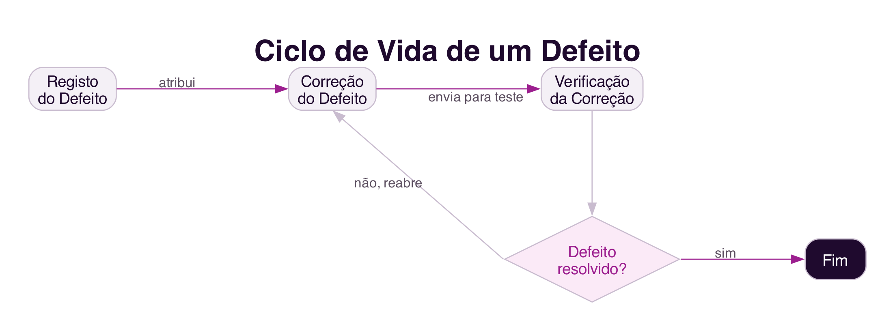

```{=html}
<div class="hero hero-chapter" style="background-image: linear-gradient(to top, rgba(31,10,46,0.88) 0%, rgba(31,10,46,0.6) 20%, rgba(31,10,46,0.15) 45%, rgba(31,10,46,0) 65%), url('../assets/images/heroes/cap08.jpg');">
  <div class="hero-badge">Capítulo 8</div>
  <h1>Desenvolvimento Colaborativo de Software</h1>
</div>
```

## Introdução {#sec-08-intro .unnumbered}

Os capítulos anteriores discutiram a colaboração em espaços virtuais e
na relação entre cidadãos e governo. Este capítulo volta-se para um
domínio mais próximo de quem estuda Computação: o desenvolvimento de
software é, ele próprio, uma atividade profundamente colaborativa,
raramente realizada por uma só pessoa, e cada vez mais realizada por
equipas geograficamente distribuídas.

## Desenvolvimento de Software como Atividade Colaborativa {#sec-08-atividade-colaborativa}

O sucesso de uma organização depende cada vez mais do software que usa
como diferencial competitivo, e o desenvolvimento desse software é
raramente uma atividade individual: diversos especialistas precisam de
trabalhar em conjunto, coordenar as suas atividades, tomar decisões e
comunicar continuamente para desenvolver software de qualidade dentro do
prazo e do custo estimados [@SouzaEtAl2011].

A colaboração organiza-se em torno de **modelos**, abstrações do
software que está a ser construído: especificações de requisitos,
diagramas de classes, casos de uso, e o próprio código-fonte. Os modelos
não são independentes uns dos outros: uma alteração no diagrama de
classes de um software, por exemplo, exige normalmente alterações
correspondentes no código-fonte, para que os dois modelos permaneçam
consistentes entre si. Esta dependência torna a coordenação entre
programadores particularmente importante, pois alterações desalinhadas
entre modelos tendem a gerar erros [@SouzaEtAl2011].

## Programação em Pares {#sec-08-pares}

A **programação em pares** (*pair programming*) é uma prática proposta
pelo método ágil *Extreme Programming*, em que dois programadores
trabalham juntos num único computador: um escreve o código enquanto o
outro o revê em tempo real, questiona decisões de implementação e
procura casos de teste que possam falhar [@SouzaEtAl2011].

Não se trata de uma pessoa a programar enquanto outra apenas assiste,
mas de um diálogo constante entre duas pessoas que procuram, em
conjunto, uma solução melhor do que a que cada uma alcançaria sozinha. O
código é revisto por duas pessoas em tempo real, o que reduz a
possibilidade de defeitos e acelera a partilha de conhecimento entre um
programador mais experiente e outro menos experiente. Como qualquer
prática colaborativa, exige uma mudança cultural: a evidência sugere
que a produtividade aumenta com a prática, à medida que a dupla aprende
a comunicar e a dividir melhor o trabalho entre si [@SouzaEtAl2011].

## Sistemas de Controlo de Versão {#sec-08-versao}

O **controlo de versão** é a disciplina responsável por controlar a
evolução e a integridade de um produto de software ao longo do tempo,
identificando, registando e coordenando as alterações feitas por
diferentes membros da equipa [@SouzaEtAl2011]. Sistemas como o `Git`,
hoje o mais usado, mantêm um repositório central com o histórico
completo do código, do qual cada programador copia uma área de trabalho
própria (@fig-08-versao).

{#fig-08-versao}

Um sistema de controlo de versão apoia a colaboração de várias formas: gera
um registo de alterações que serve de memória partilhada sobre a
evolução do produto; fornece informação de perceção sobre o que os
colegas estão a fazer, notificando alterações; e possibilita a
coordenação de dependências entre atividades, seja por meio de um
desenvolvimento sequencial, seja em paralelo, com integração posterior
do trabalho de cada pessoa. Plataformas como o `GitHub` e o `GitLab`
integram hoje o controlo de versão com a gestão de defeitos e a revisão
de código no mesmo sistema.

## Sistemas de Gestão de Defeitos {#sec-08-defeitos}

Um software raramente está livre de defeitos, encontrados pela equipa de
qualidade ou pelos próprios utilizadores. Os **sistemas de gestão de
defeitos**, como o `Bugzilla`, o `JIRA` ou os *issues* do `GitHub`,
apoiam o registo, a atribuição e o acompanhamento da resolução de
defeitos, envolvendo tipicamente vários atores em papéis distintos:
quem testa, quem desenvolve, e quem gere a equipa (@fig-08-defeitos)
[@SouzaEtAl2011].

{#fig-08-defeitos}

Um defeito é registado por quem o encontra, encaminhado para um
programador que trabalha na correção, e devolvido para verificação por
quem o reportou originalmente. Se a correção não for satisfatória, o
defeito é reaberto, reiniciando o ciclo. Além do registo e da solução,
estes sistemas possibilitam priorizar defeitos, gerar relatórios sobre o
estado de cada um, e identificar defeitos semelhantes ou já reportados,
o que é particularmente útil para equipas geograficamente distribuídas,
cujos membros nem sempre têm oportunidade de se encontrar pessoalmente
para discutir uma solução [@SouzaEtAl2011].

## Desenvolvimento Distribuído e Global {#sec-08-distribuido}

A globalização dos negócios refletiu-se também no desenvolvimento de
software: é cada vez mais comum que os membros de uma mesma equipa
estejam separados por distância física e temporal, e que um projeto
envolva participantes de diferentes países, culturas e fusos horários
[@SouzaEtAl2011].

A distância entre colaboradores tem um efeito bem documentado sobre a
colaboração. Um estudo clássico de Thomas Allen, em 1977, mostrou que a
frequência de colaboração entre engenheiros era inversamente
proporcional à distância física entre as suas secretárias: a partir de
cerca de 30 metros, a colaboração entre colegas diminuía de forma
acentuada [@SouzaEtAl2011]. O efeito é explicado pela perda de
oportunidades de **comunicação informal**, as conversas espontâneas de
corredor ou de máquina de café, sem qualquer agendamento prévio, através
das quais os colegas tomam conhecimento do andamento do trabalho uns dos
outros e encontram soluções conjuntas para problemas comuns.

Apesar de os sistemas colaborativos já discutidos ajudarem a reduzir a
distância entre pessoas, através de mensagens instantâneas e de
videoconferência, a distância física entre profissionais que precisam de
colaborar continua a ser um desafio real, a par de outros fatores como
as diferenças de fuso horário, de língua, de costumes e de normas
culturais entre equipas distribuídas [@SouzaEtAl2011].

## Síntese {#sec-08-sintese}

Este capítulo tratou do desenvolvimento de software como atividade
colaborativa:

1. O desenvolvimento de software organiza-se em torno de **modelos**
   interdependentes, cujas alterações exigem coordenação entre a equipa
   [@SouzaEtAl2011]
2. A **programação em pares** é uma prática colaborativa em que dois
   programadores trabalham em diálogo constante, reduzindo defeitos e
   partilhando conhecimento
3. Os **sistemas de controlo de versão**, hoje sobretudo baseados em
   `Git`, coordenam as alterações de uma equipa e mantêm um registo do
   histórico do produto
4. Os **sistemas de gestão de defeitos** apoiam o ciclo de vida
   colaborativo de um defeito, do registo à verificação da correção
5. O **desenvolvimento distribuído e global** é cada vez mais comum, mas
   a distância física entre colaboradores continua a prejudicar a
   comunicação informal, essencial para a colaboração

## Para Refletir {#sec-08-reflexao}

Se já trabalhaste num projeto de programação em grupo, pensa em como
foi feita a coordenação do código: usaram algum sistema de controlo de
versão? Como resolveram conflitos quando duas pessoas alteravam o mesmo
ficheiro?

E quanto à distância física: já sentiste, num trabalho de grupo, a
diferença entre resolver um problema presencialmente e tentar
resolvê-lo apenas por mensagem?

## Referências {#sec-08-referencias .unnumbered}

::: {#refs}
:::
