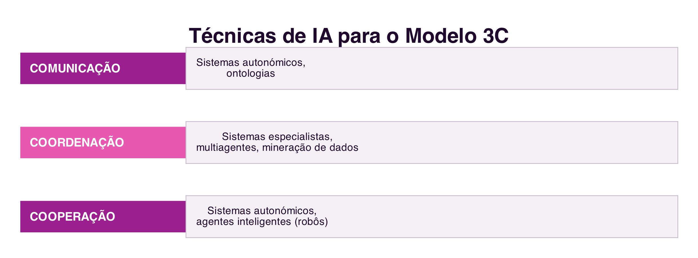

```{=html}
<div class="hero hero-chapter" style="background-image: linear-gradient(to top, rgba(31,10,46,0.88) 0%, rgba(31,10,46,0.6) 20%, rgba(31,10,46,0.15) 45%, rgba(31,10,46,0) 65%), url('../assets/images/heroes/cap10.jpg');">
  <div class="hero-badge">Capítulo 10</div>
  <h1>Sistemas de Recomendação e IA Colaborativa</h1>
</div>
```

## Introdução {#sec-10-intro .unnumbered}

O capítulo anterior mostrou como o conhecimento coletivo emerge da
combinação de contribuições humanas. Este capítulo trata de um passo
seguinte: sistemas que usam **Inteligência Artificial** (IA) para
automatizar parte desse trabalho coletivo, seja sugerindo o que pode
interessar a alguém a partir do comportamento de outros, seja apoiando
diretamente a comunicação, a coordenação e a cooperação de um grupo.

## Sistemas de Recomendação {#sec-10-recomendacao}

Um **Sistema de Recomendação** é um filtro de informação que apresenta,
a partir de grandes volumes de dados, os itens que provavelmente
interessam a um utilizador específico, sejam produtos, filmes, música
ou conteúdo [@MottaEtAl2011]. O princípio subjacente é simples: "o que é
relevante para mim também pode ser relevante para alguém com interesses
semelhantes". Praticamente toda a gente já usou um destes sistemas sem
lhe prestar atenção, das sugestões de produtos da `Amazon` às listas
"Descobertas da Semana" do `Spotify` ou às recomendações de séries do
`Netflix`.

### Métodos de Recomendação {#sec-10-metodos-recomendacao}

Existem três grandes famílias de métodos para gerar recomendações
(@fig-10-metodos) [@MottaEtAl2011]:

{#fig-10-metodos}

- **Recuperação direta da informação**: o sistema devolve itens que
  correspondem literalmente aos critérios de pesquisa do utilizador. É
  o método mais simples, mas a qualidade da recomendação depende
  inteiramente da pesquisa feita.
- **Filtragem colaborativa**: prevê o interesse de um utilizador num
  item a partir da correlação entre as suas avaliações e as de outros
  utilizadores com gostos semelhantes. É este o método que torna um
  Sistema de Recomendação verdadeiramente **colaborativo**: a
  contribuição de cada avaliação individual melhora a recomendação
  para toda a comunidade, ainda que essa colaboração seja assíncrona e
  os benefícios não sejam percebidos no momento da contribuição.
- **Filtragem por conteúdo**: prevê o interesse de um utilizador a
  partir das características do próprio conteúdo, comparando-as com o
  perfil de preferências já demonstrado por esse utilizador,
  independentemente do comportamento de outros.

A filtragem colaborativa é eficaz, mas tem um custo computacional
elevado e sofre do problema da **partida a frio**: um item novo, ainda
sem avaliações, não pode ser recomendado por este método, por melhor
que seja. A filtragem por conteúdo resolve esse problema específico, mas
depende de uma descrição rica e estruturada do conteúdo para funcionar
bem. Por isso, a maioria dos sistemas de recomendação atuais combina
vários métodos, entre os quais estes dois.

## Inteligência Artificial para Sistemas Colaborativos {#sec-10-ia-colaborativa}

Além de recomendar, técnicas de IA podem apoiar diretamente as três
dimensões do Modelo 3C (@sec-04-3c): a comunicação, a coordenação e a
cooperação [@GarciaEtAl2011] (@fig-10-mapeamento).

{#fig-10-mapeamento}

Algumas técnicas fundamentais, já maduras antes da IA generativa que se
segue, incluem:

- **Ontologias**: já discutidas no Cap.4 (@sec-04-ontologia), ajudam a
  garantir que emissor e recetor partilham as mesmas estruturas de
  linguagem, apoiando a comunicação.
- **Mineração de dados**: extrai padrões de grandes volumes de
  interações que seriam impossíveis de analisar manualmente, por
  exemplo, para recomendar competências ou identificar comportamentos
  recorrentes num grupo.
- **Sistemas especialistas e multiagentes**: apoiam a coordenação,
  detetando conflitos entre tarefas concorrentes, sugerindo a alocação
  de recursos ou gerindo a reputação dos participantes de um
  grupo.
- **Sistemas autonómicos**: monitorizam e protegem o espaço de trabalho
  partilhado, apoiando a cooperação de forma robusta e segura.

## A Atualização: IA Generativa e *Copilots* Colaborativos {#sec-10-atualizacao}

A área de IA aplicada à colaboração transformou-se profundamente na
década seguinte à publicação destas técnicas, com a chegada dos grandes
modelos de linguagem (*Large Language Models*, LLM) e da **IA
generativa**: sistemas como o `ChatGPT`, o `Gemini` ou o `Claude`, capazes
de gerar texto, código e imagens a partir de um pedido em linguagem
natural.

O impacto mais direto sobre a colaboração é o surgimento dos
***copilots***, assistentes de IA integrados diretamente nas ferramentas
colaborativas já discutidas neste livro. No desenvolvimento de software
(@sec-08-versao), o `GitHub Copilot` sugere código diretamente no
editor, tornando-se um terceiro participante silencioso ao lado da
programação em pares. Em ferramentas de escrita colaborativa, como o
`Google Docs` ou o `Notion`, assistentes de IA sugerem, resumem e
reescrevem conteúdo produzido em conjunto. E em sistemas de
comunicação (@sec-05-cmc), assistentes de reunião transcrevem, resumem
e distribuem atas automaticamente entre os participantes, uma forma
automatizada de **memória**, o mesmo aspeto já discutido a propósito da
Democracia Eletrónica (@sec-07-aspetos).

Estes *copilots* não substituem as técnicas mais antigas de IA
discutidas neste capítulo, antes as complementam: um assistente de
escrita colaborativa ainda beneficia de uma ontologia de domínio bem
definida, e um sistema de recomendação ainda depende de filtragem
colaborativa para saber o que sugerir. A diferença está na naturalidade
da interação, hoje possível através de linguagem natural em vez de
comandos ou formulários estruturados.

## Síntese {#sec-10-sintese}

Este capítulo tratou da aplicação da Inteligência Artificial aos
sistemas colaborativos:

1. Um **Sistema de Recomendação** filtra grandes volumes de informação
   para sugerir o que provavelmente interessa a um utilizador, através
   de recuperação direta, filtragem colaborativa ou filtragem por
   conteúdo [@MottaEtAl2011]
2. A **filtragem colaborativa** é o método mais diretamente
   colaborativo, mas sofre do problema da partida a frio para itens
   novos
3. Técnicas de IA como **ontologias**, **mineração de dados**,
   **sistemas especialistas e multiagentes** e **sistemas autonómicos**
   apoiam, cada uma, uma ou mais dimensões do Modelo 3C
   [@GarciaEtAl2011]
4. A **IA generativa** deu origem aos ***copilots*** colaborativos,
   assistentes integrados diretamente nas ferramentas de
   desenvolvimento, escrita e comunicação já discutidas neste livro

## Para Refletir {#sec-10-reflexao}

Pensa numa recomendação recente que recebeste, de um filme, produto ou
música, que te surpreendeu pela positiva: consegues perceber se
resultou de filtragem colaborativa (baseada em pessoas parecidas
contigo) ou de filtragem por conteúdo (baseada no que já consumiste)?

E quanto aos *copilots*: já usaste algum assistente de IA integrado
numa ferramenta colaborativa? Que tarefa te poupou, e que decisões
continuaste a reservar para ti e para os teus colegas?

## Referências {#sec-10-referencias .unnumbered}

::: {#refs}
:::
