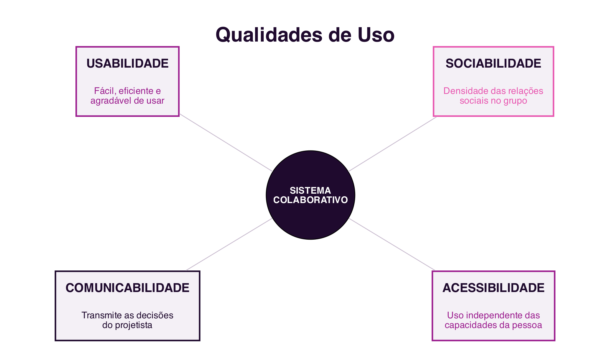

```{=html}
<div class="hero hero-chapter" style="background-image: linear-gradient(to top, rgba(31,10,46,0.88) 0%, rgba(31,10,46,0.6) 20%, rgba(31,10,46,0.15) 45%, rgba(31,10,46,0) 65%), url('../assets/images/heroes/cap11.jpg');">
  <div class="hero-badge">Capítulo 11</div>
  <h1>Mobilidade, Ubiquidade e Interação</h1>
</div>
```

## Introdução {#sec-11-intro .unnumbered}

Este último capítulo fecha o bloco dedicado às plataformas
cooperativas com duas questões complementares: como é que a
colaboração acompanha as pessoas para fora da secretária, através da
computação móvel e ubíqua; e como se avalia, de forma sistemática, se
um sistema colaborativo oferece uma boa experiência a quem o usa.

## Computação Móvel e Ubíqua {#sec-11-movel-ubiqua}

A **Computação Móvel** tem como foco a mobilidade: equipamentos
portáteis, telefonia celular e redes sem fios expandem os limites dos
locais e dos momentos em que é possível colaborar [@FilippoEtAl2011]. A
**Computação Ubíqua**, um termo cunhado por Mark Weiser em 1988,
enquanto trabalhava na Xerox PARC, tem um foco ligeiramente diferente:
a disponibilização contínua de serviços através de inúmeros objetos do
quotidiano com *software* embutido, cada vez menos percetíveis
enquanto computadores [@FilippoEtAl2011] (@fig-11-movel-ubiqua).

{#fig-11-movel-ubiqua}

Para Weiser, a Computação Ubíqua é a terceira era da computação: depois
da era dos computadores de grande porte, partilhados por vários
utilizadores, e da era dos computadores pessoais, um utilizador por
computador, segue-se a era em que cada utilizador usa, sem disso se
aperceber, vários dispositivos ao mesmo tempo. Mobilidade e ubiquidade
não são sinónimos: um portátil é móvel, mas não é ubíquo; um sensor
embutido numa porta é ubíquo, mas não é móvel. Muitos serviços
colaborativos de hoje combinam as duas dimensões.

## Localização {#sec-11-localizacao}

Uma grande parte dos serviços colaborativos móveis explora a
**localização** do utilizador: dispositivos móveis, equipados com GPS,
acelerómetro, bússola e giroscópio, informam onde o utilizador está e
para onde se dirige [@FilippoEtAl2011]. Os serviços que têm por base as
coordenadas geográficas de pessoas e elementos do mundo real e virtual
chamam-se **Serviços Baseados em Localização** (*Location Based
Services*, LBS).

Aplicações do dia a dia como o `Google Maps`, o `Uber` ou as aplicações
de entrega de comida usam a localização para coordenar encontros entre
pessoas, veículos e destinos que, de outra forma, exigiriam combinação
prévia e detalhada. Jogos como o `Pokémon GO` levam a mesma lógica ao
território da colaboração lúdica: tal como no *geocaching*, um jogo de
caça ao tesouro anterior aos telemóveis inteligentes, em que
coordenadas georreferenciadas guiam jogadores até objetos escondidos, a
localização transforma o espaço físico da cidade num tabuleiro de jogo
partilhado.

## Objetos Inteligentes {#sec-11-objetos-inteligentes}

A Computação Ubíqua deu origem à ideia de **objetos inteligentes**:
dispositivos de baixo custo, equipados com sensores e capacidade de
comunicação em rede, que deixam de ser inertes e passam a ter um
comportamento próprio, reagindo aos outros objetos, às pessoas e ao
ambiente à sua volta [@FilippoEtAl2011]. A este conjunto de objetos
ligados em rede chama-se hoje **Internet das Coisas** (*Internet of
Things*, IoT).

Uma casa inteligente, equipada com assistentes como o `Google Home` ou
a `Alexa`, fechaduras inteligentes e eletrodomésticos ligados em rede, é
o exemplo mais próximo do quotidiano de muitas pessoas. Um relógio
inteligente (*smartwatch*), como o `Apple Watch`, é outro exemplo:
comunica com o telemóvel do seu utilizador, mas também com outros
dispositivos e serviços, apoiando desde a comunicação até à
monitorização da saúde. Em conjunto, estes objetos interligados formam
um ecossistema colaborativo, em que cada dispositivo contribui com
dados e funcionalidades para os restantes. Um princípio central destes
objetos é a **tecnologia calma**: quanto mais dispositivos existem, mais
importante é que se tornem invisíveis no seu funcionamento, sem exigir
atenção constante de quem os usa [@FilippoEtAl2011].

## Infraestrutura: Redes sem Fios e Sensores {#sec-11-infraestrutura}

A computação móvel e ubíqua depende de uma infraestrutura tecnológica
que traz desafios próprios aos sistemas colaborativos [@FilippoEtAl2011]:
redes sem fios, que expandem o alcance da internet além das redes
cabeadas mas esbarram em limites físicos e de largura de banda;
sensores, que captam dados de localização, movimento ou do ambiente; e
o suporte ao contexto, a capacidade de um sistema se adaptar às
mudanças de rede, bateria e situação de quem o usa, sem que isso
prejudique a colaboração em curso.

Sem aprofundar, vale referir também os **métodos de desenvolvimento
multiplataforma**: existem hoje *frameworks* que permitem criar uma
aplicação para `Android` e `iOS` a partir do mesmo código, em vez de
programar cada versão em separado. O `React Native`, desenvolvido pela
Meta, usa `JavaScript` para produzir aplicações nativas; o `Flutter`, da
Google, usa a linguagem `Dart` e é conhecido pela sua *performance*; o
`Xamarin`, da Microsoft, usa `C#` e integra-se com o ecossistema
`.NET`; o `Ionic`, baseado em tecnologias Web como `HTML`, `CSS` e
`JavaScript`, gera aplicações híbridas.

## Qualidades de Uso {#sec-11-qualidades-uso}

Uma vez desenvolvido, como saber se um sistema colaborativo oferece
uma boa experiência a quem o usa? A área de **Interação
Humano-Computador** (IHC) propõe critérios, ou **requisitos de
qualidade de uso**, para responder a esta pergunta [@Prates2011]
(@fig-11-qualidades):

{#fig-11-qualidades}

- **Usabilidade**: segundo a norma ISO 9241-11:2018, a medida em que
  um sistema pode ser usado por utilizadores específicos para alcançar
  objetivos bem definidos com **eficácia**, **eficiência** e
  **satisfação**, num determinado contexto de uso [@ISO2018Usability].
  A eficácia diz respeito à exatidão e completude com que os
  utilizadores atingem os seus objetivos; a eficiência, aos recursos,
  como tempo e esforço, despendidos em relação a essa exatidão e
  completude; a satisfação, à ausência de desconforto e à atitude
  positiva face ao uso do sistema. Nielsen acrescenta ainda a
  facilidade de aprendizagem (*learnability*), a facilidade de
  recordação (*memorability*) e a taxa de erros como atributos
  complementares da usabilidade [@Nielsen1993].
- **Sociabilidade**: segundo Preece, a sociabilidade de uma comunidade
  *online* assenta em três pilares que determinam se ela prospera: o
  **propósito**, a razão que leva as pessoas a participar e que
  confere coesão ao grupo; as **pessoas**, as suas características,
  papéis e diversidade; e as **políticas**, as regras, normas e
  códigos de conduta que regulam o comportamento do grupo
  [@Preece2000].
- **Comunicabilidade**: a capacidade de o sistema transmitir aos
  utilizadores as decisões do seu projetista sobre quem são os
  utilizadores, o que podem fazer, e como o podem fazer. O conceito
  nasce no âmbito da **Engenharia Semiótica**, área que estuda a
  interação humano-computador como um processo de comunicação entre
  projetistas e utilizadores, mediado pela própria interface
  [@SouzaCS2005].
- **Acessibilidade**: segundo o W3C, o acesso à Web por todas as
  pessoas, independentemente de deficiência, é um aspeto essencial, o
  que implica perceber, compreender, navegar e interagir sem
  barreiras. Abrange limitações visuais, auditivas, motoras, cognitivas
  e neurológicas. A referência normativa mais usada são as `WCAG 2.2`,
  organizadas em torno de quatro princípios: percetível, operável,
  compreensível e robusto [@W3CWAI2023].

Destas quatro, a sociabilidade é a única específica dos sistemas
colaborativos: a usabilidade, a comunicabilidade e a acessibilidade
aplicam-se a qualquer sistema interativo, mesmo de um só utilizador,
mas a sociabilidade só faz sentido quando existe, de facto, um grupo a
interagir através do sistema [@Prates2011]. A acessibilidade, por seu
lado, não é exclusiva dos sistemas colaborativos, mas funciona nestes
como condição de inclusividade social: um sistema inacessível exclui
membros do grupo, comprometendo a própria sociabilidade.

As quatro qualidades relacionam-se entre si, e nenhuma existe de forma
isolada: um sistema com baixa comunicabilidade dificulta a
aprendizagem, resultando também em baixa usabilidade; um sistema com
baixa acessibilidade exclui utilizadores, o que reduz a sociabilidade
do grupo. Um sistema colaborativo de qualidade equilibra as quatro
dimensões em simultâneo, e a sua avaliação deve ser feita com
utilizadores reais, em contexto real.

## Síntese {#sec-11-sintese}

Este capítulo, o último do bloco dedicado às plataformas cooperativas,
tratou da mobilidade, da ubiquidade e da qualidade da interação:

1. A **Computação Móvel** tem foco na mobilidade dos equipamentos; a
   **Computação Ubíqua** tem foco na disponibilização contínua de
   serviços através de inúmeros objetos do quotidiano
   [@FilippoEtAl2011]
2. Os **Serviços Baseados em Localização** coordenam encontros entre
   pessoas, veículos e destinos a partir das coordenadas geográficas do
   utilizador
3. Os **objetos inteligentes**, ligados em rede como parte da Internet
   das Coisas, seguem o princípio da tecnologia calma: quanto mais
   numerosos, mais invisíveis devem ser no seu funcionamento
4. A infraestrutura de redes sem fios e sensores, e os *frameworks*
   multiplataforma, apoiam o desenvolvimento de sistemas colaborativos
   móveis e ubíquos
5. As quatro **qualidades de uso**, usabilidade (eficácia, eficiência
   e satisfação), sociabilidade (propósito, pessoas e políticas),
   comunicabilidade (a comunicação das decisões de projeto ao
   utilizador) e acessibilidade (uso sem barreiras), avaliam se um
   sistema colaborativo oferece uma boa experiência a quem o usa, e
   relacionam-se entre si [@Prates2011]

## Para Refletir {#sec-11-reflexao}

Pensa numa aplicação móvel que uses com frequência e que dependa da tua
localização: que colaboração torna possível, que de outra forma não
existiria?

E quanto às quatro qualidades de uso: escolhe um sistema colaborativo
que uses regularmente e avalia-o rapidamente em cada uma delas. Qual é
o seu ponto mais fraco?

## Referências {#sec-11-referencias .unnumbered}

::: {#refs}
:::
