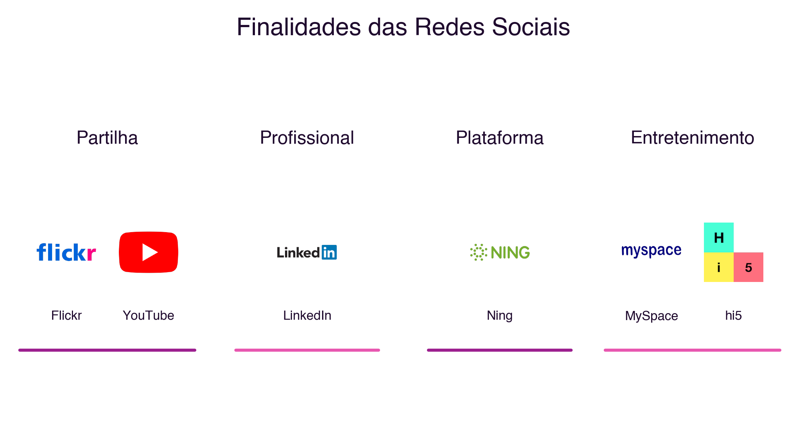

```{=html}
<div class="hero hero-chapter" style="background-image: linear-gradient(to top, rgba(31,10,46,0.88) 0%, rgba(31,10,46,0.6) 20%, rgba(31,10,46,0.15) 45%, rgba(31,10,46,0) 65%), url('../assets/images/heroes/cap02.jpg');">
  <div class="hero-badge">Chapter 2</div>
  <h1>Social Networks: Fundamentals and Statistical Data</h1>
</div>
```

## Introduction {#sec-02-intro-en .unnumbered}

The previous chapter established a fundamental distinction: the social network, as a concept, predates the technology (@sec-01-non-tech-networks-en), and what networked computing brought was mainly a change in scale, reach and medium (@sec-01-castells-networked-society-en). This chapter goes deeper into that second part: how did social networks, as an age-old human phenomenon, become the web-based social network platforms we know today, what forms they took over time, what they are for, and what their real adoption is, today, in Portugal and worldwide.

## Six Degrees of Separation {#sec-02-six-degrees-en}

In 1967, social psychologist Stanley Milgram conducted a set of experiments that would become an unavoidable reference in the study of social networks. He asked hundreds of people in different US states to get a letter to a final recipient they did not know personally, through the network of direct acquaintances of each participant. The goal was to measure how many intermediaries, on average, were needed to link two randomly chosen people [@Milgram1967].

The results are often oversimplified. Of the hundreds of letters sent, only a minority completed the journey: most chains broke off before reaching the destination. Among the letters that did arrive, the average number of intermediaries was around five to six. The idea that "we are all connected by six degrees of separation" is not, therefore, an exact, universal conclusion of Milgram's experiment, but rather a popularisation: the phrase dates back to a short story by the Hungarian writer Frigyes Karinthy, published in 1929, and only became popular decades later through the play *Six Degrees of Separation*, by John Guare (1990). Milgram himself never used that phrase in his own writings.

What Milgram's experiment demonstrated more solidly was something else, more interesting for the study of social networks: that a network of personal relationships, apparently local and limited, has a structure that allows any other node in that network to be reached through a surprisingly small number of connections. It was precisely this structural property, that of the "small world", that the first web-based social network systems were designed to exploit and make visible.

## The Generations of Web-Based Social Networks {#sec-02-generations-en}

Web-based social networks are virtual environments where each participant builds their own network of relationships, based on some kind of connection with other participants. Three successive generations of systems can be identified in their evolution [@MeiraEtAl2011a]:

- **First generation**: systems based on direct personal communication, organised around contact lists for exchanging instant messages. `ICQ` and `MSN Messenger` are characteristic examples of this generation.
- **Second generation**: systems that sought to replicate, in a virtual environment, the networks of affinity and acquaintance already existing in the real world. `Orkut`, `Friendster`, `MySpace`, `Facebook` and `LinkedIn` formalised this type of relationship, with such success that social networks became more popular than email.
- **Third generation**: systems in which social networks began to directly support the resolution of concrete problems: storing and exchanging experiences between people in similar situations, managing organisational knowledge, maintaining institutional memory, and generating new connections between people and organisations that did not previously know each other.

@fig-02-generations-en illustrates the first and second generations with the actual logos of the platforms mentioned: note how the second generation already includes platforms that would later come to fully dominate the social network landscape.

{#fig-02-generations-en}

### And after the third generation? {#sec-02-fourth-generation-en}

This three-generation classification was proposed in 2011, when `Facebook`, `Orkut` and `LinkedIn` defined the social network landscape. Since then, more than a decade of technological evolution suggests a transformation deep enough to justify a new stage.

The first three generations share a common trait: the visibility of a piece of content depends mainly on the user's network of explicit connections, the so-called **social graph**, that is, who follows whom. `TikTok`, popularised from 2018 onward, changed this principle structurally: its recommendation algorithm, "For You", decides what to show each user mainly based on observed behaviour (viewing time, interactions, content similarity), rather than on who that user follows. This marks a shift from a **social graph** to an **interest graph**: the proximity that matters is no longer "who you know" but "what you consume". This model was progressively adopted by other platforms, including `Instagram` and `YouTube`, through their short-video formats (*Reels*, *Shorts*).

Representing each network as a graph, a set of nodes connected by edges, makes the difference between the two models visible (@fig-02-graphs-en). In the social graph, the nodes are people and the edges represent explicit connections between them: who follows whom, who is friends with whom. In the interest graph, proximity is no longer between people, but between a person and the topics they interact with: two people may never have followed each other, or even know each other, and still be "neighbours" in the network, by consuming the same kind of content. How to calculate and visualise these graphs, through metrics such as distance, centrality or density, will be developed in the next chapter.

{#fig-02-graphs-en}

Sociologist Paolo Gerbaudo describes this shift as the move from "networked publics", organised by explicit interpersonal connections, to "clustered publics", organised algorithmically by behavioural similarity [@Gerbaudo2026]. According to the author, this transformation has implications that go beyond individual experience: it makes the workings of the systems that decide what each person sees more opaque, and deepens the fragmentation of the digital public space into interest groups increasingly closed in on themselves. This point connects directly to the "dark side" of networked society already discussed in the previous chapter (@sec-01-risks-en), and will be revisited when we study recommendation systems.

## Purposes of Social Networks {#sec-02-purposes-en}

Regardless of generation or underlying logic, social networks can also be classified by the main purpose for which they were designed [@MeiraEtAl2011a]:

- **Sharing**: publishing and distributing content, such as photographs or videos (historical examples: `Flickr`, `YouTube`)
- **Professional**: maintaining work contacts and relationships (example: `LinkedIn`)
- **Platform**: digital identity infrastructure used by other services for authentication and interconnection (historical example: `Ning`)
- **Entertainment**: social interaction with predominantly recreational aims (historical examples: `MySpace`, `hi5`)

@fig-02-purposes-en brings together the logos of the platforms that best illustrate each of these four purposes.

{#fig-02-purposes-en}

This classification was proposed in 2011, and the boundary between these four purposes is today even more blurred than it was then: `Instagram` combines sharing, entertainment and, increasingly, commerce; `LinkedIn` began distributing content in short-video format, traditionally associated with entertainment; and several Asian platforms, such as `WeChat`, function as "super-apps" that integrate messaging, payments, e-commerce and public services into a single environment. The dominant trend is not specialisation, but the convergence of purposes within the same platform.

## Social Network Adoption in Numbers {#sec-02-numbers-en}

According to the *Digital 2024* report by We Are Social/Meltwater, with analysis by Kepios, already mentioned in the previous chapter, there were **5.04 billion active social media user identities** in early 2024, equivalent to 62.3% of the world's population [@WeAreSocial2024]. Comparing this figure with the 5.35 billion Internet users estimated for the same period (@sec-01-numbers-en), it follows that about 94% of Internet users also use at least one social network: social network adoption is today practically on a par with Internet adoption itself. The typical user spends, on average, **2 hours and 23 minutes a day** on social networks [@WeAreSocial2024].

In Portugal, the same period records 7.43 million social network users, equivalent to 72.6% of the total population, against 8.84 million Internet users (86.4% of the population) [@DataReportalPortugal2024]. Adoption in Portugal is therefore higher than the world average on both dimensions (@fig-02-adoption-en).

![Internet and social network adoption, worldwide and in Portugal (2024). Sources: We Are Social/Meltwater [@WeAreSocial2024]; DataReportal [@DataReportalPortugal2024].](../assets/images/cap02/adocao-mundial-portugal-2024.png){#fig-02-adoption-en}

The platforms with the greatest advertising reach in Portugal, in early 2024, were `YouTube` (72.6% of the population), `Facebook` (58.1%), `Instagram` (56.7%), `LinkedIn` (47.9%) and `Facebook Messenger` (46.4%), followed by `TikTok`, already at 42.6% reach among adults [@DataReportalPortugal2024] (@fig-02-platforms-pt-en).

![Reach of the main platforms in Portugal, by potential advertising audience (January 2024). Source: DataReportal, *Digital 2024: Portugal* [@DataReportalPortugal2024].](../assets/images/cap02/pt-plataformas-2024.png){#fig-02-platforms-pt-en}

It is worth noting that this metric, potential advertising reach, is not directly comparable to the monthly active user figures published by each platform worldwide: by that metric, `Facebook` remains the largest social network in the world, with 3.05 billion monthly active users [@WeAreSocial2024]. Advertising reach and monthly active users are different metrics, calculated differently, and should not be compared directly with one another.

## Summary {#sec-02-summary-en}

This chapter went deeper into the study of social networks, as a technological instance of a pre-existing social phenomenon, introduced in the previous chapter:

1. Milgram's experiment (1967) demonstrated the "small world" property of social networks, popularised, imprecisely, as "six degrees of separation" [@Milgram1967]
2. Web-based social networks evolved through three successive generations, marked by personal communication, the replication of real affinity networks, and collaborative problem-solving [@MeiraEtAl2011a]
3. A fourth transformation, still without a consensus name, has been underway since 2018: the shift from an explicit social graph to an algorithmically defined interest graph [@Gerbaudo2026]
4. The four classic purposes of social networks, sharing, professional, platform and entertainment, tend today towards convergence within a single platform, rather than specialisation
5. Social network adoption is today close to Internet adoption itself, both worldwide and in Portugal [@WeAreSocial2024; @DataReportalPortugal2024]

## Food for Thought {#sec-02-reflection-en}

The content recommendation algorithm, by deciding what each person sees based on their behaviour rather than their explicit connections, has a power of influence far greater than a friends list ever had. What responsibility does a platform bear when it is its algorithm, not the user's explicit choices, that decides what content that user is exposed to?

Think also about your own social network use: can you identify, in the platforms you use, examples of the social graph and the interest graph operating at the same time? And do the four purposes described in this chapter, sharing, professional, platform and entertainment, still apply clearly to the platforms you use daily, or have they all already converged into one?

## References {#sec-02-references-en .unnumbered}

::: {#refs}
:::
