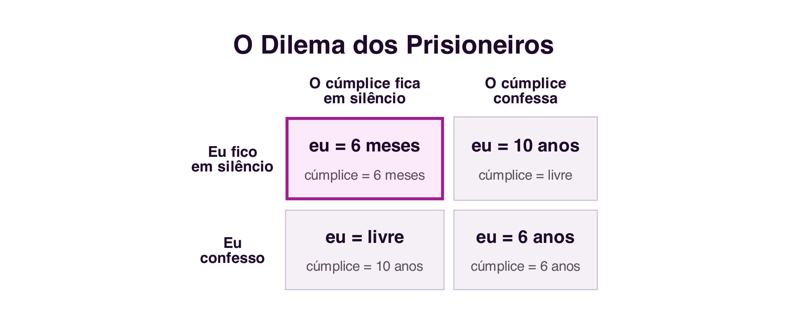
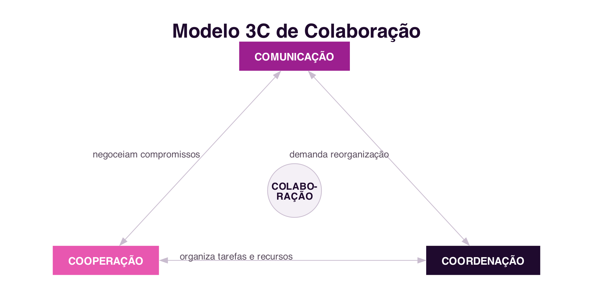
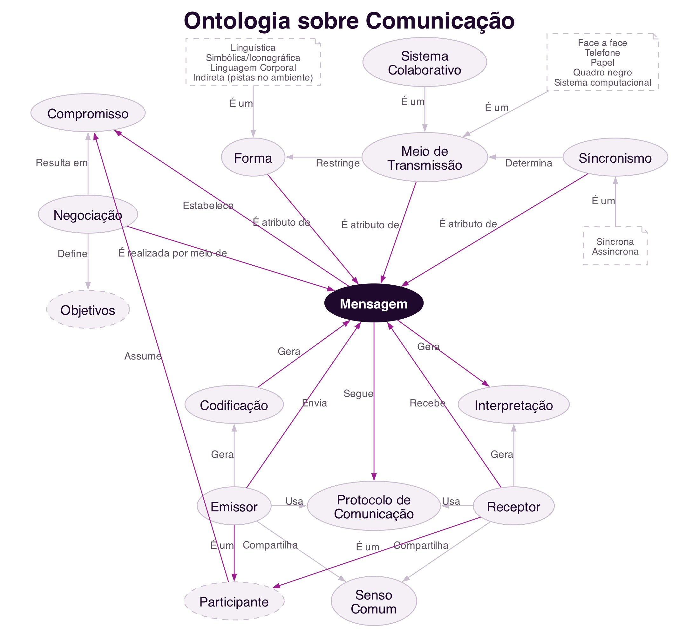

```{=html}
<div class="hero hero-chapter" style="background-image: linear-gradient(to top, rgba(31,10,46,0.88) 0%, rgba(31,10,46,0.6) 20%, rgba(31,10,46,0.15) 45%, rgba(31,10,46,0) 65%), url('../assets/images/heroes/cap04.jpg');">
  <div class="hero-badge">Chapter 4</div>
  <h1>Theories and Models of Collaboration</h1>
</div>
```

## Introduction {#sec-04-intro-en .unnumbered}

The previous three chapters dealt with **social platforms**: how society organises itself into a network, how those networks became digital platforms, and how to analyse them through metrics and folksonomy. This chapter opens a new block, dedicated to **collaborative platforms**, whose object of study is no longer the social network itself, but the **group work** it can support.

Before designing or evaluating any collaborative system, it is necessary to understand that collaboration is not a vague or purely intuitive phenomenon: it can be **modelled**, that is, described through formal theories and models that help explain why people collaborate, what collaboration requires, and where it tends to fail. This chapter presents four such models: Game Theory, Activity Theory, the 3C Collaboration Model, and a collaboration ontology that integrates the previous concepts [@FuksEtAl2011; @VivacquaGarcia2011].

## Why Model Collaboration? {#sec-04-modelling-en}

A **scientific model** is an abstract, logical or mathematical representation of a phenomenon, built to explain, analyse and predict that phenomenon systematically [@FuksEtAl2011]. One of the best-known ways to define a model is through a mathematical formula, but models can also be graphical, diagrams or schemes, like the ones that follow. Modelling collaboration means that, instead of deciding by intuition how to support a group's work, it becomes possible to analyse **what kind** of work is being done, compare different situations using the same concepts, and choose or design collaborative systems based on that analysis.

The models presented in this chapter answer different, but complementary, questions:

- **Game Theory** explains why it is rational to collaborate, or not to collaborate, when each participant's outcome also depends on the decisions of others.
- **Activity Theory** explains how a human being, individually or in a group, carries out an activity mediated by tools, within a community governed by rules.
- The **3C Model** breaks down any collaborative work into three dimensions, communication, coordination and cooperation, which any system supporting collaboration must address.
- The **Collaboration Ontology** integrates these concepts into a network of common terms, useful for those designing collaborative systems.

## Game Theory {#sec-04-game-theory-en}

**Game Theory** studies scenarios of strategic decision-making, in which each participant's final outcome depends not only on their own decision, but also on the decisions of the other participants. Each player chooses their strategy after assessing the opponents' situation and anticipating the strategies they might adopt [@FuksEtAl2011]. The theory originates in mathematics and economics, and its first studies date back to the 18th century, but it was mainly from the publication of *The Theory of Games and Economic Behavior*, by John von Neumann and Oscar Morgenstern in 1944, and the notion of equilibrium proposed by John Nash in the 1950s, that it consolidated as an autonomous field.

A central concept for classifying these scenarios is the sum of all players' gains. In a **zero-sum game**, one player's gain corresponds exactly to the others' loss, the total sum always remains equal to zero: this is the case of a game of chess, or a hand of poker. In a **non-zero-sum game**, the overall outcome can vary depending on the decisions made: it is possible for all players to gain, or lose, together. As shown below, the Prisoner's Dilemma is a classic example of a non-zero-sum game.

### The Prisoner's Dilemma {#sec-04-dilemma-en}

The best-known example of Game Theory applied to collaboration is the **Prisoner's Dilemma**, formalised by mathematician Albert W. Tucker. Two suspects are arrested by the police and interrogated in separate rooms, unable to communicate with each other. There is not enough evidence to convict them of a major crime, only a minor charge, unless one of them confesses. Each is offered the same deal:

- If **both stay silent**, each serves 6 months in prison.
- If **one confesses and the other stays silent**, the one who confesses goes free and the one who stays silent serves 10 years.
- If **both confess**, each serves 6 years.

{#fig-04-dilemma-scene-en}

These four situations form the game's **payoff matrix** (@fig-04-dilemma-en). Analysed individually, the best strategy for either suspect is to confess: if the accomplice stays silent, confessing sets them free immediately; if the accomplice also confesses, confessing still gives a lighter sentence than staying silent alone. The paradox is that, if **both** reason this way, each individually rational, both confess and serve 6 years, an outcome worse for both than if they had collaborated and both stayed silent, serving only 6 months [@FuksEtAl2011].

{#fig-04-dilemma-en}

The Prisoner's Dilemma shows how Game Theory supports understanding of real collaboration situations: it clarifies concepts such as self-interest, payoff matrix and non-zero-sum games. It applies to scenarios as diverse as negotiation between competing companies, management of a resource shared by several users, or the decision whether or not to contribute to a collective project.

### *Tit-for-Tat*: the Evolution of Collaboration {#sec-04-tft-en}

If, in isolation, the Prisoner's Dilemma suggests that confessing, betraying the accomplice, is always the rational strategy, the situation changes when the same game is repeated several times between the same participants. In the 1970s, political scientist Robert Axelrod organised competitions in which researchers submitted strategies for repeated versions of the Prisoner's Dilemma, competing against each other over many rounds. The winning strategy, named ***tit-for-tat***, was proposed by mathematician Anatol Rapoport and follows just three rules [@Axelrod1984]:

1. Contribute first: never be the first to betray.
2. If you are betrayed, retaliate on the next round.
3. After retaliating, be willing to forgive and collaborate again.

In a repeated version of the game, collaborating stops being irrational: the expectation of meeting the same opponent again gives betrayal a future cost, the other player's retaliation. *Tit-for-tat* has proven, in repeated simulations, more effective in the long run than purely selfish strategies, and is used to this day to explain how collaboration can emerge and sustain itself in a competitive scenario, without any central authority imposing cooperation [@Axelrod1984]. The same logic helps explain phenomena as distinct as informal trade agreements between companies or the reciprocity observed in the behaviour of various social animals.

### The Tragedy of the Commons {#sec-04-commons-en}

Not every collaboration-related game involves just two players. The **Tragedy of the Commons**, described by ecologist Garrett Hardin in 1968 [@Hardin1968], illustrates what happens when several participants share a common, limited resource.

Imagine a pasture shared by several herders, each with their own flock. For each herder, individually, adding one more sheep to their flock is always advantageous: the profit from that extra sheep is entirely their own, while the cost of wear on the pasture is shared among all the herders who use it. Since this reasoning holds for any herder, all tend to add as many animals as they can. At a certain point, however, the total number of animals exceeds the pasture's capacity to regenerate: the grass stops growing, stops feeding any animal, and every herder loses out, including those who had been more restrained.

The Tragedy of the Commons shows that, when the gain from an individual decision is private but the cost is shared by the whole group, the sum of each participant's rational decisions can destroy the very resource everyone depends on. For this reason, sustainable collaboration around a shared resource rarely survives on goodwill alone: it requires explicit rules, accepted by the whole group, and mechanisms that penalise those who break them, from social disapproval to formal sanctions, such as fines or exclusion from the group. It is precisely this role of rules as an element of collaboration that Activity Theory, discussed next, formalises.

## Activity Theory {#sec-04-activity-theory-en}

While Game Theory focuses on strategic decision-making, **Activity Theory** explains how human beings carry out activities in everyday situations, individually and in society, and is particularly useful for understanding technology-mediated collaboration [@FuksEtAl2011].

In this theory, **activity** is the minimal unit of meaning for understanding the actions of a **subject**, a person or a group, who acts upon an **object**, something concrete like a document, or abstract like a decision to be made, in order to achieve a goal. A central concept of the theory is that this action is never direct: it is always **mediated by artefacts**, physical tools, such as a computer, or cognitive ones, such as a language or a mathematical notation. The artefact acts upon the object, but also has a reverse effect on the subject itself, shaping how they think and solve problems [@FuksEtAl2011].

From a collective perspective, the subject does not act in isolation: they are embedded in a **community**. This collective dimension adds two new mediating elements: **division of labour**, which organises how the object is transformed into an outcome among the community's various subjects, and **rules**, implicit or explicit norms, conventions and social relations established within the community. The complete model, adapted from Yrjö Engeström [@Engestrom1987], is shown in @fig-04-activity-en.

{#fig-04-activity-en}

An example applied to the classroom illustrates the model: the subject is a student or a group of students; the object is the problem or work to be done; the artefact is the computer system, the computer, or even the language used to communicate; the community is the class; the division of labour is how the group work's tasks are split up; and the rules are, for example, the assessment criteria set by the lecturer. Introducing a new artefact, such as a collaborative platform, changes how the activity is carried out, which can create new problems but also new possibilities, and it is precisely here that the design of collaborative systems comes in.

## The 3C Collaboration Model {#sec-04-3c-en}

The **3C Collaboration Model** analyses any group work along three dimensions: **communication**, **coordination** and **cooperation**. It originates in a classification proposed by Ellis, Gibbs and Rein in 1991 for group work support systems [@EllisEtAl1991], later formalised as a model in its own right:

- **Communication**: the exchange of messages between people, through which agreements are negotiated and commitments are made.
- **Coordination**: the management of people, activities and resources, so that the work of several participants fits together without conflict or wasted effort.
- **Cooperation**: joint action within the shared workspace, for the actual production of objects or information.

These three dimensions are not independent: they interrelate so that collaboration can happen (@fig-04-3c-en). By communicating, participants make decisions that require coordination; by coordinating, they reorganise tasks that may require new communication; and effective cooperation in the shared space generates information that feeds back into both coordination and communication.

{#fig-04-3c-en}

Collaboration is not the only way to organise group work. An alternative model, typical of military organisations and the classic industrial assembly line, is **Command and Control** (C2): a central authority decides what must be done and defines all tasks in advance, replacing distributed coordination with direct supervision, and virtually eliminating the need for communication and negotiation among those carrying out the work. For group work to be genuinely characterised as collaboration, rather than merely the coordinated execution of orders, communication, coordination **and** cooperation must all, in fact, take place, as represented in the 3C Model.

## Collaboration Ontology {#sec-04-ontology-en}

The three previous models explain different aspects of collaboration, but sometimes use different terms and levels of detail. An **ontology** is the description of a domain, negotiated by a community, for a given purpose: it creates a common terminological base, which makes communication easier for those working in the field and allows computer systems to produce intelligible information about that domain [@VivacquaGarcia2011].

Building on the same model by Ellis and colleagues used in the 3C Model [@EllisEtAl1991], the collaboration ontology is organised into four parts, each with a central concept [@VivacquaGarcia2011]: **group formation**, **communication**, **coordination** and **cooperation**.

### Group Formation {#sec-04-ontology-groups-en}

The central element of this part is the **participant**. A participant takes on tasks, is part of a group and takes part in the negotiations that define shared goals; to do so, they require two essential things: **trust**, the shared belief that one can rely on the other participants, and **motivation**, without which one is unlikely to commit to a proposal. The group, in turn, carries out an activity that generates a product, and that product is itself a kind of goal (@fig-04-ontology-groups-en).

{#fig-04-ontology-groups-en}

### Communication {#sec-04-ontology-communication-en}

The central element is the **message**. A sender encodes and sends a message, which follows a communication protocol shared with the receiver, and which the receiver receives and interprets; both also share a common sense that makes interpretation possible. The message also has three attributes that shape it: **form** (linguistic, symbolic, bodily, among others), **transmission medium** (from face-to-face to a computer system) and **synchronism** (synchronous or asynchronous). It is through the message that negotiation takes place, and it is from it that participants' commitments result (@fig-04-ontology-communication-en).

{#fig-04-ontology-communication-en}

### Coordination {#sec-04-ontology-coordination-en}

The central element is the **work plan**, supported by the collaborative system and established through negotiation. The work plan defines each participant's roles and the coupling between activities, and also defines policies, deadlines and resource allocation, organising the activity into concrete tasks. Monitoring tracks deadline compliance and each task's completion status, which in turn requires the resources needed to carry it out (@fig-04-ontology-coordination-en).

{#fig-04-ontology-coordination-en}

### Cooperation {#sec-04-ontology-cooperation-en}

The central element is the **activity**, carried out by a group with a given geographical distribution (co-located or remote) and a given degree of coupling between participants. The activity is carried out in a shared workspace, and generates a product, made up of concrete artefacts. This production breaks down into tasks, which require resources and which can be individual or shared by several participants at once (@fig-04-ontology-cooperation-en).

{#fig-04-ontology-cooperation-en}

### Ontology Summary {#sec-04-ontology-summary-en}

@fig-04-ontology-en summarises these four parts: collaboration happens when motivated participants group around a shared goal, communicate through messages to negotiate tasks and make commitments, coordinate work through a plan that organises those tasks, and cooperate, producing artefacts in a shared space. Without any one of these four elements, collaboration is unlikely to happen [@VivacquaGarcia2011].

{#fig-04-ontology-en}

A collaboration ontology is especially useful for those designing collaborative systems: it helps check that important aspects of group work, such as trust between participants or the existence of an explicit work plan, are not being overlooked in the design of a new system.

## Summary {#sec-04-summary-en}

This chapter presented four models that underpin the study of collaboration:

1. **Game Theory** distinguishes zero-sum games, in which one player's gain implies an equivalent loss for another, from non-zero-sum games, in which the overall outcome can vary; the **Prisoner's Dilemma** is an example of the latter, and shows that an individually rational decision can be collectively worse than collaborating [@FuksEtAl2011]
2. In repeated versions of the game, the *tit-for-tat* strategy shows how collaboration can emerge and sustain itself without central authority [@Axelrod1984]
3. The **Tragedy of the Commons** shows that the sum of individually rational decisions can destroy a shared resource, justifying the need for rules and penalties in collaboration [@Hardin1968]
4. **Activity Theory** describes how a subject acts upon an object, always mediated by artefacts and, in the collective dimension, also by the community's division of labour and rules [@Engestrom1987]
5. The **3C Model** breaks collaboration down into communication, coordination and cooperation, distinguishing it from the Command and Control model [@EllisEtAl1991]
6. The **Collaboration Ontology** integrates these concepts, assigning a central element to each of the four parts: participant, message, work plan and activity [@VivacquaGarcia2011]

## Food for Thought {#sec-04-reflection-en}

Think of a piece of group work you took part in recently: can you identify, in that work, the three Cs, communication, coordination and cooperation? Was any one of them clearly weaker than the others, and what concrete problems did that cause?

And what about *tit-for-tat*: can you think of a relationship, at work, in friendship or between organisations, in which collaboration is sustained precisely because the parties expect to interact again in the future? Can you also think of an example of the Tragedy of the Commons that you have observed, and what rules or penalties, formal or informal, exist, or should exist, to prevent it?

## References {#sec-04-references-en .unnumbered}

::: {#refs}
:::
