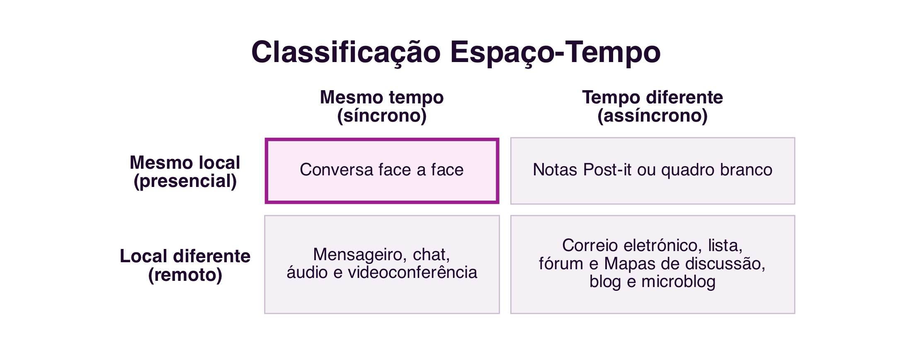
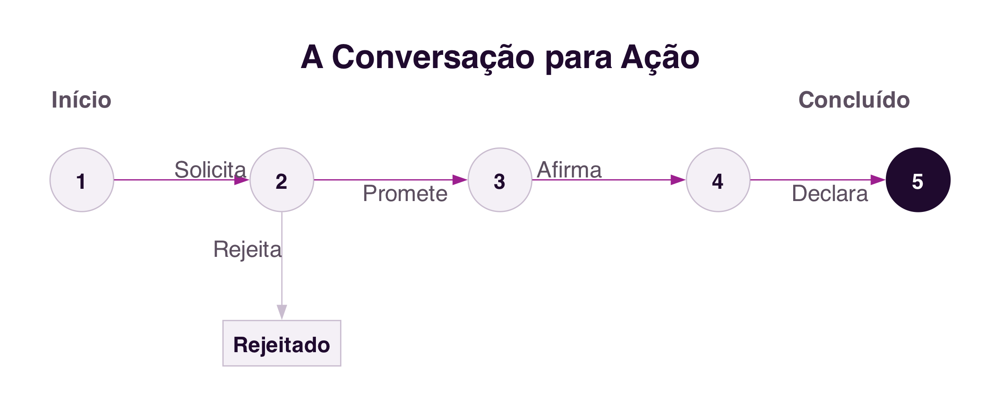

```{=html}
<div class="hero hero-chapter" style="background-image: linear-gradient(to top, rgba(31,10,46,0.88) 0%, rgba(31,10,46,0.6) 20%, rgba(31,10,46,0.15) 45%, rgba(31,10,46,0) 65%), url('../assets/images/heroes/cap05.jpg');">
  <div class="hero-badge">Chapter 5</div>
  <h1>Communication Systems for Collaboration</h1>
</div>
```

## Introduction {#sec-05-intro-en .unnumbered}

The previous chapter identified **communication** as one of the three dimensions of the 3C Model, the exchange of messages through which participants negotiate and make commitments about the work to be done (@sec-04-3c-en). This chapter explores that dimension further: what characteristics distinguish computer-mediated communication from face-to-face communication, how to classify the different communication systems, and how the language we use to communicate can itself be a form of acting. It closes with a brief look at the systems that support the other two dimensions of the 3C Model, coordination and cooperation, to complete the picture.

## Computer-Mediated Communication {#sec-05-cmc-en}

The computer became, especially after networking, a medium of human communication. The **20th century** was marked by mass media, such as the press, radio and television, characterised by the broadcast of information from a large central editorial source, with no possibility of interaction with the audience. The **21st century** is marked by social media, characterised by content production by users themselves and by conversation among crowds, as already discussed in the previous chapters regarding social networks [@PimentelEtAl2011].

**Computer-Mediated Communication** (CMC) brought new possibilities for social interaction: asynchronicity, absence of face-to-face interaction, anonymity, privacy, continuous contact with interlocutors, virtual communities, and conversation among crowds who never meet in person. The difference between *online* and *offline* interaction, and the culture specific to these new media, is also an object of CMC research [@PimentelEtAl2011].

### Internet dialect {#sec-05-reorality-en}

One of the most studied phenomena in CMC is the attempt to put the informality of face-to-face conversation into text, a process called the **reorality** of written language [@PimentelEtAl2011]. The absence of eye contact, tone of voice and body language is partly compensated for by a set of linguistic resources specific to computer-mediated written communication: *emoticons* and *emojis*, abbreviations (`u`, `pls`), onomatopoeia (`lol`, `haha`), vowel stretching (`soooo`), exaggerated punctuation (`!!!`), capital letters to SHOUT, and phonetic spelling of words (`cuz` instead of "because", `ur` instead of "your", and many others). GIFs and reaction stickers today serve a similar function, replacing with an image what facial expression would do in a face-to-face conversation.

This dialect is not a deviation to be corrected, but a functional adaptation to the medium: it represents an attempt to recover, through text, cues that face-to-face conversation offers for free. Knowing it is necessary to communicate appropriately through the different computer communication systems [@PimentelEtAl2011].

## Synchronous and Asynchronous {#sec-05-synchronism-en}

One of the most traditional ways of classifying a communication system crosses two independent dimensions: **time**, which distinguishes **synchronous** communication (the interlocutors are present at the same time in the communication medium and the message is received immediately) from **asynchronous** communication (the message is stored and can be retrieved later); and **place**, which distinguishes interlocutors located in the same physical space from interlocutors in remote locations [@EllisEtAl1991] (@fig-05-space-time-en).

{#fig-05-space-time-en}

Face-to-face conversation is **synchronous**, with people simultaneously sharing the same place where the communication takes place; a *post-it* note left on someone's desk is **asynchronous** but co-located, people act physically in the place of the message, but not at the same time. Most communication systems for collaboration, however, fall into the remote column: instant messaging, *chat* and video conferencing are synchronous and remote, while email, discussion systems, the *blog* and *microblog* are asynchronous and remote.

This distinction has a technical implication often invisible to those who use these systems: synchronous remote communication depends, moment to moment, on the quality of the network connection between the interlocutors. If the network is slow or loses information, even for an instant, the video call freezes, the audio cuts out, or the message arrives out of time, because there is no room to resend or wait without breaking the real-time experience. Asynchronous communication tolerates an unstable network much better, precisely because the message can be stored and delivered later without compromising communication: an email that takes a few extra seconds to arrive changes nothing about the experience of whoever reads it. This trade-off between immediacy and reliability still shapes, to this day, the choice between synchronous and asynchronous systems for a given collaborative task.

## Speech Acts and Conversation for Action {#sec-05-speech-acts-en}

**Speech Act** theory shows that language, besides serving to describe the world, also serves to **perform actions**. An utterance can be **constative**, a statement, description or report, or **performative**, a sentence that performs an **action** with consequences at the moment it is uttered: by saying "I declare the session open", the goal is not to inform, but precisely to open the session. This theory was grounded in John L. Austin's lectures at Harvard, in 1955, published posthumously in 1962 in the book *How to Do Things with Words* [@Austin1962].

In the field of collaborative systems, one of the best-known studies on communication is **conversation for action**: interlocutors exchange messages to negotiate and make commitments about work to be done. Terry Winograd modelled this process as a sequence of states, where each state transition occurs through a speech act [@Winograd1987] (@fig-05-conversation-en).

{#fig-05-conversation-en}

The process begins when one interlocutor **requests** a task from another. The second interlocutor can **promise** to carry it out, starting a period of execution that ends when the first interlocutor **states** they are satisfied with the result and **declares** the process complete. At any stage, however, the second interlocutor can **reject** the request, ending the process along a different path. This model shows that, even in an apparently simple exchange of messages, there is an underlying negotiation structure, made up of successive speech acts that progressively commit the interlocutors to the work to be done.

## Flaming, Trolling and the Absence of Social Cues {#sec-05-flaming-en}

CMC research also studies negative phenomena associated with new media, such as **flaming** (aggressive messages and heated discussions) and **trolling**, the deliberate provocation of other interlocutors with the aim of generating emotional reactions or disrupting a conversation. Both phenomena are mainly attributed to anonymity and to text-only communication, with the absence of eye contact and non-verbal language that, in a face-to-face conversation, naturally moderate the tone of interaction [@PimentelEtAl2011].

These phenomena are distinct from **cyberbullying**, already discussed in Chapter 1 (@sec-01-cyberbullying-en): cyberbullying is a sustained pattern of harassment directed at a specific victim, with the aim of repeatedly hurting them, while flaming and trolling can occur as one-off incidents, in a single exchange of messages, without necessarily having a fixed target or the intention to cause continued harm. The same conditions of the medium, anonymity and the absence of non-verbal cues, explain the origin of both phenomena, but their severity and persistence are very different.

Because users of current communication platforms are not required to prove their identity, the expression of opinions and ideas is made easier, which can also lead to aggressive or provocative behaviour, such as flaming and trolling. The platforms in use, mostly North American and Chinese, lack effective identity-verification mechanisms, which in many cases makes it impossible to hold aggressors accountable.

In Europe, current legislation requires platforms to identify their users, which reduces these phenomena. For example, as an alternative to a system such as `X`, the social platform `W social` ([https://wsocial.news](https://wsocial.news)) is in its final launch phase, allowing anonymous communication, but with user identification mandatorily verified against formal identity documents (national ID card or passport), which can intervene in case of abuse.

## A Brief Evolution of Communication Systems {#sec-05-evolution-en}

Communication systems for collaboration are organised into families, according to the kind of conversation they establish between interlocutors: email, discussion systems (mailing list, forum), instant messaging, *chat*, audio and video conferencing, message logs (*blog*, *microblog*) [@PimentelEtAl2011]. Each family shares characteristics and evolves influenced by earlier families, much as a species is influenced by the species it descends from (@fig-05-types-en).

{#fig-05-types-en}

Email, among the first communication systems of the internet, remains central today (`Gmail`, `Outlook`), although it has incorporated features from other systems, such as *chat*. Discussion systems evolved from mailing lists into the groups and communities of today's social networks, such as `Facebook` groups or `Reddit`. Instant messaging, which already existed before the internet as we know it today, has in applications such as `WhatsApp`, `Messenger` and `Telegram` its most popular representatives. Group *chat*, historically associated with IRC, survives today on platforms such as `Discord` and `Slack`. And the *blog*, the personal "logbook" of the 1990s, gave rise to the *microblog*, today dominated by platforms such as `X` and `Instagram`.

Regardless of the specific system, the comparative analysis still holds: the synchronism of the communication, the number of interlocutors involved, the language used, the size of messages, and the structuring of discourse continue to determine the characteristics of any new communication system that may emerge.

## Coordination and Cooperation Systems {#sec-05-coord-coop-en}

The 3C Model, presented in the previous chapter, breaks collaboration down into three dimensions: communication, coordination and cooperation (@sec-04-3c-en). This chapter has focused on the first; a brief reference is now made to the systems that support the other two.

### Coordination Systems {#sec-05-coordination-en}

**Coordination** is the planning of group work [@SantoroEtAl2011]. One of the most common ways to support coordination is through **business processes**: a defined set of steps for carrying out a piece of work, with goals, activities, people responsible, and rules that establish the order of execution. Business process management systems, or **BPMS** (*Business Process Management System*), are collaborative systems that support the definition, execution and monitoring of these processes, coordinating the different participants involved and keeping a record of the state of each activity [@SantoroEtAl2011].

### Cooperation Systems {#sec-05-cooperation-en}

**Cooperation** requires participants to have **awareness** of what others are doing in the shared workspace, a mental state of understanding others' actions and presence [@VieiraEtAl2011; @DourishBellotti1992]. In a face-to-face interaction, this awareness arises naturally, through sight and hearing; in a collaborative system, it has to be explicitly communicated, typically through notifications structured around six questions: who, what, where, when, how and why.

Awareness reduces isolation and prevents duplicated work and conflicts, but it has to be designed carefully: in excess, it generates information overload and becomes intrusive. A well-known example of this tension is `Microsoft Office`'s `Clippy` assistant, rejected by users for constantly interrupting their work with unsolicited suggestions, later replaced by discreet suggestions, activated only when the user themselves looks for them [@VieiraEtAl2011].

## Summary {#sec-05-summary-en}

This chapter characterised the communication systems that support collaboration:

1. **Computer-Mediated Communication** brought asynchronicity, anonymity and virtual communities, and gave rise to a dialect of its own, the **reorality** of written language [@PimentelEtAl2011]
2. The **space-time** classification crosses synchronism (synchronous or asynchronous) with location (co-located or remote); synchronous communication depends more critically on network quality [@EllisEtAl1991]
3. **Speech Act** theory shows that language also performs actions [@Austin1962]; Winograd's **conversation for action** model describes the negotiation of a piece of work as a sequence of speech acts [@Winograd1987]
4. **Flaming** and **trolling** result from anonymity and the absence of non-verbal cues in text-based communication, distinct from cyberbullying (@sec-01-cyberbullying-en) by the absence of a sustained pattern directed at a victim
5. Communication systems are organised into families (email, discussion, messaging, chat, conferencing, message logs), each evolving influenced by earlier ones [@PimentelEtAl2011]
6. The other two dimensions of the 3C Model also have their own systems: **coordination** relies on business processes and BPMS systems [@SantoroEtAl2011]; **cooperation** requires **awareness** of what other participants are doing in the shared space, designed carefully so as not to become intrusive [@VieiraEtAl2011]

## Food for Thought {#sec-05-reflection-en}

Think of a recent instant messaging conversation: can you identify examples of "internet dialect" that you used, emoticons, abbreviations, capital letters for emphasis? What would you be communicating differently if that same conversation had happened by email, or in person?

And what about conversation for action: next time you ask someone for something by message, notice the speech acts they use, without realising it, to negotiate the commitment, the request, the promise, the confirmation.

Take `WhatsApp` as an example: identify the components of the 3C Model in how conversation groups work, and how the platform supports each of them. Think also about the awareness mechanisms the platform offers, and how they help coordinate group work.

## References {#sec-05-references-en .unnumbered}

::: {#refs}
:::
