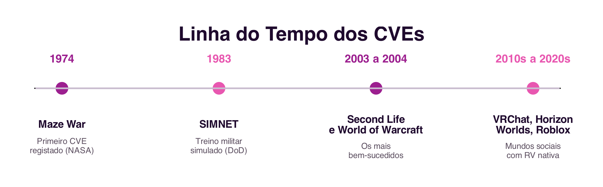

```{=html}
<div class="hero hero-chapter" style="background-image: linear-gradient(to top, rgba(31,10,46,0.88) 0%, rgba(31,10,46,0.6) 20%, rgba(31,10,46,0.15) 45%, rgba(31,10,46,0) 65%), url('../assets/images/heroes/cap06.jpg');">
  <div class="hero-badge">Chapter 6</div>
  <h1>Collaborative Virtual Environments</h1>
</div>
```

## Introduction {#sec-06-intro-en .unnumbered}

The previous two chapters dealt with collaboration mediated by text and by voice, communication systems (@sec-05-cmc-en) and systems that support coordination and cooperation (@sec-05-coord-coop-en). This chapter explores a different way of mediating collaboration: instead of a channel through which messages pass, the computer instead simulates a **shared world**, within which participants meet, navigate and interact. It is this change of metaphor, from communication channel to shared space, that distinguishes Collaborative Virtual Environments.

## What is a Collaborative Virtual Environment? {#sec-06-cve-en}

A **Collaborative Virtual Environment**, or **CVE**, is a distributed virtual reality system that graphically simulates, in real time, a real or imaginary world, where users, represented by their **avatars**, are simultaneously present, navigate and interact with objects and with other users [@Raposo2011].

The concept of the CVE began to gain popularity alongside the term **cyberspace**, coined by William Gibson in the novel *Neuromancer* [@Gibson1984] and already discussed in Chapter 1 (@sec-01-castells-networked-society-en). Although its origin is science fiction, and the physical immersion shown in films such as *The Matrix* and *Avatar* remains far from real technology, the concept popularised by Gibson significantly influenced both researchers and virtual reality systems developers.

## Elements of a CVE {#sec-06-elements-en}

Three elements are common to any CVE, regardless of what name the literature gives it, *Networked Virtual Environment*, *Metaverse*, among others (@fig-06-elements-en):

- **Virtual world**: the fundamental element of a CVE, an imaginary space made up of a description of objects and the rules that govern them. The relationship between the description of the world and its computational execution is comparable to the relationship between a play's script and its staging, with the difference that, in a CVE, the users are also actors.
- **Avatars**: the virtual objects used to represent each participant. Each virtual world is different, and to act within it requires embodying an avatar specific to that world.
- **Interactivity**: the ability of the virtual world to respond to users' actions, whether when they navigate and change their position, or when they select and manipulate objects. It is interactivity that distinguishes being in a CVE from watching an animated film.

{#fig-06-elements-en}

## Immersion {#sec-06-immersion-en}

The combination of an adequate graphical representation of the virtual world with good interactivity contributes to the feeling of **immersion**, the sensation of "being there" inside the virtual world. Two types of immersion are distinguished [@Raposo2011]:

- **Mental immersion**: the goal of content creators long before CVEs existed, the engagement and involvement of the consumer with that content. Mental immersion can occur, for example, when reading a good book, with no physical representation at all.
- **Physical immersion**: synthetically stimulates the senses, through technology, to create the illusion that the body itself is in the virtual world. Today, it is mainly stimulated through three-dimensional visual representation (stereoscopy), spatial audio and interaction devices that capture the user's movements. Current virtual reality headsets, such as the `Meta Quest` or the `Apple Vision Pro`, are today the most accessible way to achieve physical immersion.

CVEs go beyond mental immersion by also investing in physical immersion. In science fiction, as in the films already mentioned, physical immersion is complete, to the point where the user's real body becomes indistinguishable from the avatar. In practice, most current CVEs still lack stereoscopy features, even when they are three-dimensional virtual worlds: a 3D CVE, a space with three dimensions of navigation, should not be confused with a "3D movie" or with a stereoscopic virtual reality device, even though nothing prevents a CVE from also being stereoscopic.

## A Brief History of CVEs {#sec-06-history-en}

The first CVE on record, *Maze War*, was created in 1974 at a NASA research centre: a game in which users walked through a maze shooting at each other, and which already contained ideas that would become standard in CVEs, first-person navigation and instant-message communication. The most large-scale efforts came from the United States Department of Defense: `SIMNET`, developed from 1983 onward, trained military units in simulated virtual battles, and gave rise to technical standards still influential in distributed simulation today (@fig-06-history-en).

{#fig-06-history-en}

Among the most influential CVEs of their time are Second Life (2003, Linden Lab) and World of Warcraft (2004, Blizzard). Both share the definition of a CVE, but have very different purposes: `World of Warcraft` is a game, with a fantasy world defined by its creators, while `Second Life` is a "general purpose" CVE, built by the users themselves, with its own virtual economy convertible into real currency. More recently, platforms such as `VRChat`, `Meta Horizon Worlds` and `Roblox` revisit this same idea of a massive social world, now with native support for virtual reality devices.

## Identity, Interaction and Presence {#sec-06-identity-en}

One of the central ideas behind CVEs is not to invent new metaphors, but rather to reproduce, in the virtual world, notions that already exist in the real world: identity, location, presence and awareness of other participants' activities (@fig-06-iip-en) [@Raposo2011].

{#fig-06-iip-en}

**Identity** is related to the user's avatar: it is expected to be immediately recognisable as an avatar, and distinguishable from other avatars, just as we immediately recognise another person and distinguish them from other people in the real world.

**Interaction** between users of a CVE depends directly on the avatar's representation, which provides the main perceptual information about other participants, location, orientation and availability, in a sense very close to what was already discussed regarding perception in cooperation systems (@sec-05-cooperation-en). The movement of an avatar anticipates the intentions of the user it represents: turning one's back during a conversation shows disinterest, just as approaching another avatar can indicate a wish to interact with it.

**Presence**, originally called "telepresence", is "the illusory perception of non-mediation" [@LombardDitton1997]: the user does not perceive a medium during their interaction, behaving as if that medium did not exist. A distinction is drawn between physical presence, the sensation of being in a real or virtual place, and social presence, the sensation of being, physically or psychologically, with another person. In a CVE, presence involves both dimensions: the sensation of being in the virtual world (immersion) and, at the same time, the sensation of being there accompanied.

## Virtual Communities {#sec-06-communities-en}

Whatever its purpose, gaming, socialising, education or economy, a CVE almost always gives rise to a **virtual community**, with its own social rules and a particular culture. The spatial metaphor of CVEs promotes both casual encounters between strangers and collaboration between acquaintances, generally in a more motivating way than the desktop collaborative systems discussed in previous chapters.

As in any society, inappropriate behaviour also happens in CVEs: vandalism, disturbance of other users, or even harassment, echoes, in a three-dimensional space, of the flaming, trolling and cyberbullying already discussed in relation to text-based communication (@sec-05-flaming-en, @sec-01-cyberbullying-en). The companies responsible for these environments need to deal with these behaviours just like any other social platform.

## Summary {#sec-06-summary-en}

This chapter introduced Collaborative Virtual Environments:

1. A **CVE** simulates a shared world, rather than serving merely as a communication channel, made up of a virtual world, avatars and interactivity [@Raposo2011]
2. **Immersion** can be mental (engagement with content) or physical (the synthetic stimulation of the senses, today mainly through virtual reality headsets or glasses)
3. The first CVE on record was `Maze War` (1974); `SIMNET` (1983) brought the first large-scale development efforts; `Second Life` and `World of Warcraft` remain, decades later, among the most successful CVEs
4. CVEs reproduce real-world notions: **identity** (avatar recognition), **interaction** (mediated by the perception the avatar provides) and **presence** (the illusory sensation of non-mediation) [@LombardDitton1997]
5. Every CVE gives rise to a **virtual community**, with its own social rules, where inappropriate behaviour can also occur

## Food for Thought {#sec-06-reflection-en}

If you have ever used a collaborative virtual environment, a multiplayer game, a virtual reality meeting, or a platform such as `Roblox` or `VRChat`, think about your avatar: to what extent does it represent your real identity? What did you choose to change, and why?

And what about social presence: can you identify a moment when you genuinely felt "accompanied" in a virtual space, even knowing that the other people were physically far away?

## References {#sec-06-references-en .unnumbered}

::: {#refs}
:::
