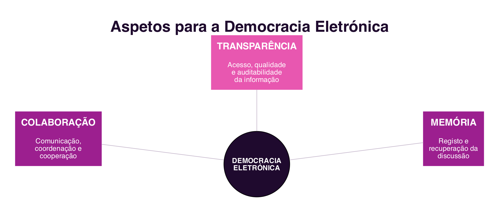

```{=html}
<div class="hero hero-chapter" style="background-image: linear-gradient(to top, rgba(31,10,46,0.88) 0%, rgba(31,10,46,0.6) 20%, rgba(31,10,46,0.15) 45%, rgba(31,10,46,0) 65%), url('../assets/images/heroes/cap07.jpg');">
  <div class="hero-badge">Chapter 7</div>
  <h1>Electronic Democracy</h1>
</div>
```

## Introduction {#sec-07-intro-en .unnumbered}

The previous chapter showed how Collaborative Virtual Environments recreate, in digital space, forms of identity, interaction and presence proper to the real world (@sec-06-identity-en). This chapter applies a similar logic to a different domain: political participation. The same social interaction technologies that connect virtual communities can also mediate the relationship between citizens and government, but doing so is not automatic: technology, by itself, does not generate more democracy. What determines the outcome is the **level of participation** designed into the system.

## Electronic Government and Electronic Democracy {#sec-07-egov-en}

Social interaction technologies have enabled new forms of political expression and citizen mobilisation. A historical case illustrates this potential well: in 2009, during the protests that followed the disputed re-election of Iran's president, protesters bypassed state censorship and used `Twitter` to report, in real time, what was happening in the country, at a time when the government had blocked access to social networks [@AraujoEtAl2011]. This episode became a reference point on the political potential of social networks, although, as will be seen further ahead, technology alone is no guarantee of effective democratic participation.

It is important to distinguish two related but different concepts:

- **Electronic Government** (e-Gov) refers to the electronic provision of services and information, from government to citizens, businesses and other levels of government, 24 hours a day, seven days a week [@AraujoEtAl2011]. It is, essentially, a matter of administrative efficiency.
- **Electronic Democracy** (e-Democracy) goes further: it refers to the set of discourses, theorisations and experiments that employ information and communication technologies to mediate political relationships, aiming at democratic participation in contemporary political systems [@AraujoEtAl2011]. It is not just about improving the quality of public services, but about creating new processes and new relationships between those who govern and those who are governed.

The distinction matters because an efficient public services portal, by itself, is not Electronic Democracy: it may make citizens' lives easier without giving them any participation in political decisions.

## Levels of Democratic Participation {#sec-07-levels-en}

To develop solutions supporting Electronic Democracy, it is first necessary to define the level of participation and interaction one wishes to achieve between government and citizens. The **Model of Levels of Democratic Participation** [@Gomes2004], adapted from an earlier proposal for classifying citizen participation into increasing levels of power [@Arnstein1969], is organised into five levels (@fig-07-levels-en):

{#fig-07-levels-en}

1. **Service Provision**: making public information and services available. Interaction is predominantly one-way: the government provides, the citizen consumes.
2. **Public Opinion Collection**: the government uses ICT as a consultation channel, but interaction remains predominantly one-way, since there is no commitment to act according to the opinion collected.
3. **Accountability**: transparency about government action, with the information made available subject to explanation and justification. Political decision-making remains with the State, but citizen participation is more effective.
4. **Deliberative Democracy**: political decisions are made after discussions of mutual persuasion between the State and civil society, which is no longer merely consulted and starts to co-produce the decision.
5. **Direct Democracy**: decision-making no longer passes through a representative political sphere; the citizen takes the State's place in the decision.

The levels are not mutually exclusive, and most real Electronic Democracy initiatives still concentrate on the most basic levels, of service and information provision. In Portugal, the `ePortugal.gov.pt` portal and the `Chave Móvel Digital` are examples of the first level; the public consultation processes available on `participa.pt` approach the second and third levels; and the **Orçamento Participativo Portugal** (Portugal Participatory Budget), in which any citizen can propose and vote on public investment projects to be financed by the State Budget, is a national example close to the fourth level, since the proposal and prioritisation come directly from citizens, even though the final decision on execution rests with the State.

## Aspects Supporting Democratic Participation {#sec-07-aspects-en}

Once the desired level of participation has been defined, it is necessary to identify the requirements of the systems that will support it. Three aspects are central sources of these requirements [@AraujoEtAl2011] (@fig-07-aspects-en):

{#fig-07-aspects-en}

- **Collaboration** between participants: the design of the interaction follows the same logic as the 3C Model already discussed (@sec-04-3c-en), communication, coordination and cooperation between citizens and government, with particular emphasis on the perception that cuts across all three dimensions.
- **Transparency** of actions and information: policies, standards and procedures that make information accessible, with quality of content, understandability and auditability.
- **Memory** of discussion and deliberation: organisation, storage, retrieval and traceability of the knowledge accumulated throughout the democratic process, through discussion histories, artefacts and decisions taken.

These three aspects cut across all levels of participation: even simple service provision benefits from more collaboration between users, more transparency about processes, and memory of previous requests, even before the institution moves on to more demanding levels of democratic participation.

## Summary {#sec-07-summary-en}

This chapter addressed the relationship between technology and political participation:

1. **Electronic Government** (electronic service provision) and **Electronic Democracy** (technological mediation of political relationships) are related but distinct concepts: the first does not imply the second [@AraujoEtAl2011]
2. The **Levels of Democratic Participation** range from service provision to direct democracy, and most real initiatives still concentrate on the most basic levels [@Gomes2004; @Arnstein1969]
3. Three aspects support Electronic Democracy at any level: **collaboration** (the 3C Model applied to the citizen-government relationship), **transparency** and **memory** [@AraujoEtAl2011]

## Food for Thought {#sec-07-reflection-en}

Think of a public service you have used online, a city council, social security, tax authorities. What level of democratic participation would you classify it at? What changes would move it to the next level?

And what about the Orçamento Participativo Portugal, or a similar initiative you know of: to what extent do you think citizens' proposals and votes really influence the final decision, and to what extent does the decision remain, in practice, in the State's hands?

## References {#sec-07-references-en .unnumbered}

::: {#refs}
:::
