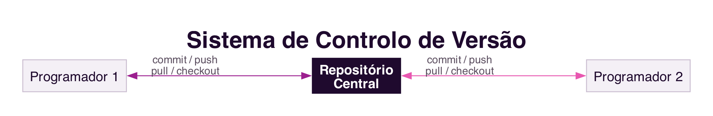

```{=html}
<div class="hero hero-chapter" style="background-image: linear-gradient(to top, rgba(31,10,46,0.88) 0%, rgba(31,10,46,0.6) 20%, rgba(31,10,46,0.15) 45%, rgba(31,10,46,0) 65%), url('../assets/images/heroes/cap08.jpg');">
  <div class="hero-badge">Chapter 8</div>
  <h1>Collaborative Software Development</h1>
</div>
```

## Introduction {#sec-08-intro-en .unnumbered}

The previous chapters discussed collaboration in virtual environments and in the relationship between citizens and government. This chapter turns to a domain closer to those studying Computing: software development is itself a deeply collaborative activity, rarely carried out by a single person, and increasingly carried out by geographically distributed teams.

## Software Development as a Collaborative Activity {#sec-08-collaborative-activity-en}

The success of an organisation increasingly depends on the software it uses as a competitive differentiator, and developing that software is rarely an individual activity: several specialists need to work together, coordinate their activities, make decisions and communicate continuously to develop quality software within the estimated time and cost [@SouzaEtAl2011].

Collaboration is organised around **models**, abstractions of the software being built: requirements specifications, class diagrams, use cases, and the source code itself. Models are not independent of one another: a change in a piece of software's class diagram, for example, usually requires corresponding changes in the source code, so that the two models remain consistent with each other. This dependency makes coordination between programmers particularly important, since misaligned changes between models tend to generate errors [@SouzaEtAl2011].

## Pair Programming {#sec-08-pair-programming-en}

**Pair programming** is a practice proposed by the agile method *Extreme Programming*, in which two programmers work together on a single computer: one writes the code while the other reviews it in real time, questions implementation decisions and looks for test cases that might fail [@SouzaEtAl2011].

This is not a matter of one person programming while the other merely watches, but a constant dialogue between two people jointly seeking a better solution than either would reach alone. The code is reviewed by two people in real time, which reduces the likelihood of defects and speeds up the sharing of knowledge between a more experienced programmer and a less experienced one. Like any collaborative practice, it requires a cultural shift: evidence suggests that productivity increases with practice, as the pair learns to communicate and better divide the work between them [@SouzaEtAl2011].

## Version Control Systems {#sec-08-version-control-en}

**Version control** is the discipline responsible for controlling the evolution and integrity of a software product over time, identifying, recording and coordinating the changes made by different team members [@SouzaEtAl2011]. Systems such as `Git`, today the most used, maintain a central repository with the complete history of the code, from which each programmer copies their own working area (@fig-08-version-control-en).

{#fig-08-version-control-en}

A version control system supports collaboration in several ways: it generates a change log that serves as shared memory of the product's evolution; it provides awareness information about what colleagues are doing, by notifying changes; and it enables the coordination of dependencies between activities, whether through sequential development or in parallel, with the work of each person integrated afterwards. Platforms such as `GitHub` and `GitLab` now integrate version control with defect management and code review in the same system.

## Defect Management Systems {#sec-08-defect-management-en}

Software is rarely free of defects, found either by the quality team or by users themselves. **Defect management systems**, such as `Bugzilla`, `JIRA` or `GitHub` *issues*, support the recording, assignment and tracking of defect resolution, typically involving several actors in distinct roles: those who test, those who develop, and those who manage the team (@fig-08-defect-cycle-en) [@SouzaEtAl2011].

{#fig-08-defect-cycle-en}

A defect is reported by whoever finds it, forwarded to a programmer who works on the fix, and returned for verification by whoever originally reported it. If the fix is not satisfactory, the defect is reopened, restarting the cycle. Beyond reporting and resolution, these systems make it possible to prioritise defects, generate reports on the status of each one, and identify similar or already-reported defects, which is particularly useful for geographically distributed teams, whose members do not always have the opportunity to meet in person to discuss a solution [@SouzaEtAl2011].

## Distributed and Global Development {#sec-08-distributed-en}

The globalisation of business has also been reflected in software development: it is increasingly common for members of the same team to be separated by physical and temporal distance, and for a project to involve participants from different countries, cultures and time zones [@SouzaEtAl2011].

Distance between collaborators has a well-documented effect on collaboration. A classic study by Thomas Allen, in 1977, showed that the frequency of collaboration between engineers was inversely proportional to the physical distance between their desks: from about 30 metres onward, collaboration between colleagues decreased sharply [@SouzaEtAl2011]. The effect is explained by the loss of opportunities for **informal communication**, the spontaneous corridor or coffee-machine conversations, with no prior scheduling, through which colleagues learn about each other's progress and find joint solutions to common problems.

Although the collaborative systems already discussed help reduce the distance between people, through instant messaging and video conferencing, physical distance between professionals who need to collaborate remains a real challenge, alongside other factors such as differences in time zone, language, customs and cultural norms between distributed teams [@SouzaEtAl2011].

## Summary {#sec-08-summary-en}

This chapter dealt with software development as a collaborative activity:

1. Software development is organised around interdependent **models**, whose changes require coordination within the team [@SouzaEtAl2011]
2. **Pair programming** is a collaborative practice in which two programmers work in constant dialogue, reducing defects and sharing knowledge
3. **Version control systems**, today mostly based on `Git`, coordinate a team's changes and maintain a record of the product's history
4. **Defect management systems** support the collaborative lifecycle of a defect, from reporting to verification of the fix
5. **Distributed and global development** is increasingly common, but physical distance between collaborators continues to hinder the informal communication that is essential for collaboration

## Food for Thought {#sec-08-reflection-en}

If you have already worked on a group programming project, think about how the code coordination was done: did you use a version control system? How did you resolve conflicts when two people changed the same file?

And what about physical distance: have you ever felt, in a group project, the difference between solving a problem in person and trying to solve it only by message?

## References {#sec-08-references-en .unnumbered}

::: {#refs}
:::
