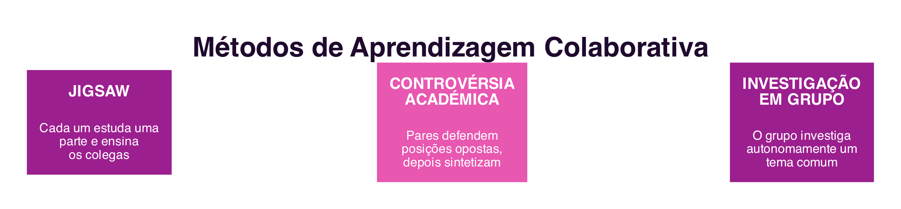
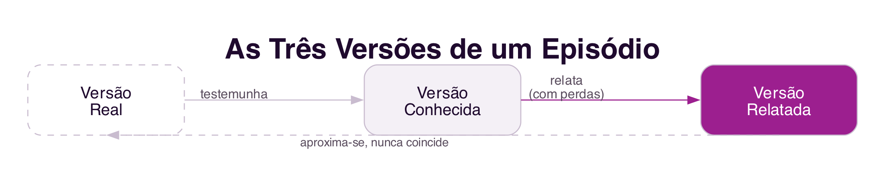

```{=html}
<div class="hero hero-chapter" style="background-image: linear-gradient(to top, rgba(31,10,46,0.88) 0%, rgba(31,10,46,0.6) 20%, rgba(31,10,46,0.15) 45%, rgba(31,10,46,0) 65%), url('../assets/images/heroes/cap09.jpg');">
  <div class="hero-badge">Chapter 9</div>
  <h1>Collaborative Learning and Collective Knowledge</h1>
</div>
```

## Introduction {#sec-09-intro-en .unnumbered}

The first attempts to use the computer in education, decades before the internet as we know it today, saw the computer as a kind of automated teacher: a system that presented content, checked answers and reinforced correct behaviours, according to behaviourist principles of programmed instruction. This chapter deals with a different paradigm, consolidated from the 1970s onward and reinforced by the arrival of collaborative systems: **learning as a social process**, in which knowledge is not transmitted from a teacher-computer to a passive student, but built jointly by those who learn [@CastroMenezes2011].

## Collaborative Learning {#sec-09-collaborative-learning-en}

Learning is an activity arising from the continuous pursuit of adaptation to the physical and social environment: much is learned from others, solving problems together, obtaining explanations of already-solved problems, debating the advantages and disadvantages of a choice, and building collective syntheses [@CastroMenezes2011]. **Collaborative learning** rests on two principles: students work together in the pursuit of learning, and are responsible not only for their own learning, but also for their peers' learning. These principles imply collective goals which, the better they are met, the greater the learning possibilities for each participant [@CastroMenezes2011].

## Methods of Collaborative Learning {#sec-09-methods-en}

Three methods, with decades of proven use in school settings, illustrate concrete ways of structuring collaborative learning (@fig-09-methods-en) [@CastroMenezes2011]:

{#fig-09-methods-en}

- ***Jigsaw***: the class is organised into groups, and each group member studies, in an "expert group", a different part of the topic. Each student then returns to their original group to teach their peers the part they studied. Since each student holds a piece of the "puzzle" that the others do not have, interdependence between them is total: without everyone's contribution, the group cannot reconstruct the complete topic.
- **Academic Controversy**: students are organised into pairs who defend opposing positions on a topic, present the best possible arguments for their position, discuss openly, then switch the positions they were defending, and finish by jointly building a synthesis that integrates the best ideas from both sides.
- **Group Investigation**: small groups autonomously investigate a topic of common interest, from defining the research question to presenting a final report, combining investigation, social interaction, individual interpretation and intrinsic motivation.

Although different from one another, the three methods share essential components: group goals that encourage students to support one another; individual accountability, which requires each member to master the concepts they explain to their peers; and equal opportunity for success, recognising each student for their effort, regardless of their starting abilities [@CastroMenezes2011].

## Collective Knowledge {#sec-09-collective-knowledge-en}

Many of the problems solved in organisations today are too complex and multidisciplinary for a single person. **Collective knowledge** is the combination of the individual knowledge of a group with a common goal, and is richer than the simple sum of that individual knowledge, because combining different perspectives reveals relationships that are not visible when each piece of knowledge is presented in isolation [@Borges2011].

A recurring problem is recovering knowledge about past events that were not properly documented when they occurred. In this process, three versions of the same episode can be distinguished (@fig-09-versions-en) [@Borges2011]: the **known version**, held in the mind of whoever witnessed the episode, tacit and abstract knowledge until it is transmitted; the **reported version**, the account that results from transmitting that knowledge, orally or in writing; and the **real version**, what actually happened, also an abstract concept, which can rarely be fully reconstructed.

{#fig-09-versions-en}

In any transmission of knowledge, whether by socialisation (oral explanation) or by externalisation (written record), there are losses: no one reproduces everything they know when giving an account, and socialisation also suffers from the "game of telephone" effect, in which knowledge changes with each new transmission [@Borges2011].

## Group Storytelling {#sec-09-storytelling-en}

***Group storytelling*** is a technique for the collective recovery of knowledge in which several people contribute, synchronously or asynchronously, to reconstruct an episode, bringing the reported version closer to the version known by each participant [@Borges2011]. The technique typically assigns four roles to participants: the **storyteller**, who recounts their version of the facts; the **facilitator**, who looks for inconsistencies, contradictions and gaps between the various accounts; the **reviewer**, who identifies ambiguous or incomplete passages; and the **administrator**, who organises the dynamics and invites participants.

Since different people recount the same episode in different ways, according to their own perspective, individual accounts can relate to one another in several ways: **confirmation**, when one account confirms another; **inconsistency**, when two accounts contradict each other; **precedence**, when one event precedes another in time; and ***gap***, when information is missing between two accounts for the story to make sense. Making these relationships explicit is what turns a set of individual accounts into a true collective story, richer than any of the isolated accounts.

## Summary {#sec-09-summary-en}

This chapter dealt with learning as a social process and with the collective construction of knowledge:

1. **Collaborative learning** replaces the computer-teacher with a joint construction of knowledge among students who take responsibility for one another [@CastroMenezes2011]
2. The ***Jigsaw***, **Academic Controversy** and **Group Investigation** methods structure interdependence between students in different ways [@CastroMenezes2011]
3. **Collective knowledge** is richer than the sum of a group's individual knowledge, and is distinguished into known, reported and real versions [@Borges2011]
4. ***Group storytelling*** collectively recovers knowledge about an episode, through defined roles and by making relationships between individual accounts explicit [@Borges2011]

## Food for Thought {#sec-09-reflection-en}

Think of a group project in which you used one of the three methods discussed, even without knowing its name: which one, and how did interdependence between group members go?

And what about group storytelling: have you ever reconstructed, with colleagues or friends, the story of a shared event, each from your own version? What inconsistencies or gaps did you find between your accounts?

## References {#sec-09-references-en .unnumbered}

::: {#refs}
:::
