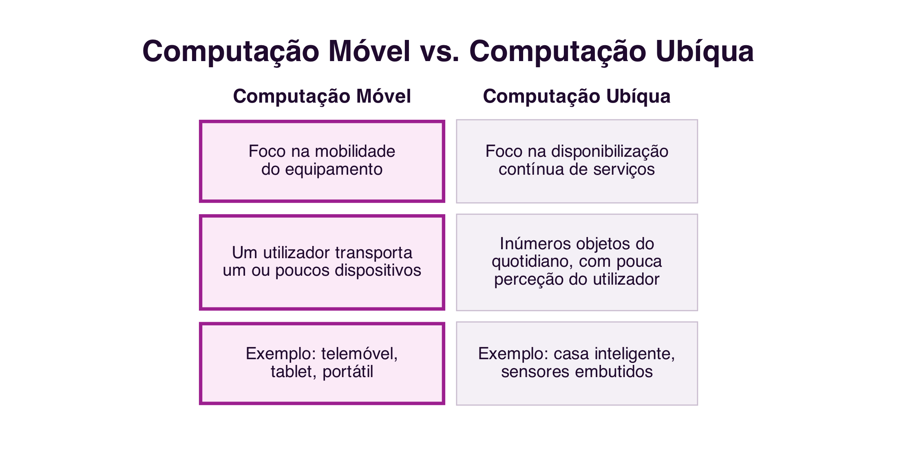

```{=html}
<div class="hero hero-chapter" style="background-image: linear-gradient(to top, rgba(31,10,46,0.88) 0%, rgba(31,10,46,0.6) 20%, rgba(31,10,46,0.15) 45%, rgba(31,10,46,0) 65%), url('../assets/images/heroes/cap11.jpg');">
  <div class="hero-badge">Chapter 11</div>
  <h1>Mobility, Ubiquity and Interaction</h1>
</div>
```

## Introduction {#sec-11-intro-en .unnumbered}

This final chapter closes the block dedicated to cooperative platforms with two complementary questions: how collaboration follows people away from the desk, through mobile and ubiquitous computing; and how to systematically assess whether a collaborative system offers a good experience to those who use it.

## Mobile and Ubiquitous Computing {#sec-11-mobile-ubiquitous-en}

**Mobile Computing** focuses on mobility: portable equipment, cellular telephony and wireless networks expand the boundaries of where and when collaboration is possible [@FilippoEtAl2011]. **Ubiquitous Computing**, a term coined by Mark Weiser in 1988, while working at Xerox PARC, has a slightly different focus: the continuous availability of services through countless everyday objects with embedded *software*, increasingly imperceptible as computers [@FilippoEtAl2011] (@fig-11-mobile-ubiquitous-en).

{#fig-11-mobile-ubiquitous-en}

For Weiser, Ubiquitous Computing is the third era of computing: after the era of mainframe computers, shared by several users, and the era of personal computers, one user per computer, comes the era in which each user uses, without realising it, several devices at the same time. Mobility and ubiquity are not synonyms: a laptop is mobile, but not ubiquitous; a sensor embedded in a door is ubiquitous, but not mobile. Many collaborative services today combine both dimensions.

## Location {#sec-11-location-en}

A large part of mobile collaborative services exploits the user's **location**: mobile devices, equipped with GPS, accelerometer, compass and gyroscope, report where the user is and where they are heading [@FilippoEtAl2011]. Services based on the geographic coordinates of people and elements of the real and virtual world are called **Location Based Services** (LBS).

Everyday applications such as `Google Maps`, `Uber` or food-delivery apps use location to coordinate meetings between people, vehicles and destinations that would otherwise require prior, detailed arrangement. Games such as `Pokémon GO` take the same logic into the territory of playful collaboration: as in *geocaching*, a treasure-hunting game that predates smartphones, in which georeferenced coordinates guide players to hidden objects, location turns the physical space of the city into a shared game board.

## Smart Objects {#sec-11-smart-objects-en}

Ubiquitous Computing gave rise to the idea of **smart objects**: low-cost devices, equipped with sensors and network communication capability, which stop being inert and start having behaviour of their own, reacting to other objects, to people and to the environment around them [@FilippoEtAl2011]. This set of networked objects is today called the **Internet of Things** (IoT).

A smart home, equipped with assistants such as `Google Home` or `Alexa`, smart locks and networked appliances, is the example closest to many people's everyday lives. A *smartwatch*, such as the `Apple Watch`, is another example: it communicates with its user's phone, but also with other devices and services, supporting everything from communication to health monitoring. Together, these interconnected objects form a collaborative ecosystem, in which each device contributes data and functionality to the others. A central principle of these objects is **calm technology**: the more devices there are, the more important it becomes for them to become invisible in their operation, without requiring constant attention from those who use them [@FilippoEtAl2011].

## Infrastructure: Wireless Networks and Sensors {#sec-11-infrastructure-en}

Mobile and ubiquitous computing depends on a technological infrastructure that brings its own challenges to collaborative systems [@FilippoEtAl2011]: wireless networks, which extend the Internet's reach beyond wired networks but run into physical and bandwidth limits; sensors, which capture location, movement or environmental data; and context support, a system's ability to adapt to changes in network, battery and the situation of whoever uses it, without harming the collaboration under way.

Without going into depth, it is also worth mentioning **cross-platform development methods**: there are today *frameworks* that make it possible to build an application for `Android` and `iOS` from the same code, instead of programming each version separately. `React Native`, developed by Meta, uses `JavaScript` to produce native applications; `Flutter`, from Google, uses the `Dart` language and is known for its *performance*; `Xamarin`, from Microsoft, uses `C#` and integrates with the `.NET` ecosystem; `Ionic`, based on Web technologies such as `HTML`, `CSS` and `JavaScript`, generates hybrid applications.

## Qualities of Use {#sec-11-qualities-of-use-en}

Once developed, how can one tell whether a collaborative system offers a good experience to those who use it? The field of **Human-Computer Interaction** (HCI) proposes criteria, or **quality-of-use requirements**, to answer this question [@Prates2011] (@fig-11-qualities-en):

{#fig-11-qualities-en}

- **Usability**: according to ISO standard 9241-11:2018, the extent to which a system can be used by specific users to achieve well-defined goals with **effectiveness**, **efficiency** and **satisfaction**, in a given context of use [@ISO2018Usability]. Effectiveness concerns the accuracy and completeness with which users achieve their goals; efficiency, the resources, such as time and effort, spent in relation to that accuracy and completeness; satisfaction, the absence of discomfort and a positive attitude towards using the system. Nielsen further adds ease of learning (*learnability*), ease of recall (*memorability*) and error rate as complementary attributes of usability [@Nielsen1993].
- **Sociability**: according to Preece, the sociability of an *online* community rests on three pillars that determine whether it thrives: **purpose**, the reason that leads people to participate and that gives the group cohesion; **people**, their characteristics, roles and diversity; and **policies**, the rules, norms and codes of conduct that regulate the group's behaviour [@Preece2000].
- **Communicability**: the system's ability to convey to users its designer's decisions about who the users are, what they can do, and how they can do it. The concept originates within **Semiotic Engineering**, a field that studies human-computer interaction as a communication process between designers and users, mediated by the interface itself [@SouzaCS2005].
- **Accessibility**: according to the W3C, access to the Web by everyone, regardless of disability, is an essential aspect, which requires perceiving, understanding, navigating and interacting without barriers. It covers visual, hearing, motor, cognitive and neurological limitations. The most widely used normative reference is `WCAG 2.2`, organised around four principles: perceivable, operable, understandable and robust [@W3CWAI2023].

Of these four, sociability is the only one specific to collaborative systems: usability, communicability and accessibility apply to any interactive system, even a single-user one, but sociability only makes sense when there is, in fact, a group interacting through the system [@Prates2011]. Accessibility, in turn, is not exclusive to collaborative systems, but functions in them as a condition of social inclusiveness: an inaccessible system excludes group members, undermining sociability itself.

The four qualities relate to one another, and none exists in isolation: a system with low communicability hinders learning, also resulting in low usability; a system with low accessibility excludes users, which reduces the group's sociability. A quality collaborative system balances all four dimensions at once, and its evaluation should be carried out with real users, in a real context.

## Summary {#sec-11-summary-en}

This chapter, the last in the block dedicated to cooperative platforms, addressed mobility, ubiquity and the quality of interaction:

1. **Mobile Computing** focuses on the mobility of equipment; **Ubiquitous Computing** focuses on the continuous availability of services through countless everyday objects [@FilippoEtAl2011]
2. **Location Based Services** coordinate meetings between people, vehicles and destinations from the user's geographic coordinates
3. **Smart objects**, networked as part of the Internet of Things, follow the principle of calm technology: the more numerous they are, the more invisible they should be in their operation
4. Wireless network and sensor infrastructure, and cross-platform *frameworks*, support the development of mobile and ubiquitous collaborative systems
5. The four **qualities of use**, usability (effectiveness, efficiency and satisfaction), sociability (purpose, people and policies), communicability (conveying design decisions to the user) and accessibility (barrier-free use), assess whether a collaborative system offers a good experience to those who use it, and relate to one another [@Prates2011]

## Food for Thought {#sec-11-reflection-en}

Think of a mobile application you use frequently that depends on your location: what collaboration does it make possible that would not otherwise exist?

And regarding the four qualities of use: pick a collaborative system you use regularly and quickly assess it on each of them. What is its weakest point?

## References {#sec-11-references-en .unnumbered}

::: {#refs}
:::
